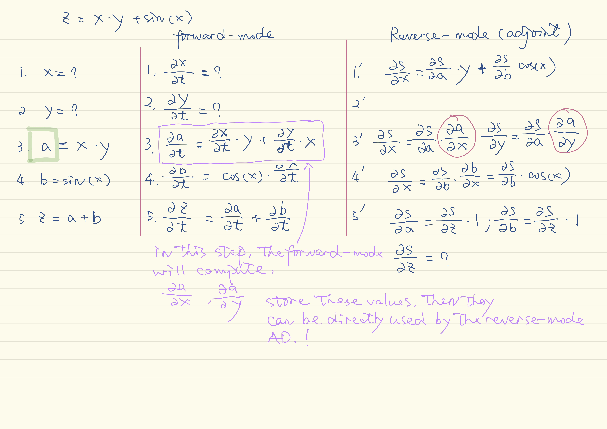

[TOC]

# [Dynamic Automatic Differentiation of GPU Broadcast Kernels](https://arxiv.org/pdf/1810.08297.pdf)

## Background

### Broadcast and Broadcast Fusion

### Broadcast in Julia

## What is [Multidimensional Dual Numbers](https://arxiv.org/pdf/1607.07892.pdf)

>_A previous [notes on forward-mode AD and dual number algebra](https://github.com/lcy-seso/learning_notes/blob/master/paper_notes/AD/brief_introduction_to_AD.md#forward-mode-ad)._

### Notations

_Multidimensional dual number_'s behavior on _**scalar functions**_ is defined as:

$$f\left(x + \sum^{k}_{i=1}y_i\epsilon_i \right) = f(x) + f'(x)\sum^{k}_{i=1}y_i\epsilon_i$$

_**Orthogonal $\epsilon$ components are appended**_ to input vector components to _**track their individual directional derivatives**_.

where _**orthogonal**_ means: $\epsilon_i\epsilon_j=0$

### Extracting $\epsilon$ comonents (TL;DR)

To extract the $\epsilon$ components as a tuple from a multidimensional dual number, this paper employs a tangent extraction function $\bold{tg}$ defined as:

$$\bold{tg}_\alpha \left(x + \sum^{k}_{i = 1}y_i \alpha[\epsilon_i] = (y_1, ..., y_k) \right)$$

* $\bold{tg}$ utilizes the notion of tagged perturbations
    * _**ONLY**_ extracts perturbations that are marked with the tag $\alpha$
    * this tagging machinery is to avoid a class of AD bugs knowns as _**perturbation confusion**_[TL;DR].

## Tips on Performance

* Vector forward mode enables the calculation of entire gradients in a single pass of the program defining $f$, but _**at the cost of additional memory and operations**_.

    * In practice, especially in memory-managed languages like Julia, the cost of rapidly allocating and deallocating large $\epsilon$  vectors on the heap can lead to slowdowns that practically outweigh the advantage of fewer passes through $f$.
    * [ForwardDiff.jl](https://github.com/JuliaDiff/ForwardDiff.jl)'s implementation works around this pitfall by stack-allocating the $\epsilon$ vector, as well as permitting their size to be tunable at runtime.

>_**What are the deferences regarding performance between heap-allocating and stack-allocating?**_

### An Observation for Performance Implications

The below equation only works for elementwise operation.

$$ \text{Given} b: \mathbb{R}^N \rightarrow \mathbb{R}^M \text{s.t}$$
$$ b.(\bf{X}_1...\bf{X}_N) = \text{map}(b, \bf{{\mathcal{X}}_1...\bf{\mathcal{X}}_N}) = (\bf{Y}_1...\bf{Y}_N), \text{then}$$
$$\bf{D}(b).(\bf{X}_1...\bf{X}_N)
\rightarrow
\left \{ \text{diag}
\left(
\frac{\partial{\text{vec}(\bf{Y_i})}}
{\partial{\text{vec}(\bf{\mathcal{X_j}})}}
|
i \in 1...M, j \in 1...N
\right)
\right \} $$

where: $\text{vec}$ is vectorization, $\text{diag}$ is extracting the diagonal of a square matrix.

Performance implicatioins:
1. The above equation exploits the sparsity structure imposed on the Jacobian by the broadcast operation, avoiding calculation of the zero-valued cross-element partial derivatives.

### Combining Forward and Reverse mode AD

## References

1. [Forward-Mode Automatic Differentiation in Julia](https://arxiv.org/pdf/1607.07892.pdf)
