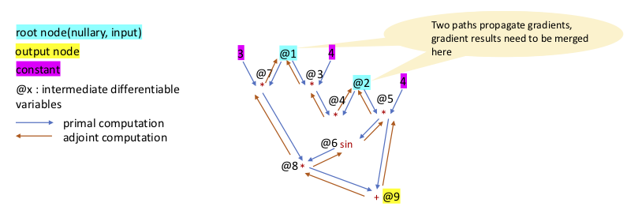

Let's take this example, and do gradient computation by hand:
$z = 4xy + 3x\text{sin}4y$

## The primal program

|No.|tape node|explanation|
|--|--|--|
|1|$\text{@1} = ?$ |$x$, this node should be marked as a root|
|2| $\text{@2} = ?$ |$y$, this node should be marked as a root
|3|$\text{@3} = 4 * \text{@1}$|4$x$
|4|$\text{@4} = \text{@3} * \text{@2}$|4$xy$
|5|$\text{@5} = 4 * \text{@2}$|4$y$
|6|$\text{@6} = \text{sin(@5)}$|$\text{sin}(4y)$
|7|$\text{@7} = 3 * \text{@1}$|$3x$
|8|$\text{@8} = \text{@6} * \text{@7}$
|9|$\text{@9} = \text{@4} + \text{@8}$|this node should be marked as an output node.

  Fig.1 the expression graph

## The adjoint program

Given the primal program, generate the adjoint program. Let's denote $\frac{\partial l}{\partial \text{@x}} \triangleq \bigtriangledown\text{@x}$, where $l$ is the loss function.

The adjoint program:

|No.|tape node|explanation|
|--|--|--|
|9|$\bigtriangledown\text{@9} = ?$|Initialization. This is the seed set to 1.
|9|$\bigtriangledown\text{@4} = \bigtriangledown\text{@9}$|$+$ is a binary operation, gradients for the first operand|
|9|$\bigtriangledown\text{@8} = \bigtriangledown\text{@9}$|$+$ is a binary operation, gradients for the second operand|
|8|$\bigtriangledown\text{@6} = \bigtriangledown\text{@8} * \text{@7}$|   |
|8|$\bigtriangledown\text{@7} = \bigtriangledown\text{@8} * \text{@6}$|   |
|7|$\bigtriangledown^{1}\text{@1} = 3*\bigtriangledown\text{@7}$|   |
|6|$\bigtriangledown\text{@5} = \bigtriangledown\text{@6} * \text{cos}(\text{@5})$|   |
|5|$\bigtriangledown^{1}\text{@2} = 4\bigtriangledown\text{@5}$|   |
|4|$\bigtriangledown\text{@3} = \bigtriangledown\text{@4} * \text{@2}$|   |
|4|$\bigtriangledown^{2}\text{@2} = \bigtriangledown\text{@4} * \text{@3}$|   |
|3|$\bigtriangledown^{2}\text{@1} = 4 * \bigtriangledown\text{@3}$|   |
|2 | Stop  |   |
|1 | Stop  |   |

We finally obtain:

1. $\bigtriangledown\text{@1} = 4y + 3\text{sin}(4y)$
1. $\bigtriangledown\text{@2} = 4x + 12x \text{cos}(4y)$
