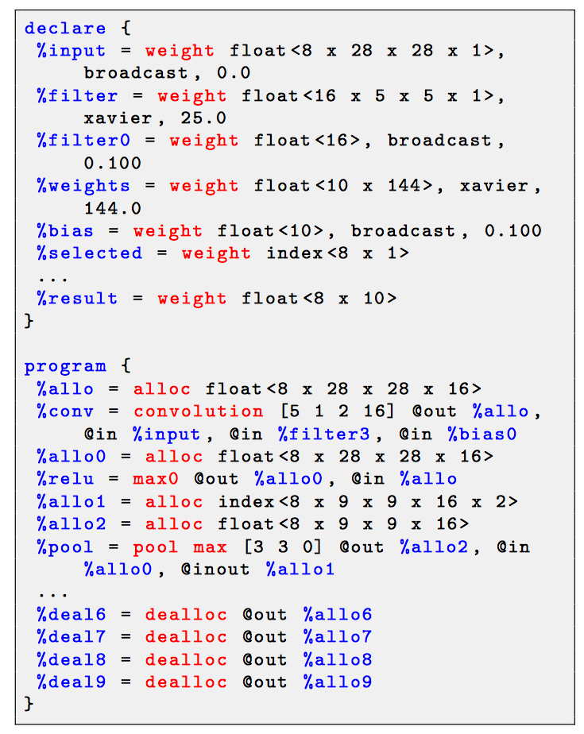

# [Glow](https://github.com/pytorch/glow)

## Goals

Consume a neural network computation graph, optimize it, and code generation for it for a diverse set of backends.

* Glow is a machine learning compiler for heterogeneous hardware.
* Glow lowers the traditional neural network dataflow graph into a two-phrase _**strongly-typed**_
 IR:
    1. the hight-level IR allowing domain-specific optimization.
        * kernel fusion
    1. the low-level instruciton-based address-only IR to perform memory-related optimizatons
        * instruction scheduling
        * static memory allocation
        * copy elimination

## High Level IR : target independent optimization

* High-level IR is Dataflow node based representation (Tensors and operators).
* The graph is strongly-typed (Each tensor has a known data type).

_**Glow graph is structured as a module**_

* Variable, Function, Node are concepts from the implementations.

1. Variables: persistent tensors for learnable parameter (global tensors).
1. A module contains multiple functions (functions are a set of sequentially executed operators in essense).
    * for training tasks, there will be forward funcions, backward funcions, optimization funcions.
    * Glow functions contain "nodes" that represent the different operations of a neural network.
* A function contains multiple nodes (nodes are operators in essense).
* Nodes inside functions are able to reference variables which are owned by the module.

_**Node lowering**_

* breaks the high-level operator nodes into low-level linear algebra operator nodes.
    * It gives me the feeling that these low-level linear algebra operator nodes are very HLO primitives in XLA.
* the new graph may affect instruction scheduling.

## Low-level IR

* Low-level IR is a instruction based representation.
  * Glow use a _**self-defined IR**_, not directly use LLVM IR.
* One-to-many translation: each high-level node is translated into one or more instructions.
* Memory is added at the low-level IR.
  * In-place memory transformation for elementwise computation.
* The IR is strongly typed. Each operand has known parameter type.
* Device dependent optimization.
  * define hardware specific DMA instruction.
    * implement a instruction scheduling to hidden memory latency.

### An example of IR format function

* A function in IR format has two parts:
  1. declare
      * declare serveral memory regions that live throughout the lifetime of the program (like global variable in C++)
      * memory region in the declare part is GLOBAL.
  1. program
      * a list of instructions
      * memory region in the program part is LOCAL.

* Memory region is strongly-typed.
* Each operand is annotated with one of the qualifiers: `@in` (the buffer is read from), `@out`(the buffer is written to), `@inout` (the buffer is both read from and written to)
  * copy elimination
  * buffer sharing
  * keep the memory buffer (not deleted) of forward computation, so that they can be resued in backward computation
