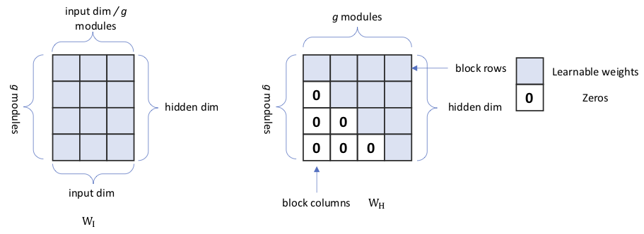
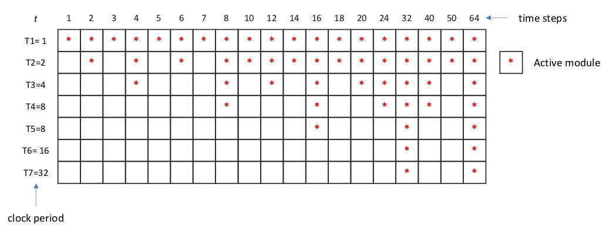
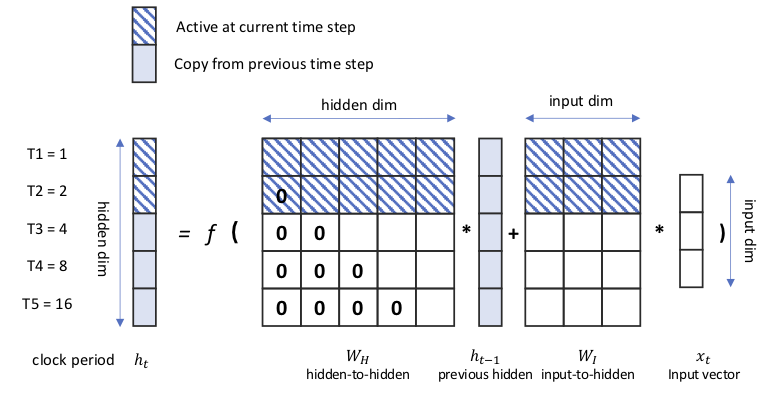

<!-- TOC depthFrom:1 depthTo:6 withLinks:1 updateOnSave:1 orderedList:0 -->

- [Clockwork RNN](#clockwork-rnn)
	- [Simple RNN](#simple-rNN)
	- [Clockwork RNN](#clockwork-rnn)
      - [Why Clockwork RNN](#why-clockwork-rnn)
      - [Computation Details](#computation-details)
        - [1. Partition hidden layer into sub-modules](#1-partition-hidden-layer-into-sub-modules)
        - [2. Assign different clock period to different modules](#2-aassign-different-clock-period-to-different-modules)
        - [3. For unactive modules, directly copy their values in previous time step to current time steps](#3-for-unactive-modules-directly-copy-their-values-in-previous-time-step-to-current-time-steps)
- [References](#references)

<!-- /TOC -->

# Clockwork RNN

Recurrent neural networks(RNN) are a class of connectionist models that process internal state due to recurrent feed-back connections, making them suitable for sequence modeling. RNN can be regarded as a mathematical model for describing the dynamics of a nonlinear system, hidden states of which are supposed to contain sufficient information to predict the future evolution of the system.

Generally, the computation of RNN in each time step is made up of three parts: (1) input-to-hidden projection; (2) hidden-to-hidden projection; (3) hidden-to-output projection. The dynamics of RNN has its roots in the hidden-to-hidden projection, that the hidden state in time step $t - 1$ is one of the inputs to compute hidden state in time step $t$.

## Simple RNN

At time step $t$, the output of the Simple RNN (SRN) $\bold{h}_O^t$ is computed according to equation (1) and (2) where $\bold{W}_I$, $\bold{W}_H$, $\bold{W}_O$ is the input-to-hidden, hidden-to-hidden, and hidden-to-output matrices, $\bold{x}_t$ is the input vector, and $\phi_h$, $\phi_O$ are non-linear activation functions.

$$ \bold{h}_H^t = \phi_h(\bold{W}_H \bold{h}_{t - 1} + \bold{W}_I \bold{x}_t) \tag{1}$$
$$ \bold{h}_O^t = \phi_O(\bold{W}_O \bold{h}_H^t) \tag{2}$$

Backpropagation is easily adapted to an RNN by unrolling it to a feed-forward network through treating successive time steps as if they were successive layers, and learnable parameters are shared among these layers. This is called Backpropagation through time (BPTT). Fig.1 shows the unrolled computation graph for a two-layer RNN. Blue nodes represent hidden states, and the corresponding red node represents the gradient of the loss with respect to the hidden state.

 
Fig.1 The unrolled computation graph for a two-layer RNN.

_**The animation is from [Waybackprop](https://magenta.tensorflow.org/blog/2017/06/01/waybackprop).**_

## Clockwork RNN

### Why Clockwork RNN

Due to the notorious gradient vanishing and explosion problem, SRN architecture is difficult to train if complex dependencies among hidden states are present in training data. The high-level idea of gradient vanishing and explosion problem is:
1. In SRN, $\bold{h}_t$ implicitly relies on all $\{ \bold{h}_{t'} | t' \lt t\}$. If input $\{\bold{x}_1, \bold{x}_2, ..., \bold{x}_T\}$ is a long sequence, this will form a long chain over which gradients flows as depicted in Fig 1.
1. The output value of a neuron in forwarding computation is bounded, because most of the non-linear activations (except RELU) are a squashing function which maps unconstrained values into a limited range, by contrast, the output of gradient computation is usually unbounded.
1. To back-propagate gradients to inputs, BPTT involves a consecutive series of multiplications which suffers from numerical unstableness. Usually, successive multiplications are easy to go into two extremes: the result becomes smaller and smaller till underflowing (vanishing gradient), or the result becomes larger and larger till overflowing (explosive gradient).

Clockwork RNN (CW-RNN) introduces a simple yet powerful way to ease the learning of long-term dependencies in RNN.

### Computation Details

Like SRN in Equation (1) and (2), CW-RNN also consists of input-to-hidden, hidden-to-hidden, and output-to-hidden projection, but unlike SRN:

#### 1. Partition hidden layer into sub-modules

Neurons in the hidden layer are partitioned into $g$ modules of size $k = \frac{d}{g}$. $d$ is CW-RNN's hidden dimension.

Specifically:
- Matrices $\bold{W}_I$ and $\bold{W}_H$ are partitioned into $g$ block-rows.
- Each block-row of $\bold{W}_H$ is further partitioned into $g$ block-columns.
    - Suppose $\{ \bold{\omega}_{i,j} | i,j \in {1, ..., g}\}$ are blocks of $\bold{W}_H$.
    - $\bold{W}_H$ is a block-upper triangular, that is $\bold{\omega}_{i, j} = \bold{0}$ when $i \lt j$.

Below figure shows the partition of $\bold{W}_H$ and $\bold{W}_{I}$ with $g = 4$.

#### 2. Assign different clock period to different modules

After partition, each block-row is assigned a different time period $T_i$, $T_n \in \{ T_1, ..., T_g \}$. Clock period is an important time hyper-parameter that significantly affacts CW-RNN's learning performance. In [[1](#Reference)], the exponential series of periods are used. That is: $T_i = 2^{i - 1}$.

Below figure shows when exponential series is chosen as the clock period and $g = 7$, at time step 1 ~ 64 (skip some time steps), which modules are active.

#### 3. For unactive modules, directly copy their values in previous time step to current time steps.

At each CW-RNN time step $t$:
- Only the output of modules $i$ that satisfy: $(t$ MOD $T_i) = 0$ are active.
- Non-active modules are directly copied from the previous time step.

Below figure shows how output vector is computed in CW-RNN with $g = 6$ at time step 6 ($t = 6$).

# Reference

1. [A Clockwrok RNN](https://arxiv.org/abs/1402.3511)
1. [Waybackprop](https://magenta.tensorflow.org/blog/2017/06/01/waybackprop)
