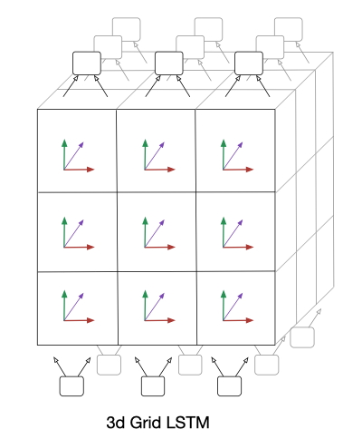

# [Grid LSTM](https://arxiv.org/abs/1507.01526)

## My takeaways

1. DL models can all be regarded as the tensor program, and these tensor can be regarded as the multi-dimensional sequence.
1. RNN cell can be iteratively applied along any dimension, and then another design choice needs to make is communication among all these dimensions.
1. The most intuitive way to implement this kind of model requires high-order function.

## Goal of this paper

- Extend LSTM cell to deep networks within a unified architecture.
- Propose a novel robust way for modulating $N$-way communication across the LSTM cells.

## Model

Recap standard LSTM first

$$\mathbf{f}_t = \sigma (W_f\mathbf{x}_t + U_f\mathbf{h}_{t-1} + \mathbf{b}_f) \tag{1}$$
$$\mathbf{i}_t = \sigma (W_i\mathbf{x}_t + U_i\mathbf{h}_{t-1} + \mathbf{b}_i) \tag{2}$$
$$\mathbf{o}_t = \sigma (W_o\mathbf{x}_t + U_o\mathbf{h}_{t-1} + \mathbf{b}_o) \tag{3}$$
$$\mathbf{\hat{c}}_t = \text{tanh}(W_c\mathbf{x}_t + U_c\mathbf{h}_{t-1} + \mathbf{b}_c) \tag{4}$$
$$\mathbf{c}_t = \mathbf{f}_t \circ \mathbf{c}_{t-1} + \mathbf{i}_t \circ \mathbf{\tilde{c}}_t \tag{5}$$
$$\mathbf{h}_t = \mathbf{o}_t \circ \text{tanh}(\mathbf{c}_t) \tag{6}$$

### GridBlock

_**Inputs**_:

1. a $N$-dimensioanl block receives $N$ hidden vectors: $\mathbf{h}_1, \mathbf{h}_2, ..., \mathbf{h}_N$ and,
1. $N$ memory vectors $\mathbf{m}_1, \mathbf{m}_2, ..., \mathbf{m}_N$

_**Compute**_:

1. deploys cells along _**any**_ or _**all**_ of the dimensions including the depth of the network;
    - In the sequence prediction context, there are two dimensions: sequence length and depth.
1. _**concatenate**_ all input hiddens to form $\mathbf{H}=\begin{bmatrix}\
\mathbf{h}_1 \\
\vdots \\
\mathbf{h}_N \\
\end{bmatrix}$. _**This is the difference from HM-LSTM**_.
1. compute $N$ LSTM transforms: $(\mathbf{h}_i, \mathbf{m}_i) = \text{LSTM}(\mathbf{H}, \mathbf{m}_i, \mathbf{W}_i)$ where $i = [1, ..., N]$, $W$ cancatenates $\mathbf{W}_i^i$, $\mathbf{W}_f^i$, $\mathbf{W}_o^i$, $\mathbf{W}_c^i$ in $\mathbb{R}^{d \times Nd}$.

 Fig3, The example of 3D GridLSTM example.

### Priority Dimensions

1. in general case, a $N$-dimensional block computes the transforms for all dimensions are _**in parallel.**_
1. prioritize the dimension of the network. For dimensions other than prioritized dimensions, their output hidden vectors are computed first, and finally, the prioritized.
    - for example, to prioritize the first dimension of the network, the block first computes the $N$ − 1 transforms for the other dimensions obtaining the output hidden vectors $\mathbf{h}_2', ..., \mathbf{h}_N$.

### Non-LSTM dimensions

Along some dimension, regular connection instead of LSTM is used.

$$\mathbf{h}'_1 = \alpha(\mathbf{V} * \mathbf{H})$$

$\alpha$ above is a standard nonlinear transfer function or identity mapping.

### An example: GirdLSTM for NMT

This example is a novel way to address the NMT problem.

