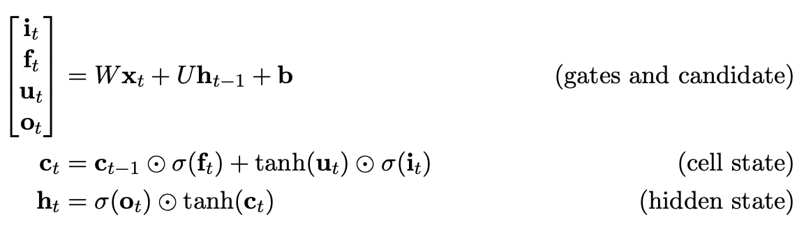

<!-- TOC depthFrom:1 depthTo:6 withLinks:1 updateOnSave:1 orderedList:0 -->
- [Hierarchical Multiscale Recurrent Neural Networks](#hierarchical-multiscale-recurrent-neural-networks)
  - [Takeaways](#takeaways)
  - [Problem proposed in this paper](#problem-proposed-in-this-paper)
  - [Approach](#approach)
  - [Model](#model)
    - [HM-RNN based on LSTM update rule](#hm-rnn-based-on-lstm-update-rule)
  - [Some claims made in this paper](#some-claims-made-in-this-paper)
- [References](#references)

<!-- /TOC -->
# Hierarchical Multiscale Recurrent Neural Networks

## Takeaways

## Problem proposed in this paper

Learn the hierarchical multiscale structure from temporal data ***without explicit boundary information***.

## Approach

1.  [**key**] [Introduce ***a parametrized binary boundary detector***] at each layer.
    -   turned on only at the time steps where a segment of the corresponding abstraction level is completely processed.
2.  Implement three operations: **UPDATE**, **COPY**, **FLUSH**.
    -   **UPDATE**: similar to update rule of the LSTM.
    -   **COPY**: ***simply copies*** cell and hidden states of the previous time step which is unlike the ***leaky integration*** in LSTM/GRU.
    -   **FLUSH**: executed when a boundary is detected, where it first ejects the summarized representation of the current segment to the upper layer and then reinitializes the states to start processing the next segment.
3.  Use ***straight-through estimator*** to train this model to learn how to select a proper operation at each time step and to detect the boundaries.
    -   "selecting one of the three operations" is a discrete variable.

## Model

1.  A parametrized boundary detector in each layer of a stacked RNN which outputs a boundary state $z_{t}^l$.
    -   Uses parameterized binary boundary detectors at each layer. **Avoids “soft” gating which leads to “curse of updating every timestep”.**
    -   Whenever the boundary detector is turned on at a time step of layer $l$, the model considers this to be the end of a segment corresponding to the latent abstraction level of layer $l$.
2.  Each layer selects **one** of **UPDATE**, **COPY**, **FLUSH** using the boundary states at each time step:

    The computation of RNN is a grid. The selection of boundary state of the current timestep $t$ at layer $l$ is determined by the boundary state at left and below.
    

    
    

    | $z_{t-1}^l$  left| $z_{t}^{l-1}$ buttom | The Selected Operation ||
    |:-----------:|:-------------:|:----------------------:|:-:|
    |      0      |       0       |        **COPY**        |buttom and left states both do not reach to a boundary.|
    |      0      |       1       |       **UPDATE**       |left state does not reaches to a boundary but buttom does. **UPDATE** is executed sparsely|
    |      1      |       0       |       **FLUSH**        |left state reaches to a boundary.|
    |      1      |       1       |       **FLUSH**        |left state reaches to a boundary.|

### HM-RNN based on LSTM update rule

Recap LSTM's equation first:

---

HM-RNN based on LSTM cell.

1. compute pre-activation
    

    
    

1. cell update

    $$
    \begin{equation}
    \mathbf{c}_t^l = \left\{\begin{array}
    \mathbf{f}_t^l \odot\mathbf{c}_{t-1}^l + \mathbf{i}_t^{l} \odot \mathbf{g}_t^{l}, & \text{if UPDATE}\\
    \mathbf{c_{t-1}^{l}}, & \text{if COPY}\\
    \mathbf{i}_t^{i}\odot\mathbf{g}_t^l,& \text{if FLUSH}
    \end{array}
    \right.
    \end{equation}
    $$

1. hidden update

    $$
    \begin{equation}
    \mathbf{h}_t^l = \left\{\begin{array}
    \mathbf{h}_{t-1}^{l}, &\text{if COPY}\\
    \mathbf{o}_{t}^l \odot \text{tanh}(\mathbf{c}_t^l), &\text{otherwise}
    \end{array}
    \right.
    \end{equation}
    $$

    - $\mathbf{g}$ is a cell proposal vector.
    - $\mathbf{i}$, $\mathbf{f}$, $\mathbf{o}$ are the input/forget/output gate.

## Some claims made (and learned) from this paper

1.  However, because ***non-stationarity is prevalent in temporal data***, and that many entities of abstraction such as words and sentences are in variable length, we claim that ***it is important for an RNN to dynamically adapt its timescales*** to the particulars of the input entities of various length.
2.  It has been a challenge for an RNN to discover the latent hierarchical structure in temporal data without explicit boundary information.
3.  Although the LSTM has a *** self-loop for the gradients that helps to capture the long-term dependencies*** by mitigating the vanishing gradient problem, in practice, it is still limited to a few hundred-time steps due to the leaky integration by which the contents to memorize for a long-term is gradually diluted at every time step.

# References

1. [Hierarchical Multiscale Recurrent Neural Networks](https://arxiv.org/pdf/1609.01704.pdf)
    - [its slides](https://duvenaud.github.io/learn-discrete/slides/hierarchical-rnns.pdf)
1. [Revisiting the Hierarchical Multiscale LSTM](https://www.aclweb.org/anthology/C18-1272)
1.  This paper uses the [***straight-through estimator***] to train neural networks with discrete variables. This paper points to two references using this methods:
    -   [Binarized neural networks: Training deep neural networks with weights and activations constrained to+ 1 or-1](https://arxiv.org/abs/1602.02830)
    -   [Strategic attentive writer for learning macro-actions](https://pdfs.semanticscholar.org/c3dd/2bf141c1371398e29ad37ced18bee34e1766.pdf)
    - [Estimating or Propagating Gradients Through Stochastic Neurons for Conditional Computation](https://arxiv.org/pdf/1308.3432.pdf)
1. [Hard-sigmoid](https://stackoverflow.com/questions/35411194/how-is-hard-sigmoid-defined)

    > $\sigma$ is the “hard sigmoid” function: $$\sigma(x) = \text{max}(0, \text{min}(1, (\alpha x + 1)/2))$$

1. [Notes on Hierarchical Multiscale Recurrent Neural Networks](https://medium.com/jim-fleming/notes-on-hierarchical-multiscale-recurrent-neural-networks-7362532f3b64)
