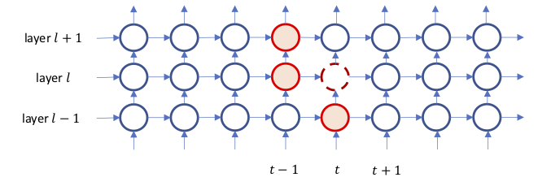

<!-- $theme: gaia -->

<!-- *template: invert -->

# ==Outlines==

1. _Motivations and background_
    - Challenges of RNNs from the ML perspective
    - Challenges of RNNs from the system perspective
1. _RNN variants_
    - [Dilated LSTM](https://arxiv.org/abs/1710.02224) (NIPS 2017)
    - [ClockworkRNN](https://arxiv.org/abs/1402.3511) (2014)
    - [Multi-dimensional RNN](https://arxiv.org/pdf/0705.2011.pdf) (2007)
    - [Grid LSTM](https://arxiv.org/abs/1507.01526) (2015)
    - [Hierarchical Multiscale Recurrent Neural Networks](https://openreview.net/forum?id=S1di0sfgl) (ICLR 2017)
    - [ON-LSTM](https://openreview.net/pdf?id=B1l6qiR5F7) (ICLR 2019's best paper award)
1. _Summary & Disscussion_

---

# Motivations

1. RNNs are notorious for their sequential execution natures. Nevertheless, is there no parallelism at all in recurrent models?
1. RNN is a wide spectrum of models more than LSTM/GRU. Is there common semantics to describe general-purpose RNN computation, and the description is able to be optimized?  

---

## Background: Challenges of sequence modeling

1. The vanishing gradient problems is originated from BP algorithm.
    - Existing solutions
        1. Truncated BPTT
        1. gate
        1. skip connections
        1. normalization
1. How to design RNNs to adaptively learn patterns span over multiple and variable time step?
1. How to design RNNs to adaptively learn underlying hierarchically structured features?

---

# Recap RNN computation

1. All RNNs are made up of three parts:
    1. _input-to-hidden_ projection $U$
    1.  _hidden-to-hidden_ projection $V$
    1. _hidden-to-output_ projection $W$
1. hidden-to-hidden projection $U$ is intrinsically sequential.
1. the computation of RNN is dominated by MMs, and GEMM works poorly for small MMs.

---

<!-- *template: invert -->

# ==Related work for RNN optimizations==
1. [Investigating performance of GPU BLAS Libraries](http://svail.github.io/rnn_perf/)
1. [Persistent RNNs: 30 times faster RNN layers at small mini-batch sizes](http://svail.github.io/persistent_rnns/)
1. [DeepCpu](https://www.usenix.org/conference/atc18/presentation/zhang-minjia)

---

# Gradient vanishing/explosion problem and LSTM

RNNs form a long chain over which gradient flows.

==References==

1. [waybackprop](https://magenta.tensorflow.org/blog/2017/06/01/waybackprop)

---

# Recap the standard LSTM cell

$$\mathbf{f}_t = \sigma (W_f\mathbf{x}_t + U_f\mathbf{h}_{t-1} + \mathbf{b}_f) $$
$$\mathbf{i}_t = \sigma (W_i\mathbf{x}_t + U_i\mathbf{h}_{t-1} + \mathbf{b}_i) $$
$$\mathbf{o}_t = \sigma (W_o\mathbf{x}_t + U_o\mathbf{h}_{t-1} + \mathbf{b}_o) $$
$$\mathbf{\hat{c}}_t = \text{tanh}(W_c\mathbf{x}_t + U_c\mathbf{h}_{t-1} + \mathbf{b}_c) $$
$$\mathbf{c}_t = \mathbf{f}_t \circ \mathbf{c}_{t-1} + \mathbf{i}_t \circ \mathbf{\hat{c}}_t $$
$$\mathbf{h}_t = \mathbf{o}_t \circ \text{tanh}(\mathbf{c}_t) $$

---

# Summary: csore of LSTM

1. Introduce the cell memory (GRU has no cell).
1. In LSTM, history information flow along with the redline, and no non-linear squashing function is applied.

---

## Question: are there no parallelism at all for RNNs?

1. Stacked multiple RNNs
1. Bidirection

 
Fig. As dependencies are resolved a wavefront of operations moves through the network.

* _This picture is from the blog [Optimizing Recurrent Neural Networks in cuDNN 5](https://devblogs.nvidia.com/optimizing-recurrent-neural-networks-cudnn-5/)_

---

<!-- *template: invert -->

# ==RNN Variants==

---

## Dilated RNN (NIPS 2017)

Problem to address

1. complex dependencies in long sequence
1. vanishing and exploding gradients
1. efficient parallelization.

Approach

- multi-resolution dilated recurrent skip connections that can be applied to any RNN cell

---

## Dilated RNN (II)

---

## Clockwork RNN (CW-RNN, 2014)

- Problem to address
    1. vanishing/gradient.
    1. learn patterns that span at different time scale.
    1. less computation but learning comparable performance as LSTM.

---

## Clockwork RNN (I)

1. Partition hidden layer into sub-modules.

---

## Clockwork RNN (II)

2. Assign different clock period to different modules.

---

## Clockwork RNN (III)

3. For unactive modules, directly copy their values in previous time step to current time steps.

 

---

## Downside of Clockwork RNN

How to choose clock period significantly affect clockwork RNN's learning performance and is non-trivial.

---

## Multi-dimensional LSTM (MD-LSTM)

- Problem to solve: Applied RNN to multi-dimensional data rather than sequence.

- Models
    1. Replace the single recurrent connection found in standard RNNs with _**as many recurrent connections**_ as there are dimensions in the data.
    1. During the forward pass, at each point in the data sequence, the hidden layer of the network receives both an external input and its activations from one step back along all dimensions.
    

 
Fig1. Figure 1 and 2 from the paper.

---

## Multi-dimensional LSTM (MD-LSTM)

3. MD-LSTM can also be equipped with directional information.

 
Fig2. Figure 4 and 5 from the paper.

---

## MD-LSTM on 2D

  LSTM on 2D

1. $N$: the dimension number
1. Input $\mathbf{x}$ that is arranged in an $N$-dimensional grid
     - such as 2-D grid of pixels in an image.
1. $N$ hidden vectors $\mathbf{h}_1, ..., \mathbf{h}_N$
1. $N$ memory vectors $\mathbf{c}_1,...,\mathbf{c}_N$

$$\mathbf{c}_t = \sum_{i}^{N}\mathbf{f}_t^i \circ \mathbf{c}^i_t + \mathbf{i}_t \circ \mathbf{\hat{c}}_t$$

---

## Grid LSTM

- Extend LSTM cell to deep networks within a unified architecture.
- Propose a novel robust way for modulating $N$-way communication across the LSTM cells.

---

# GridLSTM

_**Inputs**_:

1. a $N$-dimensioanl block receives $N$ hidden vectors: $\mathbf{h}_1, \mathbf{h}_2, ..., \mathbf{h}_N$ and,
1. $N$ memory vectors $\mathbf{m}_1, \mathbf{m}_2, ..., \mathbf{m}_N$

_**Compute**_:

1. deploys cells along _**any**_ or _**all**_ of the dimensions including the depth of the network;
1. _**concatenate**_ all input hiddens to form $\mathbf{H}=[\mathbf{h}_1, ..., \mathbf{h}_N]'$. _**This is the difference from HM-LSTM**_.
1. compute $N$ LSTM transforms: $(\mathbf{h}_i, \mathbf{m}_i) = \text{LSTM}(\mathbf{H}, \mathbf{m}_i, \mathbf{W}_i)$ where $i = [1, ..., N]$, $W$ cancatenates $\mathbf{W}_i^i$, $\mathbf{W}_f^i$, $\mathbf{W}_o^i$, $\mathbf{W}_c^i$ in $\mathbb{R}^{d \times Nd}$.

---

# GridLSTM

### Priority Dimensions

1. in general case, a $N$-dimensional block computes the transforms for all dimensions are _**in parallel.**_
1. prioritize the dimension of the network. For dimensions other than prioritized dimensions, their output hidden vectors are computed first, and finally, the prioritized.
    - for example, to prioritize the first dimension of the network, the block first computes the $N$ − 1 transforms for the other dimensions obtaining the output hidden vectors $\mathbf{h}_2', ..., \mathbf{h}_N$.

### Non-LSTM dimensions

Along some dimension, regular connection instead of LSTM is used.

$$\mathbf{h}'_1 = \alpha(\mathbf{V} * \mathbf{H})$$

$\alpha$ above is a standard nonlinear transfer function or identity mapping.

---

# An example: a 3D GridLSTM

---

# 3D GridLSTM for NMT

  Fig. GridLSTM for NMT.

---

## Hierarchical Multiscale Recurrent Neural Networks (HM-RNN)

- Problem to address:
    Learn the hierarchical multiscale structure from temporal data ***without explicit boundary information***.

---

---

# HM-RNN (I)

1.  [**key**] Introduce ***a parametrized binary boundary detector*** at each layer.

    - turned on only at the time steps where a segment of the corresponding abstraction level is completely processed.
    - ***straight-through estimator*** is used to calculate gradient of this boundary detector.

    - boundary state of the current timestep $t$ at layer $l$ is determined by the boundary state at left and below.

---

# HM-RNN (II)

2.  Implement three operations: **UPDATE**, **COPY**, **FLUSH**.
    -   **UPDATE**: similar to update rule of the LSTM.
    -   **COPY**: ***simply copies*** cell and hidden states of the previous time step which is unlike the ***leaky integration*** in LSTM/GRU.
    -   **FLUSH**: executed when a boundary is detected, where it first ejects the summarized representation of the current segment to the upper layer and then reinitializes the states to start processing the next segment.

---

## HM-RNN (III): boundary detector and selected action

| $z_{t-1}^l$  left| $z_{t}^{l-1}$ buttom | The Selected Operation ||
|:-----------:|:-------------:|:----------------------:|:-:|
|      0      |       0       |        **COPY**        |buttom and left states both do not reach to a boundary.|
|      0      |       1       |       **UPDATE**       |left state does not reaches to a boundary but buttom does. **UPDATE** is executed sparsely|
|      1      |       0       |       **FLUSH**        |left state reaches to a boundary.|
|      1      |       1       |       **FLUSH**        |left state reaches to a boundary.|

---

### STE (Straight-through estimator)

1. Straight-through estimator.
    - forward pass uses the step function to activate $z_t^l$
    - backward pass uses [hardsigmoid](https://stackoverflow.com/questions/35411194/how-is-hard-sigmoid-defined) function as the biased estimator of the outgoing gradient.
    $$\sigma(x) = \text{max}(0, \text{min}(1, (\alpha x + 1)/2))$$

1. Slope annealing.
    - start from slope $\alpha = 1$.
    - slowly increase the slope until it reaches a threshold. In the paper, the annealing function task-specific.