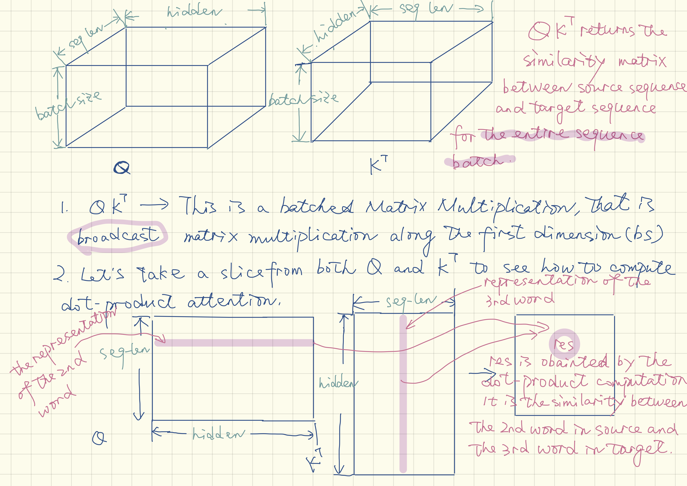

# What is the "attention"?

A sequence to sequence model maps a sequence $A$ to a sequence $B$, and $A$ and $B$ does not necessarily have the same length. Examples include machine translation, speech recognization, OCR, and etc. Take machine translation for example, when translating a long sentence from one language to another, at any given point human will be focussing more on the specific word or phrase instead of the entire sentence. Attention mechanism recreates this mechanism for neural networks.

Attention requires two inputs: $A$, a sequence as the source and $b$, a token as the target, and it finds out a small segment of $A$ that is most relative to $b$, and returns such a segment.

## Why QKV?

The process of figuring out where to attend to _**can be formulated as a searching process**_: give a query (this is our token $b$), the attention mechanism searches the given set of values (this is our $A$) and returns the searched result.

When searching, attention mechanism _**relies on a chosen similarity measurement**_(dot-product is such a measurement. It can be replaced with any other similarity measurement.) to measure the similarity between $b$ and each token in $A$ _**one by one**_. Algorithm designer can also choose not to directly compare $b$ with each token in $A$, but compare $b$ with a key that is corresponded to each token in $A$. That is to say, $K$ is a projection from $V$, and usually, this projection is optional. Identity projection can also be used, then $K = V$.

Figure 1 below explains the computation process and the meaning of $QK^T$:

## What is self-attention?

1. $Q = V$ is called self-attention. This is used to encode a sequence. A big breakthrough the entire community learns from the Transformer is: self-attention is able to replace traditional RNN in _**some**_ tasks (RNN is not out-of-date.).

1. When $Q \ne V$ this is the attention between encoder and decoder.

1. So, $Q = K = V$ only works for encoder.

## How to guarantee *the searching* is differentiable?

A problem for machine learning models is: _**the searching process must be differentiable**_. So, it is actually implemented as:

1. learn a distribution $\omega$ over $V$ using `softmax` (softmax normalizes a vector into a distribution).
1. return the weighted sum of $V$ using $\omega$ as weights.

1 (softmax) and 2 (weighted sum) are differentiable.

## Self-attention vs. RNN

From the computation of $\text{softmax}(QK^T)V$, it is easily found that scaled dot-product attention (short for SDPA below) processes the entire sequence batch in parallel.

Usually, sequence modeling projects input sequential data into a new vector space. In the projection, _**position of a token in the sequence matters**_.

Let's recap RNN.
$$\bold{h}_t = f(\bold{x}; \bold{h}_{t-1})$$
RNN is an iteratively applied projection to sequential inputs that output of the previous time step will become an input of the current time step. In RNN models, $k$ iterative matrix multiplications are used to compute the hidden representation for the token at the position $k$, so such a representation is position-aware.

SDPA can be used to calculate hidden representations for the entire sequence batch, _**but such a representation is not explict position-aware!**_, because SDPA simply uses weighed sum to get a hidden representation. This is the reason why Transformer _**has to**_ use an explicit positional embedding to enhance position information.

Transformer is not computionally universal (Turning complete), but RNN is (see this [Google's paper](https://ai.googleblog.com/2018/08/moving-beyond-translation-with.html)). This means, theoretically, Transformer cannot fit arbitrarily real-valued continuous functions, but RNN can. Transformer is system friendly, but this does not mean RNN will be replaced. To improve the fitting ability, usually SDPA _**has to**_ be stacked for multiple layers.

# Appendix: Some computation details

## dot-product attention

The dot product attention can be formulated as:

$$
\text{Attention}(Q, K, V) = \text{softmax}(QK^T)V
$$

>_**NOTE: $QK^T$ and $\text{softmax}(QK^T)V$ are batched matrix multiplication. They are not common matrix multiplication. We can use [numpy's matmul](https://docs.scipy.org/doc/numpy/reference/generated/numpy.matmul.html) as a reference to get an overview of broadcast matmul's semantics.**_

Above, $Q$, $K$, and $V$ are all 3-D tensor.

1. $Q$ has a shape of $[\text{bs} \times N \times D]$
    - where $\text{bs}$ is the batch size, $N$ is the max target sequence length in a mini-batch (sequences in a mini-batch are all padded to having the same length), and $D$ is the hidden size.
1. $K$ has a shape of $[\text{bs} \times M \times D]$
    - where $\text{bs}$ is the batch size, $M$ is the max source sequence length in a mini-batch (sequences in a mini-batch are all padded to having the same length), and $D$ is the hidden size.
1. $V$ has a shape $[\text{bs} \times M \times D]$.
    - where $\text{bs}$ is the batch size, $M$ is the max source sequence length in a mini-batch (sequences in a mini-batch are all padded to having the same length), and $D$ is the hidden size.

With the above notation:
- Suppose $W = \text{softmax}(QK^T)$. $W$ is the attention weight with a shape $[\text{bs} \times N \times M]$.

- Suppose $C = WV$ is the context vector with a shape $[\text{bs} \times N \times D]$.

For self-attention, $M = N$. For attention between encoder and decoder, $M \ne N$.

Some requirements originated from SDPA in Transformer:
1. Sequences in one mini-batch MUST be padded to have the same length.
1. The padding MUST be fixed to zeros so that it does not affect the softmax normalization.
1. The padding MUST not be changed in entire computation process and it does not need gradients.

## Multi-head dot-product attention

Instead of performing a single attention function, in Transformer paper, it is found that it is beneficial to linearly project the $Q$, $K$, $V$ $h$ times. This is to compute $h$ SDPA $h$ times in parallel.

A straightforward way is using a `for` loop to define multiple heads, for a single head $i$:

First compute:

- $\widetilde{Q_i} = QW_i^Q$. (_**this is also a batched matrix multiplication, the same below**_)
    - $W_i^Q$ is the projection matrix which is a 2-D Tensor with a shape $[D \times D']$ .
    - $D'$ is the size of the context vector computed by one head.
    - $D'$ is set to $D/\text{number of heads}$ .

- $\widetilde{K_i} = KW_i^K$.
    - $W_i^K$ is the projection matrix which is a 2-D Tensor with a shape $[D \times D']$
    - $D'$ is the size of the context vector computed by one head.
    - $D'$ is set to $D/\text{number of heads}$ .

- $\widetilde{V_i} = KW_i^V$.
    - $W_i^V$ is the projection matrix which is a 2-D Tensor with a shape $[D \times D']$
    - $D'$ is the size of the context vector computed by one head.
    - $D'$ is set to $D/\text{number of heads}$.

Then, use $\widetilde{Q}$, $\widetilde{K}$ and $\widetilde{V}$ to compute dot product attention as described in the above section.

BUT in real-world implementation, _**the first step is not implemented as a `for loop` but reshape 3D tensor to 4D (a transpose is also required after reshape to adjust memory layout), and then apply batched matrix multiplication**_:

1. $\widetilde{Q}$, $\widetilde{K}$ and $\widetilde{V}$  can be computed at the same time for all the heads by simply making $D' = D$. The resulted $\widetilde{Q}$, $\widetilde{K}$ and $\widetilde{V}$ are all 3-D tensors.

1. then reshape the 3-D tensor $\widetilde{Q}$, $\widetilde{K}$ and $\widetilde{V}$ into a 4-D tensor by making the number of heads a dimension.

1. finally, compute the multi-head attention in parallel. This will lead to two 4-D tensors to matmul as its inputs.
