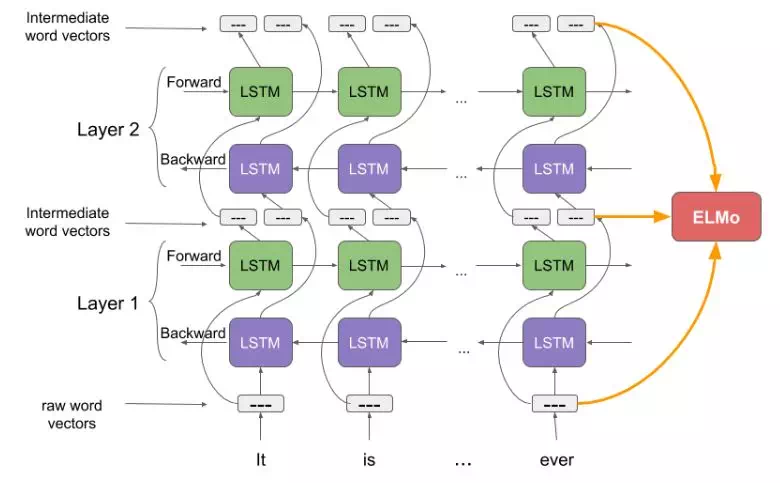

# ELMo （Embedding from Language Model）

## 1. Problem to address

An ideal representation should model: syntax, semantics, and polysemy.

## 2. Contributions

1. propose a new type of deep contextualized **word** representation ELMo:
    - word vectors are learned functions of the internal states of a deep bidirectional language model.
1. this work demonstrates that exposing the deep internals of the pre-trained network is crucial.

## 3. Approach

### 3.1 biLM

LM used by ELMo is proposed from the paper: [Exploring the Limits of Language Modeling](https://arxiv.org/abs/1602.02410?context=cs), but extends to bi-directional LSTM, and some weights are shared between forward and backward directions.

Key learnings from the above paper used by ELMo, I think are twofold:

1. use big LSTM
1. CNN + LSTM

    Quoted from the paper:

    >most recent work on large scale LM has shown that RNNs are great in combination with N-grams, as they may have different strengths that complement N-gram models, but worse when considered in isolation.

### 3.2 ELMo vectors

1. for each token $t_k$, a $L$-layer biLM computes a set of $2L + 1$ representations

    $$R_k = \{ \mathbf{x}_k^{LM}, \overrightarrow{\mathbf{h}_{k,j}^{LM}}, \overleftarrow{\mathbf{h}_{k,j}^{LM}} | j = 1,...,L\}$$

1. compute a task-specific weighting of all biLM layers.

    $$ \text{ELMo}_k^{task} = E(R_k; \Theta) = \gamma^{task} \sum_{j=0}^Ls_j^{stack}\mathbf{h}_{k,j}^{LM}$$

    where $\mathbf{h}_{k,j}^{LM} = [\overrightarrow{\mathbf{h}_{k,j}^{LM}}; \overleftarrow{\mathbf{h}_{k,j}^{LM}}]$

### 3.3 Using biLM for downstream task

1. first freeze the weights of the biLM;
1. concatenate the ELMo vector $\text{ELMo}_k^{task}$ with $\mathbf{x}_k$: $[\mathbf{x}_k;\text{ELMo}_k^{task}]$;
1. further improvements are observed when including ELMo at the output layer of the target task;

### Model Capacity

There are three exposed layers in ELMo:

1. input tokens flow into 2048 character-level convolution filters, followed by 2 highway layers.
1. a linear projection project CNN's output down to 512 dimensions.
1. $L = 2$, stacked 2 biLSTM layers.
    - 4096 hidden units, input/output dimension 512
    - with a residual connection between layers (which I’m reading as, a residual connection that spans the first layer).

    $$y=H(\boldsymbol{x},W)\cdot T(\boldsymbol{x},W_{T}) + x \cdot C(\boldsymbol{x}, W_{C})$$

    $T(\boldsymbol{x},W_{T})$ is the transform gate，and $C(\boldsymbol{x}, W_{C})$ is the carry gate。

    

    <image src="images/highway.png" width=50%>
    

This pre-trained model is trained for 10 epoches.

# Reference

1. [Exploring the Limits of Language Modeling](https://arxiv.org/abs/1602.02410?context=cs)
1. [Byte pair encoding (BPE)](https://leimao.github.io/blog/Byte-Pair-Encoding/)

---

 
蕴含/冲突/中立

