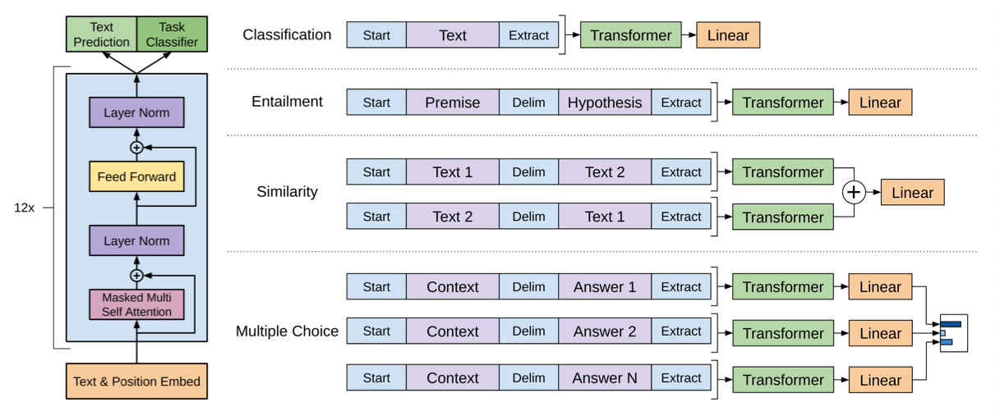

# GPT (Generative Pre-Training)

## 1. Goal

Learn a universal representation that transfers with little adaptation to a wide range of tasks.

## 2. Contributions

1. Use transformer decoder instead of LSTM to achieve better capture long-term linguistic structure.
1. Include auxilliary tranining objectives.
1. Propose the unsupervised pre-training (_generative pre-training_) + supervised fine-tuning framework.

## 3. Approach

### 3.1 Unsupervised pre-training

1. standard language modeling objective (MLE), denoted as $L_1$.
1. transformer decoder as the LM.

    

    <image src="images/transformer-block.png">
    

### 3.2 Supervised fine-tuning

- Adapt the parameters to the supervised target task:

    a labeled dataset $\mathcal{C}$. Each instance in $\mathcal{C}$ consists of a sequence of input tokens $x^1,...,x^m$ along with a label $y$.

- ELMo uses the pre-trained model to provide features, but GPT fine-tunes the parameters.
- How to fine-tune the target task:
    1. an extra linear output layer is added after the final transformer block's activation.
        - the learnable parameter for this layer and embeddings for delimiter token are the only extra parameters in fine-tuning.
    1. loss function of the supervised task:
        $$L_2(\mathcal{C}) = \sum_{(x, y)} \text{log} P(y|x^1,...,x^m)$$
    1. add an auxiliary training objective with weight $\lambda$.

        $$L_3(\mathcal{C}) = L_2(\mathcal{C}) + \lambda * L_1(\mathcal{C})$$

        

        
        

### 3.3 task-specific input transformations

## Model Capacity

1. 12-layer transformer decoder (with masked self-attention)
    - 768 dimensional states, 12 heads
    - FFN: 3072 dimensional states
1. train for 100 epoches on minibatches of 64 randomly sampled, contiguous sequences of 512 tokens.

---

## Auxiliary prediction tasks

