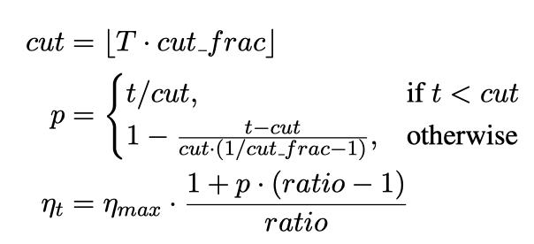

# ULM-FiT

This paper:

1. proposes _**Universal Language Model Fine-tuning (ULMFiT)**_, a method that can be used to achieve CV-like transfer learning for any task for NLP.
1. proposes _**discriminative fine-tuning**_, _**slanted triangular learning rates**_, and _**gradual unfreezing**_ to retain previous knowledge and avoid catastrophic forgetting during fine-tuning.

## Problem setting

The most general inductive transfer setting for NLP:

Given a static source task $\mathcal{T}_S$, and any target task $\mathcal{T}_T$ with $\mathcal{T}_S \ne \mathcal{T}_T$, we would like to improve the performance on $\mathcal{T}_T$.

## Problem to address

A Universal Language Model Fine-tuning enables robust inductive transfer learning for any NLP task

Some Facts:

1. Applied CV models are rarely trained from scratch, but instead are fine-tuned from models that have been pretrained on ImageNet, MS-COCO, and other datasets.
1. Inductive transfer learning has greatly impacted computer vision, but existing approaches in NLP still require task-specific modifications and training from scratch.
1. Inductive transfer via fine-tuning has been unsuccessful for NLP.

### Challenges

The idea of LM fine-tuning and lack of knowledge of how to train them effectively has been hindering wider adoption.

1. LMs overfit to small datasets.
1. LMs suffer catastrophic forgetting when fine-tuned with a classifier.
1. compared to CV, _**NLP models are typically more shallow**_ and thus require different fine-tuning methods.

## Approach

ULMFiT consists of three stages:

### 1. General-domain LM pre-training: capture general features of the language in different layers

_**This stage is the most expensive, it only needs to be performed once.**_

Three stacled AWD-LSTM are trained on a _**general-domain corpus**_.

- dataset Wikitext-103 is used as the _**general-domain corpus**_.
- Wikitext-103 consists of 28,595 preprocessed Wikipedia articles and 103 million words.

### 2. Target task LM fine-tuning: learn task-specific features.

_**This stage converges faster as it only needs to adapt to the idiosyncrasies of the target data.**_

The full LM is fine-tuned on target task data using discriminative fine-tuning (Discr) and slanted triangular learning rates(STLR).

#### 2.1 discriminative fine-tuning (Discr)

Tune each layer with different learning rates:

$$\theta_t^l = \theta_{t-1}^l - \eta^l \cdot \nabla_{\theta^l}J(\theta)$$

The paper empirically found it to work well to first choose the learning rate $\eta^L$ of the last layer by fine-tuning only the last layer and using $\eta^{l−1} = \eta^{l /2.6}$ as the learning rate for lower layers.

#### 2.2 slanted triangular learning rates

1. First linearly increases the learning rate and then linearly decays it according to the following update schedule.
1. The paper found this is the key for good performance.

motivations for this:

- would like the model to _**quickly converge to a suitable region of the parameter space in the beginning of training**_
- and then refine its parameters.

    

    
    

    where:

    - $T$: the number of training iterations.
    - _cut_frac_: the fraction of iterations that the LR is increased
    - _cut_: the iteration when LR is switched from increasing to decreasing
    - $p$: the fraction of the number of iterations that LR have increased or will decrease respectively
    - _ratio_: how much smaller the lowest LR is from the maximum LR $\eta_max$
    - $\eta_t$ is the learning rate at iteration $t$

    below is the figure for STLR.

    

    
    

### 3. Target task classifier fine-tuning: preserve low-level representations and adapt high-level ones

- The parameters in these task-specific classifier layers are the only ones that are learned from scratch.
- Fine-tuning the target classifier is the most critical part of the transfer learning method.

Model:

- Augment the pretrained language model with two additional linear blocks
    1. the first linear layer takes as the input the pooled last hidden layer states.
        - concatenate sequence last, max pooling, and mean pooling.
    1. each block uses batch normalization, and dropout.
    1. with ReLU activations for the intermediate layer.
    1. a softmax activation at the last layer.
- The classifier is fine-tuned on the target task using _**gradual unfreezing**_, _**Discr**_, and _**STLR**_.

#### 3.1 gradual unfreezing

1. first unfreeze the last layer and fine-tune all un-frozen layers for one epoch.
1. then unfreeze the next lower frozen layer and repeat, until all layers are fine-tuned until convergence at the last itera- tion.

## Experimental study

1. target task is text classification
1. six datasets including sentiment analysis (3), question classification (1), and topic classification (2).

Sidenote:

textual entailment, question answering, sentiment anaylsis are all language understanding tasks.

## Ablation analysis

# Reference

1. [What is ablation study in machine learning](http://qingkaikong.blogspot.com/2017/12/what-is-ablation-study-in-machine.html)

---

# Appendix

### 1. Transductive transfer learning vs. inductive transfer learning

Imagine you have a training data, but only a subset of it has labels.

For example, you are trying to classify whether an image has a flower in it or not: You have 100,000 images, but you only have 1,000 images that you know definitively contain a flower; and another 1,000 that you know don't contain a flower. The other 98,000 you have no idea about -- maybe they have flowers, maybe they don't.

1. _**Transductive Transfer Learning**_ (转导推理，aks. semi-supervised learning)
    - maybe the other 98,000 images don't have labels, but they tell me something about the problem space.
    - still use the unlabeled data to help improve accuracy.
1. _**Inductive Transfer Learning**_ （归纳推理）
    - looks at the 2,000 labeled examples, builds a classifier on this.
1. _**Active Learning**_ (主动学习)
    - when looking through the 98,000 examples, select a subset and request labels from an oracle.
    - the algorithm might say of those 98,000, can you label this set of 50 images for me? That will help me build a better classifier.

### 2. Why LM as the pre-training model for NLP?

1. It captures many facets of language relevant for downstream tasks, such as long-term dependencies, hierarchical relations, and sentiment.
1. It provides data in near-unlimited quantities for most domains and languages.
1. A pretrained LM can be easily adapted to the idiosyncrasies of a target.
1. Language modeling already is a key component of many existing tasks such as MT and dialogue modeling.
