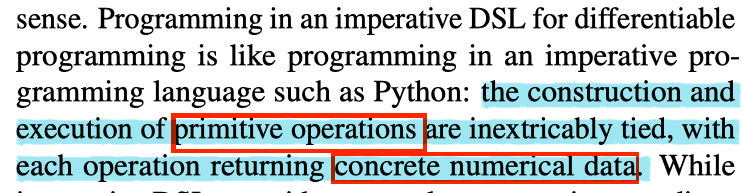

[TOC]

# TensorFlow Eager: A Multi-Stage, Python-Embedded DSL for Machine Learning

[link](https://arxiv.org/pdf/1903.01855.pdf)

Highlight some keywords of TensorFlow Eager's technical choices.

TensorFlow Eager is a _**multi-stage**_, Python-embedded domain-specific language for _**hardware-accelerated**_ machine learning, suitable for both interactive research and production.

## My Takeaways

1. dataflow graph is still a core design choice for TesorFlow's efficiency that permits compiler optimizations and simplifies deployment, but **hinder run-time dynamism.**
    - So, how to elaborate "run-time dynamism" is necessary and valuable for emerging researches?

## Overview

### The Problem

Offers a multi-stage programming model that makes it easy to interpolate between imperative and staged execution in a single package.

- imperative DSL: the construction and execution are inextricably tied.
    - _**Pros**_ Provides a natural programming paradigm
    - _**Cons**_ when embedded in _**an interpreted language**_ like Python:
        1. _**performance is bottlenecked on the interpreter**_.
            - Maybe this blog [Why Python is slow](http://blog.kevmod.com/2016/07/why-is-python-slow/) explains some technical details about Python's language design makes it slow since this article has a section called: "Python spends almost all of its time in the C runtime".
        1. serialization of models is difficult.
- declarative DSL: separates the specification and execution
    1. _**Pros**_ permits compiler optimizations and exploitation of parallelism
    1. _**Cons**_ not suitable for expressing models with data-dependent structures

### Approaches

1. executes imperatively by default.
1. to reap the benefits of dataflow graphs, provides a Python decorator that _**traces**_ its Python function in a graph-building context, staging primitive operations to construct a dataflow graph with named inputs and outputs and returning an _**executable graph function**_.
1. the execution of graph functions _**bypasses**_ Python
    1. Executed using a C++ dataflow runtime or are compiled to generate optimized code for CPUs, GPUs.

# References

1. [Why Python is slow](http://blog.kevmod.com/2016/07/why-is-python-slow/)
1. [A Gentle Introduction to Multi-stage Programming?](http://citeseerx.ist.psu.edu/viewdoc/download?doi=10.1.1.438.6924&rep=rep1&type=pdf)
