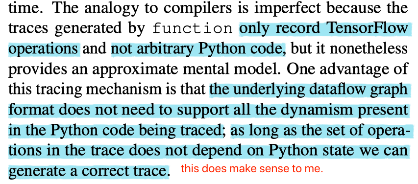

[TOC]

# TensorFlow Eager: A Multi-Stage, Python-Embedded DSL for Machine Learning

[link](https://arxiv.org/pdf/1903.01855.pdf)

Highlight some keywords of TensorFlow Eager's technical choices.

TensorFlow Eager is a _**multi-stage**_, Python-embedded domain-specific language for _**hardware-accelerated**_ machine learning, suitable for both interactive research and production.

## My Takeaways

1. dataflow graph is still a core design choice for TesorFlow's efficiency that permits compiler optimizations and simplifies deployment, but **hinder run-time dynamism.**
    - So, how to elaborate "run-time dynamism" is necessary and valuable for emerging researches?

2. An important keyword in this paper is "staged programming" which is claimed to be a technique that _**bridges the gap between imperative and declarative programming**_. If finally a new framework will be designed/created, I think this is feature should be considered. But "staged programming" is a new keyword and research topic for me, it is worth further reading.

1. This paper also gives its (very rough) scope, or to say, its definition of _**differentiable programs**_ that is a keyword we also focus on:
    > models written using automatic differentiation software are often referred to as differentiable programs.

    Because this paper is not a research on "differentiable programming", so I think, this is also a space to extend regarding today's frameworks, admittedly, the problem, if we make extensions to today's AD features in DL frameworks, how to make a correct co-design with things like execution model, code optimizations, scale-up, scale-out.
1. In this paper, a word is frequently used, that is the "execution model". It gives me a feeling that today's framework is highly monolithic, does this mean "execution model" is a module can be decoupled, and design space to explore.
1. _**Dispatch**_ can be a powerful design tool to extend the execution behavior of users' codes.
    > TensorFlow Eager provides two ways of executing operations: imperatively or as part of a static dataflow graph. Both execution models have access to the same set of operations and kernels, but they differ in how they _**dispatch**_ kernels.
1. Personally, the biggest inspiration from this paper is, when designing a framework, flexibility and efficiency are conflicting needs, it is extremely hard to strike a perfect balance, but, performance is opt-in!
1. A very interesting point for me is:
    - TF eager introduces a tracing mechanism to trace all the TF operations upon tensors instead of arbitrary Python codes, and a JIT compiler (I guess this is XLA infrastructure for TF) generates _**an optimized polymorphic function**_ for a Python function, creating concrete functions backed by dataflow graphs via a straightforward _**binding-time analysis**_ at run-time.

    Here I highlight "binding-time analysis". I am not familiar with this keyword. It seems from programming language research, see [3](#References). And [3](#References) says that "It may be more efficient to implement as a type inference". Does this imply more things can be decoupled into our programming language?

---

1. Eager and PyTorch implements a tape-based AD, some constraints:
    - Eager _**FULLY UNROLLS**_ Python `for` and `while` loops. If unrolling is a problem, user has to re-factor his Python codes to user TF's `for` construct. The same situation for conditional branch.

## Overview

### The Problem

- Offers a multi-stage programming model that makes it easy to interpolate between imperative and staged execution in a single package.

- imperative DSL: the construction and execution are inextricably tied.
    - _**Pros**_ Provides a natural programming paradigm
    - _**Cons**_ when embedded in _**an interpreted language**_ like Python:
        1. _**performance is bottlenecked on the interpreter**_.
            - Maybe this blog [Why Python is slow](http://blog.kevmod.com/2016/07/why-is-python-slow/) explains some technical details about Python's language design makes it slow since this article has a section called: "Python spends almost all of its time in the C runtime".
        1. serialization of models is difficult.
- declarative DSL: separates the specification and execution
    1. _**Pros**_ permits compiler optimizations and exploitation of parallelism
    1. _**Cons**_ not suitable for expressing models with data-dependent structures

### Approaches

Staged execution is an opt-in extension, and is often necessary.

1. executes imperatively by default.
1. to reap the benefits of dataflow graphs, provides a Python decorator that _**traces**_ its Python function in a graph-building context, staging primitive operations to construct a dataflow graph with named inputs and outputs and returning an _**executable graph function**_.
1. the execution of graph functions _**bypasses**_ Python
    1. Executed using a C++ dataflow runtime or are compiled to generate optimized code for CPUs, GPUs.

## Execution Model

1. _**Imperative execution**_
    > Calling `.numpy()` on a tensor fetches a NumPy array storing the tensor’s data, and tensors can be supplied to external libraries like matplotlib that expect NumPy arrays.

    My question is, does this "_fetching_" process cause data transformation between language boundries, considering Python is not good at interop with C/C++, thus leading to inextricably costs?
1. _**Staged execution**_
    1. provide a decorator that _**traces**_ the execution of a Python function, recording all TensorFlow operations and the tensors flow between them in a dataflow graph.
    1. _**JIT compiler**_ generates an optimized _**polymorphic function**_ for a Python function, and creates _**concrete functions backed by dataflow graphs**_ via a straightforward _**binding-time analysis**_ at runtime.

    

    
    

    1. Invoke the callable graph function. This will bypass Python interpreter to execute a dataflow graph.
        - graph functions are themselves executed by an operation that takes tensors as inputs and a function name as an attribute.
        - the graph runtime is written in C++, automatically partitions subgraphs across devices and parallelizes operations when possible.

# References

1. [Why Python is slow](http://blog.kevmod.com/2016/07/why-is-python-slow/)
1. [A Gentle Introduction to Multi-stage Programming?](http://citeseerx.ist.psu.edu/viewdoc/download?doi=10.1.1.438.6924&rep=rep1&type=pdf)
1. [Binding-Time Analysis](http://www.cs.cmu.edu/~spot/nitrous/bta.html)
