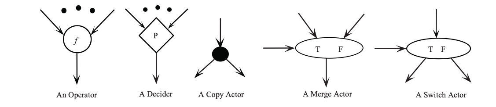

<!-- TOC depthFrom:1 depthTo:6 withLinks:1 updateOnSave:1 orderedList:0 -->

- [Dataflow computers: their history and future](#dataflow-computers-their-history-and-future)
    - [My Takeaways](#my-takeaways)
    - [Overview](#overview)
    - [Dataflow principles](#dataflow-principles)
    - [Dataflow graph](#dataflow-graph)
    - [References](#references)

<!-- /TOC -->

# [Dataflow computers: their history and future](https://csrl.cse.unt.edu/kavi/Research/encyclopedia-dataflow.pdf)

## My Takeaways

1. Below sentence is quoted from the paper:
    >Concurrency in conventional systems is based on instruction level parallelism (ILP), data level parallelism (DLP), and/or thread level parallelism (TLP). These parallelisms are achieved using techniques such as _**deep pipelining**_, _**out-of-order execution**_, _**speculative execution**_, and _**multithreaded execution**_ of instructions with considerable hardware and software resources.

    From the description, _**deep pipelining**_, _**out-of-order execution**_, _**speculative execution**_, and _**multithreaded execution**_ are techniques to achieve efficiency through more parallelism and concurrency. I am not familiar with these techniques, but they are worth further reading.

## Overview

Quoted from the paper:

>As we approach the technological limitations, concurrency will become the major path to increase the computational speed of computers.

## Dataflow principles

||Dataflow|Controlflow
|--|--|--|
|when instructions are enabled for execution|all the required operands are available|are executed sequentially under the control of a program counter|

- In the dataflow program, any two enabled instructions do not interfere with each other, thus can be executed in any order, or concurrently.
- In a dataflow environment
    1. conventional concepts such as "variables" and "memory updating" are nonexistent;
    1. instead, objects are consumed by an actor that yields a result object that is passed to the next actors;

## Dataflow graph

What is a dataflow graph?

- Dataflow graphs can be viewed as the machine language for dataflow computers.
- It is a directed graph.
- In a dataflow graph:
    1. nodes (or actors) are instructions
    1. arcs are data dependencies among nodes

Below figure depicts the basic primitives of the dataflow graph.

 
Fig. Basic primitives of the dataflow graph.

|No.|Primitive|Functionality|
|--|--|--|
|1.|operator|produces a data value that is the result of some operation $f$|
|2.|decider|generates control value which is `true` or `false`|
|3.|merge actor|directs data values.  Direct an input data token to one of its outputs depending on the control input.|
|4.|switch actor|directs data values.  Passes one of its input tokens to the output based on the value of the control token.|
|5.|copy|identity operators that duplicate input tokens.|

## Dataflow language

### VAL

1. relies on pure functional language semantics to exploit implicit concurrency.
    - dataflow language use single assignment semantics, the implementation and the use of arrarys present unique challenges.

### Id

block-structured

# Reference

1. [Tensorflow Conditionals and While Loops](http://mlexplore.org/2018/03/27/tensorflow-conditionals-and-while-loops/)
1. [dataflow architecture](https://en.wikipedia.org/wiki/Dataflow_architecture)
