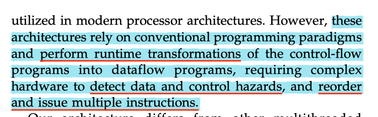
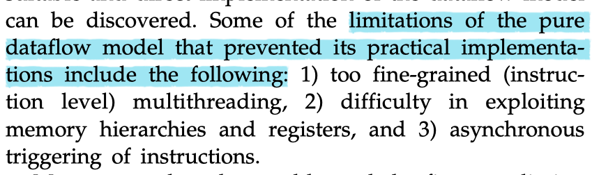

<!-- TOC depthFrom:1 depthTo:6 withLinks:1 updateOnSave:1 orderedList:0 -->

- [Scheduled Dataflow: Execution Paradigm, Architecture, and Performance Evaluation](#scheduled-dataflow-execution-paradigm-architecture-and-performance-evaluation)
	- [Takeaways and Further Questions](#takeaways-and-further-questions)
		- [Takeaways](#takeaways)
		- [Further Questions](#further-questions)
	- [Problem to solve](#problem-to-solve)
	- [Approaches](#approaches)
	- [Some details](#some-details)
	- [References](#references)

<!-- /TOC -->

# Scheduled Dataflow: Execution Paradigm, Architecture, and Performance Evaluation

[link](https://pdfs.semanticscholar.org/1250/388ecf7d51ed97fb5da7b51af64c45553f8f.pdf?_ga=2.107290434.1156145545.1560920308-1707014877.1560920308)

## Takeaways and Further Questions

### Takeaways

This paper talks about designing a new hardware architecture, but it is worthing learning to inspire the software or framework design.

1. Dataflow is a programming model that permits for clean separation of memory accesses from execution which is very difficult to coordinate in other programming models.
1. Control-flow and dataflow should be decoupled to different functional units.
    >The instruction set implements dataflow computational model, while the execution engine relies on control-flow-like sequencing of instructions (hence the name Scheduled Dataflow).
1. The dataflow model hold the promise of _**an elegant execution paradigm with the ability to exploit inherent parallelism available in applications**_.
    - dataflow model also finds its place in modern processor architectures and compiler, such as SSA [2](#Reference).

### Further Questions

1. This paper refers to a work called Rhamma [1](#References). It says that "Rhamma uses _**conventional control-flow programming paradigm**_ and blocking threads"
    - read this paper to check what is the "conventional control-flow programming paradigm" if necessary.
1. The paper makes the claim that "limitations of the _**pure dataflow model**_ that prevented its practical implementations", and gives some analysis. Here, I do not quite understand the exact meaning of "pure dataflow model" and troubles for practical implementation.
    - find some reference if this matters.

## Problem to solve

These problems I think also share some lessons and design philosophies for framework design.

- The trend that the performance gap between processors and memory appears to continue in the foreseeable future.
- Control flow and blocking threads requiring many more thread context switches complicate hardware design.
- Dataflow model holds the promise of elegant execution paradigm with the ability to exploit inherent parallelism, but actual implementations of the model have failed to deliver the promised performance.

## Approaches

1. Design a new architecture that is _**SIMPLER**_, yet _**POWERFUL**_.
1. Two key ideas of the new architecture are "multi-threading" and dataflow.
    1. Eliminates the need for runtime instruction scheduling;
    1. Complete decoupling of all memory accesses from execution pipeline;

## Some details

- The _**CONSENSUS**_ on multithreading is that, in general, it achieves higher instruction issue rates on processors that _**contain multiple processing elements**_ or _**multiple functional unites**_.
- Some lessons suggested that (1) _**attention to data-dependencies**_ and (2) _**hardware support for forking multiple threads**_ help increase the performance.

- Most modern processors utilize complex hardware techniques to detect data and control hazards and dynamic parallelism. Such complexities can be eliminated if a more suitable and direct implementation of the dataflow model can be discovered.

## References

1. [A Multithreaded Processor Design for Distributed Shared Memory System](https://pdfs.semanticscholar.org/135a/9cd39276c2997c7e102c260a522541e60db8.pdf)
