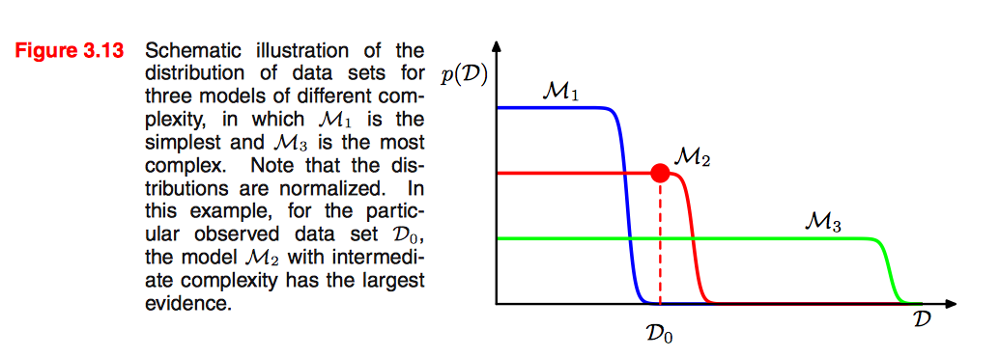

- If we hold the learning rate fixed and increase the batch size, the test accuracy usually falls.

## Bayesian Model Comparison [[1](#Reference)]

### problem settings

- use probabilities to represent uncertainty in the choice of model.
- suppose we wish to compare a set of models: $\{\mathcal{M}_i\}_i^L$
  - model refers to a probability distribution over the observerd data $\mathcal{D}$.
- data is generated from one of these models, but we are uncertain which one.
- the uncertainty is experessed throuth a prior distribution $p(\mathcal{M}_i)$
- given a training set $\mathcal{D}$, we then hope to evaluate the posterior distribution:
$$ p(\mathcal{M}_i|\mathcal{D}) \propto p (\mathcal{M}_i)p(\mathcal{D}|\mathcal{M}_i) \tag{1}$$
- the term $p(\mathcal{D}|\mathcal{M}_i)$ is called model evidence, sometimes also called margianl likelihood, which experssed the perference shown by the data for different models. It can be viewed as a likelihood function over the space of models.

### a simple approximation to the evidence

- for a model governed by a set of parameters $\mathbf{w}$, from the sum and product rule of probability, the model evidence is given by:
$$ p(\mathcal{D}|\mathcal{M}_i) = \int p(\mathcal{D|\mathbf{w}, \mathcal{M}_i}) p(\mathbf{w}|\mathcal{M}_i) d\mathbf{w} \tag{2}$$

> from a samping perspective, the evidence can be viewed as the probability of generating the data set $\mathcal{D}$ from a model whose parameters are sampled from the prior.

- Let omit the dependence on model $\mathcal{M}_i$ to keep the notation uncluttered, then we have:
$$ p(\mathcal{D}) = \int p(\mathcal{D}|\mathbf{w})p(\mathbf{w}) d\mathbf{w} \tag{3}$$
- Let's consider a simple approximation to gain some insights:
  1. the model has one parameter $w$
  1. assume $p(\mathcal{D}|\mathbf{w})$ is sharply peaked around the most probable value at $w_{MAP}$ with width $\bigtriangleup w_{posterior}$
  1. assume $p(\mathbf{w})$ is flat with width $\bigtriangleup w_{prior}$, so that $p(\mathbf{w}) = \frac{1}{\bigtriangleup w_{prior}}$
- then, the integral canbe approximated by the value of the integrand at its maximum times the width of the peak, we get:

$$ p(\mathcal{D}) \backsimeq p(\mathcal{D}|w_{MAP})\frac{\bigtriangleup  w_{posterior}}{\bigtriangleup w_{prior}}$$
$$ \text{ln}p(\mathcal{D}) \backsimeq \text{ln}p(\mathcal{D}|w_{MAP}) + \text{ln}\frac{\bigtriangleup  w_{posterior}}{\bigtriangleup w_{prior}}$$

### insights from Bayesian model comparison

- for a model has M parameter, we can make a similar approximation. Suppose each parameter has the same ratio $\frac{\bigtriangleup  w_{posterior}}{\bigtriangleup w_{prior}}$, then we can get:

$$ \text{ln}p(\mathcal{D}) \backsimeq \text{ln}p(\mathcal{D}|\mathbf{w}_{MAP}) + M\text{ln}\frac{\bigtriangleup  w_{posterior}}{\bigtriangleup w_{prior}} \tag{4}$$

1. the first term represents the fit the data given by the most probable value.
1. the sechond penalizes the model according to its complexity.
    - $\bigtriangleup \mathbf{w}_{posterior} < \mathbf{w}_{prior}$, the second term is negative.

### how the evidence favors intermediate complexity

Let's take an example: imagine runing the models generatively to produce example data sets:

1. step1: choose the values of parameters from their prior distribution.
1. step2: for these parameter values, sample data from $p(\mathcal{D}|\mathbf{w})$

from the above figure.

- A simple model:
  - has little variablity, the data generated are very similar to each other.
  - its distribution $p(\mathcal{D})$ is confined to a small region of the horizontal axis.

- A complex model:
  - can generate a variety of different data.
  - its distribution $p(\mathcal{D})$ is spread over a large region of the horizontal axis.

Essentially:

1. **the simple model cannot fit data well.**
1. **the complex model spreads its predictive probability over too broad a range of data sets and so assigns relatively small probability to any one of them.**

- Some notes
  - the Bayesian framework assumes that the true distribution from which the data generated are contained in within the set of models under consideration.
  - provided this, the **Bayesian model comparision will on average favor teh correct model.**.

## Reference
1. chapter 3.4 of [Pattern recognition and machine learning](http://users.isr.ist.utl.pt/~wurmd/Livros/school/Bishop%20-%20Pattern%20Recognition%20And%20Machine%20Learning%20-%20Springer%20%202006.pdf).

1. Wilson D R, Martinez T R. [The general inefficiency of batch training for gradient descent learning](http://axon.cs.byu.edu/papers/Wilson.nn03.batch.pdf)[J]. Neural Networks, 2003, 16(10): 1429-1451.
1. Hardt M, Recht B, Singer Y. [Train faster, generalize better: Stability of stochastic gradient descent](https://arxiv.org/pdf/1509.01240.pdf)[J]. arXiv preprint arXiv:1509.01240, 2015.
1. Smith S L, Kindermans P J, Le Q V. [Don't Decay the Learning Rate, Increase the Batch Size](https://arxiv.org/pdf/1711.00489.pdf)[J]. arXiv preprint arXiv:1711.00489, 2017.
1. Smith S L, Le Q V. [A bayesian perspective on generalization and stochastic gradient descent](https://arxiv.org/pdf/1710.06451.pdf)[C]//International Conference on Learning Representations. 2018.
