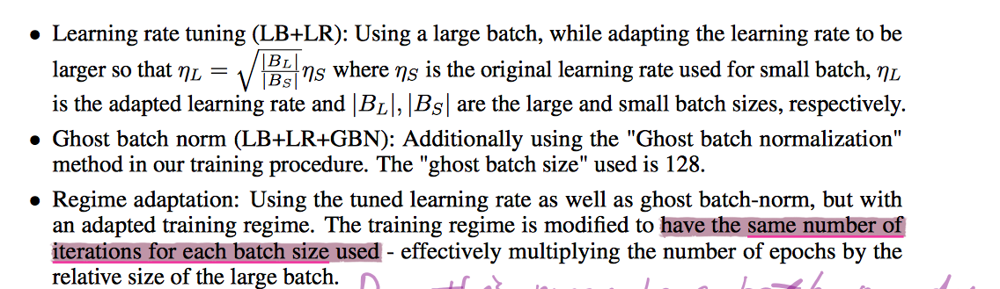

# [Train longer, generalize better: closing the generalization gap in large batch training of neural networks](https://arxiv.org/abs/1705.08741)

## The problems

- what is the **generalization gap**?
  there is a persistent degradation in generalization performance when using large batch size.

- generalizaiton gap stems from **the relatively small number of updates rather than the batch size**.

## Theoretical Analysis

- For physical intuition, one can think of the *weight vector* $\mathbf{w}_t$ as: **a particle performing a random walk on the loss ("potential") landscape $L (\mathbf{w_t})$**.
- **ultra-slow diffusion**: the asymptotic behavior of the [auto-covariance](https://en.wikipedia.org/wiki/Autocovariance) of the random potential: $\mathbb{E}( L({\mathbf{w}_1}) L({\mathbf{w}_2})) \sim \parallel \mathbf{w}_1 - \mathbf{w}_2 \parallel^2$, determines the asymptotic behavior of the random walker:
$$\mathbb{E} \parallel \mathbf{w}_t - \mathbf{\mathbf{w}_0} \parallel^2 \sim (\text{log t}^\frac{4}{\alpha})$$
- typically:  $d \triangleq \parallel \mathbf{w}_t - \mathbf{w}_0 \parallel \sim \left(\text{log} t \right) ^\frac{2}{\alpha}$, where $\parallel \cdot \parallel$ is the Euclidean distance of two vector.
  - to climb (or go around) each barrier takes exponentially long time in the heigh of the barrier: $t \sim \text{exp}(d^\frac{\alpha}{2})$

## Empirical results and implications

The below figure examines $\parallel \mathbf{w}_t - \mathbf{w}_0 \parallel$ during the initial training phrase:

Figure 2(a) from the paper.

>In Figure 2 (in the paper), all the models are trained for a constant number of epochs, smaller batch sizes entail more training iteration in total.

Foundings in the paper:
- Weight distance from initial training phrase increases logarithmically with the number of training iterations (weight updates): $\parallel \mathbf{w}_t - \mathbf{w}_0\parallel \sim \text{log}(t)$.
- A very similar logarithmic graph is observed for all batch sizes, however:
  1. Each batch size seems to have a different slop, indicating a somewhat **differnet different diffusion rate for different batch sizes**.
  1. Weight distance reached at the end of the initial learning phrase are significantly different for different batch sizes.

The findings lead to the flowing informal argument:
- To reach a minima of "width" $d$ the weight vector $\mathbf{w}_t$ has to travel at least a distance $d$.
- Thus, to reach wide ("flat") minima, we need to have the highest possible diffusion rates and a large number of training iterations.

## Solutions given in this paper

 Solutions given in this paper.

Does "Regime adaption" means: to achieve the same learning performance when using a large batch size, a longer time is required for training. If so, what is the advantage of large batch training?

## Conclusions in this paper

- Even though small batch updates still posses a desirable property of convergence to solutions with good generalizaiton, there is no fundamental issues with big batch updates.
- A certain amount of SGD updates is required to reach a good solution. By contrast, less computations are required when the number of samples is small in each batch.
- Good generalization can result from extensive amount of gradient updates in which there is no apparent validation error change and training error continues to drop.

**Move our attentions from the "generalization gap" to a more modest "computational gap" where we desire that big-batches will improve optimization time without incurring large computional overhead.**
