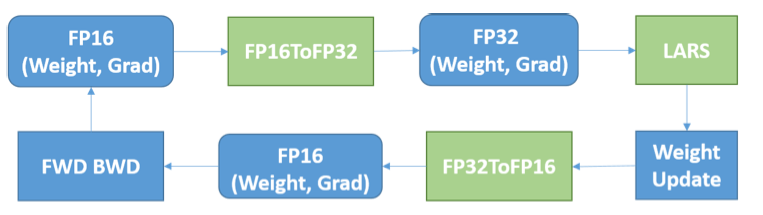

# [Highly Scalable Deep Learning Training System with Mixed-Precision- Training ImageNet in Four Minutes](https://arxiv.org/pdf/1807.11205.pdf)

## Challenge

_**Goals**_

Build a high-throughput distributed deep learning training system.
1. improve training throughout
    * need faster computation and more efficient bandwidth utilization
1. improve the scaling efficiency
    * need more collective communication primitives
    * can handle a system with thousands of GPUs

_**Challenge**_

1. Large mini-batch size leads to lower test accuracy due to the generalization gap problem.
1. When using large clusters, it is hard to achieve near-linear scalability as the number of machine increase.

## Optimizations

### 1. Mixed-Precision Training with LARS

_**Mixed-precision training with LARS is one of the critical reasons that the proposed system could keep good scalability while increasing the mini-batch size to 64K**_.

1. half-precision (FP16)
    * lower memory bandwidth pressure
    * increase arithmetic throughput
1. use LARS to enable large mini-batch training

_**Problems by a naive implementation**_

>_**using LARS directly on half-precision training will cause the computed learning rate to be out of the dynamic range of IEEE half-precision format (FP16), and thus cause the gradients to vanish and stall the training process**_.

_**Solution**_

1. the operations in forward and backward propagation are performed in FP16.
1. weights and gradients are cast to single-precision (FP32) format before applying LARS
1. after applying LARS, weights, and gradients are cast back to FP16.

### 2. Model Architecture Improvments

1. _**eliminate weight decay on the bias and batch normalization**_.
1. add proper batch normalization layers (after pool5) for AlexNet.

* In neural network training, it is a typical practice to penalize _**only the weights of the affine transformation**_ at each layer and leaves the biases unregularized.

### 3. Communication Strategies

objective: _**maximize the throughput as well as reduce the latency**_.

* Tensor fusion
  * challenges
      1. when training deep neural networks with multiple layers, the sizes of gradient tensors to aggregate vary a lot for different types of layers.
      1. sending too many small tensors in the network will not only cause the bandwidth to be under-utilized but also increase the latency.
  * solution
    * pack multiple small size tensors together before all-reduce to better utilize the bandwidth of the network.
    * set a threshold in backward phase. only send fused tensor when the total size is larger than the threshold.

* Hybrid all-reduce
  * challenges
    * tensor fusion increases the throughput but also increase latency.
    * hierarchical all-reduce instead of ring-base all-reduce perform better for small tensor communication.

## Experimental Results

1. For ResNet-50 training, LARS could improve the top-1 accuracy from 60.6% to 71.9%, but cannot reach the baseline accuracy yet. Eliminating weight decay on bias and batch normalization meets the baseline test accuracy.
1. Using mixed-precision training can speedup the single-node performance of ResNet-50 from 172 images/second to 218 images/second. (1.26)
1. scalability

