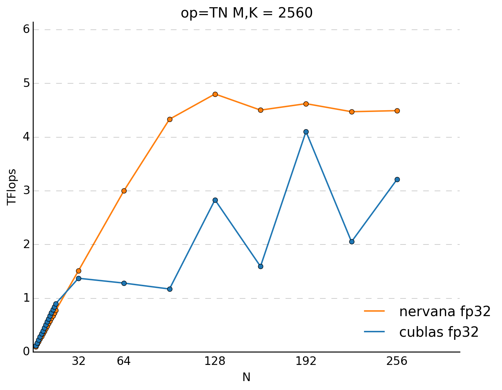

# [Investigating performance of GPU BLAS Libraries](http://svail.github.io/rnn_perf/)

## Introduction

* Achieving optimal performance across a wide range of hardware and _**input sizes**_ is extremely challenging.
* Sequential data dependencies are best modeled with recurrent neural networks. The cost of evaluating these networks is _**dominated by matrix-matrix multiplies**_ (the GEMM operation).
  * Neural networks that work on images where the data dependencies are hierarchically local and the evaluation cost is _**almost entirely due to the convolutions**_ and related operations.

## RNN review

Here use simple RNN for analysis. More complicated units like LSTM and GRU just have more recurrent weight matrices.

* Three factors determine the speed of a GEMM operation:
    1. Matrix size (a triple $(M, N, K)$)
    1. "op" (tells which matrices are transposed)
    1. datatype (double, single, or half)
* In conclusion, the important operations in terms of performance will be these three variants of GEMM:
    1. the NN op for the forward-pass multiplications $Wx$ and $Uh$.
    1. the TN op for the backward-pass multiplications $U^T \delta$ and $W^T \delta$
    1. the NT op for the update calculations $\delta h^T$ and $\delta x^T$

### Batch Size

 * The performance of GEMM libraries is _**not monotonically increasing with batch size**_.
   * There are _**hardware constraints and implementation choices that favor some sizes over others**_.
   * It is important to examine the actual performance curves and choose batch sizes that yield the best performance.
* The upper bound on the size of a mini-batch is determined by the length of sequences in the training data, the available memory, the implementation of the memory allocator, and the data type used to store activations.
  * The activations $x$ and $h$ must be saved for each time step of the RNN, so longer sequences require more memory.
* In practice, mini-batches during training tend to be between 32 and 128. In the test, the settings are: $M = K \in [512, 2560]$, $N \in [32, 256]$

## Performance Improvement

1. Clear advantage can be obtained by having a mini-batch size at least of 32
    * performance increases by 14x with cuBLAS over a mini-batch of 1 and nearly linear increase of almost 30x for the Nervana kernels.
1. Combine multiplications that does not have data dependencies into larger one.
    * larger multiplications tend to be more efficient than many small ones.
    * once the matrix is large enough, the speed is almost the same for both libraries. The speed is almost independent of matrix size.
    * After having made this optimization, _**the main performance bottleneck will be the recurrent multiplies, by $U$**_
1. Use multiples of 32.
1. If there is a significant difference in speed between the NN and TN ops, then we can take advantage of that by _**explicitly transposing the weight matrix**_ so that we can use the faster version.
    * Not all sizes exhibit an asymmetry, but when it does, why not take advantage of it.

## Small mini-batches

* Drawbacks of ASGD

  1. there are multiple different copies of the network parameters which communicate with each other through a parameter server. The concept of a global mini-batch is less clear.
  1. runs are not reproducible which makes it very hard to determine the correctness of the code.
  1. it is possible to reduce the cost of the synchronization to a small part of the training time.

* _**the drop in performance of the matrix multiplies as the mini-batch gets smaller is a bigger hindrance to increasing parallelism than is the increase in communication cost for synchronizing the weight updates**_.
    * write a custom kernel that doubles the performance.

# [Persistent RNN](http://svail.github.io/persistent_rnns/)

## Conclusions

1. Reduce the amount of memory required to train RNNs
1. RNN (this blog only considers simple RNN) weights can be efficiently cached in GPU registers.
    * high computational throughput can be attained with this approach.
1. This substaintially improves performance _**at low mini-batch sizes**_
    * Enable training deeper models on the same hardware, and scale to more GPUs.

## Problems

* In high performance processors such as GPUs, off-chip memory is much slower and much less efficient than on-chip memory such as register files or caches.
* Matrix multiplications are most efficient _**when the mini-batch size is relatively large**_ (about 64 or higher per GPU) because _**the recurrent weights can be loaded from off-chip memory once**_, and reused over each sample in the mini-batch.
  * Why large mini-batch makes weight matrix be loaded from off-chip memory only once?
* When training RNNs over many timesteps, there is actually _**much more memory required to store the activations than the network weights**_.
  * I have a question here, it is true that RNN weight matrix are shared among different timesteps, there can be only one copy of RNN weight matrix in forward computation, however, in backward computations, the gradients are proprotional to sequence length, which seems cannot be reduced, still consuming much memory.

## Persistent Kernels

Load recurrent weights once and reuse them multiple times without increasing the mini-batch size.

* For a GPU, the _**largest source of on-chip memory is distributed among the individual register files of thousands of threads**_.
* Persistent kernels exploit this register file memory to cache recurrent weights and reuse them over multiple timesteps.
* Individual threads are each working on a subset of the network weights, and they must communicate to aggregate partial results
  * thousands of GPU threads need to communicate and synchronize with each other between each timestep
* Solution: implement a form of _**preemptive multitasking**_ on the GPU.
    1. threads attempt to _**synchronize directly using a global barrier**_, but eventually time out and exit.
    1. a runtime system on the CPU monitors threads that have exited early and restarts the kernel until all of them succeed.

## Some of my notes

The problem persist RNN used in DeepSpeech2 address is a bit different from the common settings, which may always hold in other senario:

1. Keep algorithmic batch size unchanged, for example 512 or 1024.
1. Use small batch size on each GPU card.
    * This is because sequences in speech problem are way longer than in NLP problems. Small batch size enables modeling longer sequences and deeper models and it also simplies the deployment.
1. The same model can be scaled to more GPUs when using small batch size.

This is a very special senario that small mini-batch training has obvious advantage. In some other senario, large batch training is more advantagous.

# [Optimizing Performance of Recurrent Neural Networks on GPUs](https://arxiv.org/pdf/1604.01946.pdf)

To get the best performance out of Recurrent Neural Networks you often have to expose much more parallelism than direct implementation of the equations provides. Three stages optimizations:

1. Optimizing a single cell
1. Optimizing a single layer
1. Optimizing the entire network

<image src="images/starting_point.png" width=55%>
  Fig. starting point for optimization.

## Single cell

1. streamed matrix multiplications
    * the matrix multiplication performed by RNNs often have insufficient parallelism for optimal performance on the GPU.
    * current state-of-art GEMM kernels are implemented with each CUDA block computing a rectangular tile of the output.
      * dimensions of this tile is typically from 32 to 128
      * it is desireable to _**have multiple blocks per SM**_ to maximise latency hiding.
    * use CUDA stream to inform the hardware the matrix multiplications are independent
1. fuse elementwise operation
   * reduces data transfers to and from global memory.

<image src="images/single_cell_optimization.png" width=45%>
  Fig. After single pass optimization.

## Single layer

1. pre-transposing the weight matrix lead to noticeable performace improvments.
    * This is based on the fact that: in BLAS APIs, some of the four combinations of transpose/not-transposed run slightly faster or slower than others.
1. combining input GEMMs.
    * there is a trade-off: combining input GEMMs gives more parallelism in that operation, but also prevents overlap with the recurrent GEMMs.
    * the best strategy here depends a lot on the RNN hyperparameters.
    * combining two input GEMMs works best in this case.
    * batch inputs is actually found to be detrimental in many cases for minibatch size other than 32.

<image src="images/single_layer_optimization.png" width=70%>

## Multiple layers

<image src="images/multiple_layer_optimization.png" width=70%>

# References

1. [Learning both Weights and Connections for Efficient Neural Networks](https://arxiv.org/pdf/1506.02626v2.pdf) : This paper has a nice accounting of the flops in the various layers of image style convnets.
1. [Why GEMM is at the heart of deep learning](https://petewarden.com/2015/04/20/why-gemm-is-at-the-heart-of-deep-learning/)
1. [cuDNN: Efficient Primitives for Deep Learning](https://arxiv.org/pdf/1410.0759.pdf)
1. [Caffe con Troll: Shallow Ideas to Speed Up Deep Learning](https://arxiv.org/pdf/1504.04343v1.pdf)
