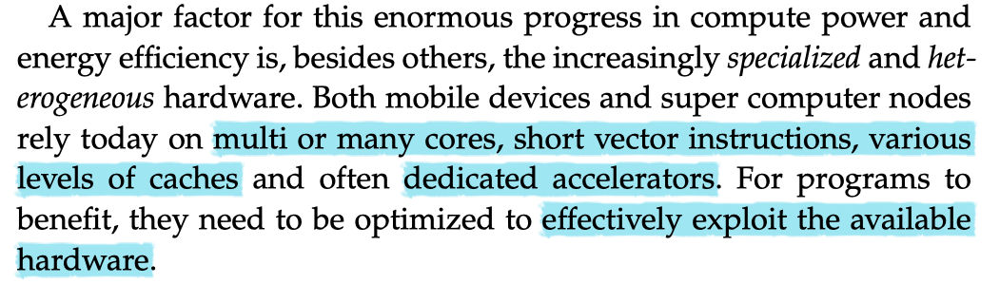
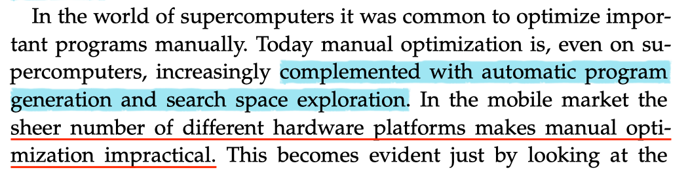
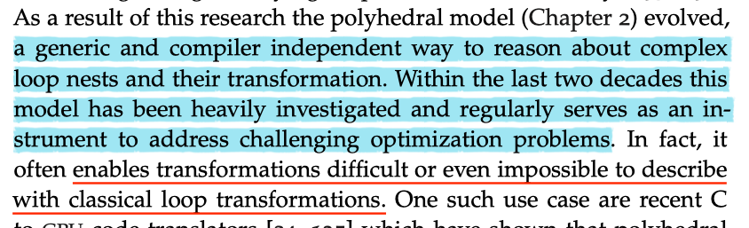
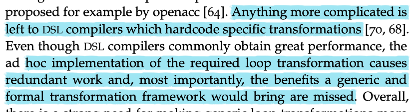

# [A decoupled approach to high-level loop optimization tile shapes, polyhedral building blocks and low-level compilers](https://tel.archives-ouvertes.fr/tel-01144563/document)

## My take-aways

1. We aim for a solution that _**clearly separates domain and target specific optimizations**_ from _**non-problem specific code generation strategies**_ and techniques necessary to obtain _**peak performance**_.
    1. one of the opportunities for optimizations is to make the best use of domain knowledge and the particular case.
    1. generally, the compiler's code generation is non-problem specific.
    1. parameterizes underlying infrastructure to ensure the generation of optimal code is complicated.
1. The core idea here is _**reusability**_.
    - We can characterize deep learning frameworks as a DSL compiler. DSL commonly obtain great performance, but it also missed the benefits a generic and formal framework would bring.
    - We aim for making loop transformations and generic optimization strategies that potentially benefit performance less compiler dependent.
1. Traditional, a language's compiler, is mainly designed for optimal code generation. Besides code generation, there is another critical factor for performance: task scheduling to automatic scale the computation.
1. From this thesis, the polyhedral schedule is a loop analysis theory that will facilitate and generalize loop and data layout transformation. It is worth further learning.
1. Existing frameworks do not take advantage of many compiler's generic transformations in their default optimization sequence. Frameworks are required to hardcode domain specific transformations in their backends which _**reduce performance portablity**_ and increase code bloat and repeated efforts.
    - there is a strong need for making generic loop transformations more accessible.

1. Some difficult    to    understand knowledge are exposed:
    1. [isl](https://core.ac.uk/download/pdf/34473132.pdf)
    1. _**Polyhedra**_[[8](#Reference)] or _**Presburger**_[[9,10](#Reference)]  relations are the mathematical foundations of polyhedral compilation. Read these to learn more.

## Some excerpts from the thesis

- Key techniques even for manual optimizations: _**automatic program generation**_; _**search space exploration**_.
- Instead, the RenderScript compute interface was designed with automatic performance optimization as a design goal.

    >“While testing and tuning a variety of devices is never bad, no amount of work allows them to tune for unreleased hardware they don’t yet have. A more portable solution _**places the tuning burden on the runtime, providing greater average performance at the cost of peak performance.**_”
- Loop optimizations had already been investigated in the context of FORTRAN compilers over thirty years ago. Some techniques to improve performance include:
    1. Loop optimization together with data dependence analysis [[1](#Reference)].
    1. Introduce data dependence graph into loop optimization  [[2](#Reference)].
    1. Loop transformations:
        - _**fussion**_ and _**fission**_ improve program performance by enabling better use of _**vector hardware**_.
        - _**loop interchange**_ reduces expensive memory movements. loop blocking (?? what is this?) [[3,4,5 ](#Reference)].

- Some solutions to address the challenges
    1. _**computes an entirely new loop structure directly form a set of data dependences without ever applying any loop transformations, or of deriving combinations of classical loop transformations using a single unifying loop transformation theroy**_.  --> _**polyhedral model**_.

    

    
    

- The challenges here are how to _**parameterise target-independent loop transformations**_ to obtain competitive platform-specific code.
- DSL compiler vs. generic compiler.

    

    
    

## Polyhedral Compilation

Polyhedral compilation uses _**a compact mathematical representation**_ to _**precisely model**_ the individual elements of a compute program. The use of a solid mathematical model enables detailed static analysis and exact transformations.

# Reference

1. Data dependence in ordinary programs.
1. Kuck D J, Kuhn R H, Padua D A, et al. [Dependence graphs and compiler optimizations]((https://courses.engr.illinois.edu/cs421/sp2013/project/p207-kuck.pdf))[C]//Proceedings of the 8th ACM SIGPLAN-SIGACT symposium on Principles of programming languages. ACM, 1981: 207-218.
1. Wolfe M. Iteration space tiling for memory hierarchies[C]//Proceedings of the Third SIAM Conference on Parallel Processing for Scientific Computing. Society for Industrial and Applied Mathematics, 1987: 357-361.
1. Abu-Sufah W, Kuck D, Lawrie D. [Automatic program transformations for virtual memory computers](https://www.researchgate.net/profile/Walid_Abu-Sufah2/publication/232638977_Automatic_program_transformations_for_virtual_memory_computers_PDF/links/56bc3d5e08ae3f9793155bfe.pdf)[C]//1979 International Workshop on Managing Requirements Knowledge (MARK). IEEE, 1979: 969-974.
1. Allen R, Kennedy K. [Automatic translation of Fortran programs to vector form](http://citeseerx.ist.psu.edu/viewdoc/download?doi=10.1.1.14.1321&rep=rep1&type=pdf)[J]. ACM Transactions on Programming Languages and Systems (TOPLAS), 1987, 9(4): 491-542.
1. Wolf M E, Lam M S. [A loop transformation theory and an algorithm to maximize parallelism](https://www.cs.indiana.edu/~achauhan/Teaching/B629/2006-Fall/CourseMaterial/1991-tpds-wolf-unimodular.pdf)[J]. IEEE Transactions on Parallel & Distributed Systems, 1991 (4): 452-471.
1. Verdoolaege S. [isl: An integer set library for the polyhedral model](https://lirias.kuleuven.be/retrieve/123807)[C]//International Congress on Mathematical Software. Springer, Berlin, Heidelberg, 2010: 299-302.
1. Loechner V, Wilde D K. [Parameterized polyhedra and their vertices](https://www.researchgate.net/profile/Doran_Wilde/publication/47735236_Parameterized_Polyhedra_and_Their_Vertices/links/0f31753275c2d0fecb000000/Parameterized-Polyhedra-and-Their-Vertices.pdf?origin=publication_detail)[J]. International Journal of Parallel Programming, 1997, 25(6): 525-549.
1. Pugh W, Wonnacott D. [Static analysis of upper and lower bounds on dependences and parallelism](https://drum.lib.umd.edu/bitstream/handle/1903/629/CS-TR-3250.pdf?sequence=4&isAllowed=y)[J]. ACM Transactions on Programming Languages and Systems (TOPLAS), 1994, 16(4): 1248-1278.
1. Pugh W, Wonnacott D. [An exact method for analysis of value-based array data dependences](https://drum.lib.umd.edu/bitstream/handle/1903/608/CS-TR-3196.pdf?sequence=4&isAllowed=y)[C]//International Workshop on Languages and Compilers for Parallel Computing. Springer, Berlin, Heidelberg, 1993: 546-566.
