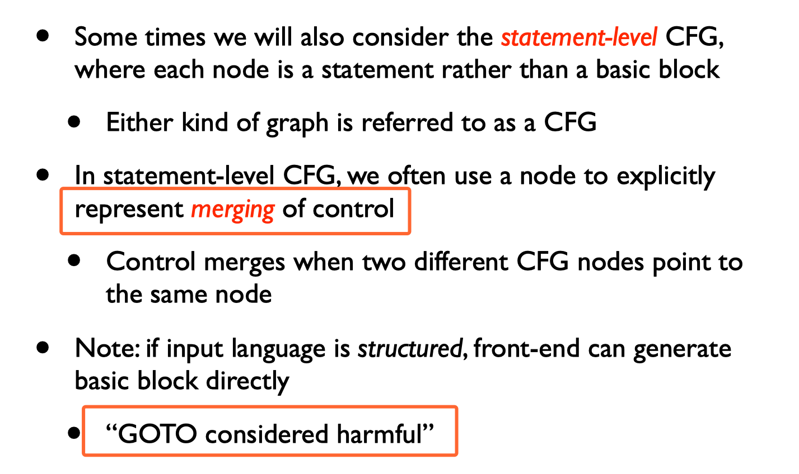

# Control Flow Optimization

My questions:

1. Control flow optimization happens at which step of the compilation pipeline?
1. What problems and challenges traditional control-flow optimizations care about, and what are the most challenging issues remained so far?

## My Takeaways

1. Loop transformations can have dramatic effects on performance. _**Most loop transformations target cache performance.**_
1. Doing loop transformation legally is very difficult, and techniques like _**unimodular transform framework**_ and _**polyhedral framework**_ have been developed to determine the legality of loop transformations and automatically transform the loop.
    - _**[TODO, requires more learning]**_ Whether these high-level loop transformation technique could also benefit the framework's design?
    - _**[TODO, requires more learning]**_ Or is there analysis lessons we could learn from these techniques?

---

## 1. Representation of CFG

### 1.1 basic block-level CFG

Terminologies involved

1. _**three address code**_ (dragon book, section 6.2)

1. _**basic blocks**_

### 1.2 statement-level CFG

Below picture is from Reference [[1](#References)]. Here I have two questions:

1. Why statement-level CFG compared to basic block CFG? Is this for low-level optimizations? It seems that TF chooses this way.
1. Why GOTO considered harmful? PyTorch chooses this way at its back-end.

    >_**if input language is structured, front-end can generate basic block directly.**_

1. How to define "input language is structured"? I think DL framework's front-end language feel in this category.

    

    
    

### 1.3 constructing CFG

This algorithm is not complicated. Skip this at the moment.
See section 8.4.1 of the Dragon Book for reference if needed.

## 2. Loop optimization

### 2.1 Low level optimization

_**Affect a single loop.**_

1. includes:

    1. loop invariant code motion
        - Some expressions evaluated in a loop never change; they are loop invariant.
    1. strength reduction
        - _**I did not quite understand this and did not dive into the details**_.
        - My takeaways are this technique to replace expensive instruction with a chape one. And this is applied to array indexing.
    1. loop unrolling
        - There are three types of loop unrolling, see page 3~8 of References [[2](#References)].

1. usually performed at three-address code stage.
1. a problem should be solved: identifying loops since there is no obvious loop at the low-level representation.

Terminologies involved:

1. _**induction variables**_

### 2.2 High level optimization

_**Restructuring loops often affects multiple loops.**_

1. includes:

    1. loop fusion: combining two loops together
    1. loop interchange: switching the order of a nested loop
    1. loop tiling: completely changing the traversal order of a loop
        -  _**One of the more complex loop transformations**_
        - _**Create new inner loops so that data accessed in inner loops fit in cache.**_

1. _**usually take place at the AST level (where loop structure is obvious)**_.

# References

1. [Control flow graphs and loop optimizations](https://engineering.purdue.edu/~milind/ece573/2011spring/lecture-11.pdf)
1. [Control Flow Analysis Dragon Book Section 8.4](http://www.cs.ecu.edu/karl/5220/spr16/Notes/Optimization/controlflow.html)
1. [Control Flow Optimization](https://www.cs.princeton.edu/courses/archive/spr04/cos598C/lectures/04-ControlFlow-3x1.pdf)
1. [Control-Flow Analysis and Optimization](https://arcb.csc.ncsu.edu/~mueller/cfopt.html)

---

1. [Parallel Synchronization and Communication Instructions](http://www.hsafoundation.com/html/Content/PRM/Topics/09_Parallel/_chpStr_parallel_sync_and_comm.htm)
1. [Some related publications](https://arcb.csc.ncsu.edu/~mueller/publications.html#mueller91)
