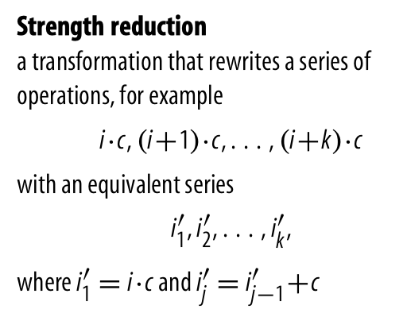

# Introduction to optimization

## Takeaways

1. The compiler has front-end, middle-end and back end.
    - _**front-end**_: translate source-code into some form of IR
        - Graphical IRs
            - AST
            - graphs
        - Linear IRs
            - stack-machine code
            - three-address code
                - representing linear code
                - build CFG from linear codes
    - _**back-end**_: translates the IR program into a form where it can execute directly on the target machine.
    - _**middle-end**_: optimizer. transform their program produced by the front end in a way that will improve the quality of the code produced by the back end. “Improvement” can take on many meanings.


- The goal of code optimization is to _**discover and reason about**_, at compile-time, information about the runtime behavior of the program.
- Opportunities for optimization arise from many sources. _**A major**_ source of inefficiency arises from the _**implementation of source-language abstractions**_.

    > Because the translation from source code into IR is a local process. It occurs without extensive analysis of the surrounding context. It typically generates IR to handle the most general case of each construct. _**With contextual knowledge**_, the optimizer can _**often determine**_ that the code _**does not need**_ that full generality; when that happens, the optimizer can _**rewrite the code**_ in _**a more restricted**_ and more efficient way.

    > A _**second significant source**_ of opportunity for the optimizer lies with the target machine. The compiler must understand, in detail, of the target that affects performance. Issues such as the number of functional units and their capabilities, the latency and bandwidth to various levels of the memory hierarchy, the various addressing modes supported in the instruction set, and the availability of unusual or complex operations all affect the kind of code that the compiler should generate for a given application.
- Optimization further insulates the front end from performance concerns.
- At the same time, optimization changes the code that the back end processes. Modern optimizers assume that the back end will handle resource allocation; thus, they _**typically target an idealized machine**_ that has an unlimited supply of registers, memory, and functional units. This, in turn, places more pressure on the techniques used in the compiler’s back end.
- If compilers are to shoulder their share of responsibility for runtime performance, they must include optimizers.
- The compiler's ability to reduce the cost of that computation depends directly on its analysis of the code and the surrounding context.
    - This is more to be a generally true philosophy.

## Two examples

### 1. Array address: knowledge and context plays a vital role in optimization

<span style="background-color:#ACD6FF;">_**The compiler’s ability to reduce the cost of that computation depends directly on its analysis of the code and the surrounding context.**_</span>

consider the array reference example below.

$$\text{m}(i,j)$$

#### 1.1 Without knowledge about `m`, `i` and `j` or the surrounding context

the compiler MUST generate _**the full expression**_ for addressing a two-dimensional array stored in column-major order:

$$\text{@m} + (j - low_2(\text{m})) \times (high_1(\text{m}) - low_1(\text{m}) + 1) \times \omega +(i - low_1(\text{m})) \times \omega$$

- $low_i(\text{m})$: the lower bound.
- $high_i(\text{m})$: the higher bound.
- $\omega$: the size of an element of $m$.

#### 1.2 Given the knowledge about _m_

If `m` is a local array with lower bounds of 1 in each dimension and known upper bounds, then the compiler can simplify the calculation to:

$$\text{@m} + (j - 1) \times h\omega + (i - 1) \times \omega$$

#### 1.3 Given the context

<span style="background-color:#ACD6FF;">_**Knowing the context around the reference to m(i,j) allows the compiler to significantly reduce the cost of array addressing.**_</span>

If the compiler knows the context:

1. _**context 1**_: _**the reference occurs inside a loop where $j$ runs from 1 to $k$**_, the compiler might use _**operator strength reduction**_ to replace the term $j - 1$:

    > _**[Operator strength reduction](https://en.wikipedia.org/wiki/Strength_reduction)**_ _is a technique that improves compiler-generated code by reformulating certain costly computations in terms of less expensive ones._

    <p align="center">
    <br>Fig 1. strength reduction.
    </p>

    replace the term $(j - 1) \times hw$ with a sequence $j'_1$,$j'_2$,$j'_3$,...,$j'_k$, where $j'_1 = 0$, and $j'_i = j'_{i-1} + hw$

1. _**context 2**_: if $i$ is also the induction variable of a loop running from 1 to $l$, then strength reduction can replace $(i - 1) \times w$ with the sequence $i'_1$,$i'_2$,$i'_3$,...,$i'_k$, where $i'_1 = 0$ and $i'_j = i'_{j-1} \times w$:

1. After given context 1 and 2, the address calculation is just:

    $$\text{@m} + j' + i'$$

    the $j$ loop must increment $j'$ by $hw$ and the $i$ loop must increment $i'$ by $w$.

    1. if the $j$ loop is the outer loop, the computation of ${@m} +j'$ can be moved out of the inner loop, then
        - the address computation in the inner loop contains an add and the increment for $i'$.
        - the outer loop contains an add and the increment for $j'$

1. _**context 3**_: if m is an actual parameter to the procedure

    1. then the compiler may not know these facts at compile time.
        - The upper and lower bounds for _m_ might change on each call to the procedure.
    1. the compiler may be unable to simplify the address calculation.

### 2 Loop nest in LINPACK: the transformation process and challenges

`dmxpy` routine: $y + x \times m$ where $x$ and $y$ are vectors and $m$ is a matrix.

#### 2.1 Hand-applied transformation

Fig 2 is the simple implementation of `dmxpy` before the author hand transforms the codes:

```python
    do 60 j = 1, n2
        do 50 i = 1, n1
            y(i) = y(i) + x(j) * m(i, j)
50      continue
60  continue
```

Manual optimizations.

<p align="center">
<image src="images/excerpt-from-dmxpy-in-linpack.png" width=50%>
</p>

To improve performance:

1. the author _**unrolled**_ the outer loop: the _j_ loop 16 times.
    - this rewrite will create 16 copies of the assignment statement with distinct values for _j_.
    - the unrolling also changes the increment on the outer loop from 1 to 16.

#### 2.2 Challenges compiler faced

# Reference

1. [operator strength reduction](https://www.cs.rice.edu/~keith/EMBED/OSR.pdf)
1. [Engineering A Compiler: Chapter 8](https://www.elsevier.com/books/engineering-a-compiler/cooper/978-0-12-088478-0)
