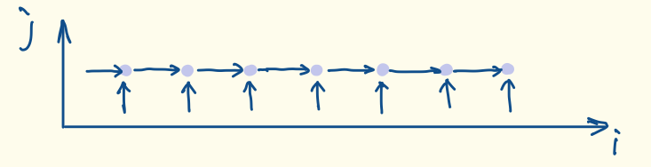
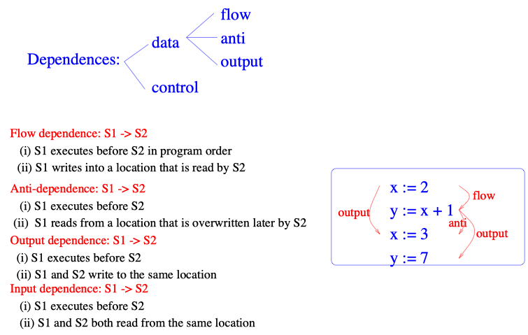

# Loop nesting analysis for deep learning program

Taking advantage of the available parallelism is the major way to speed up a compute program. There are different levels of parallelism that can be exploited. Scientific programs usually make heavy use of loops to operate on array data structure. To produce efficient parallel code, the user must consider different ways of ordering the operations to increase parallelism.

Without formalized loop nets representatioin.

## Basics of parallelization

Program parallelization and restructuring must preserve the initial program semantics. The order of read and write accesses to each memory location is kept while accesses to distinct memory locations can be exchanged. thus the value history of each memory location remains the same and final states are equal at the bit level.

Dependence based parallelization enforces the order between any read and any write and between writes. This is a sufficient condition for histories to be preserved.

## Dependences in loop nets

### What is dependence analysis

1. Scalar variables are easy to deal with since dependences can be tested with a string comparison. So, here we only considers array references enclosed in for loop bodies.
1. GOTO and IF statement can be dealt with the IF conversion algorithm.
    - FOR loop can be normalized.

### Dependence system

#### Definition

Dependence system is a set of linear equation and inequations that sets the conditions for a dependence between two statements $S_1$ and $S_2$ to exist because of references $R_1$ of $S_1$ and $R_2$ of $S_2$.

#### Usage

A dependence system is used to compute the set of points of $\vec{j_2}$ of the iteration space which are dependent on a given point $\vec{j_1}$. This set may be approximated by a convex polyhedron.

Such dependence systems are built for each pair $(R_1, R_2)$ of references to the same array.

#### Variables of the dependence system

1. **iteration vector** $\mathbf{i}_l^j$: the value of index $I_l$ for statement $S_j$
    - iteration vectors $\vec{\mathbf{j}_1}$ and $\vec{\mathbf{j}_2}$ of $S_1$ and $S_2$.
    - can I understand this as a way to describe the iteration space?
1. $\vec{\mathbf{d}}$: the dependence vector.
1. **variable vectors**.
    - usually the subscript expression or DO-loop bounds.
    - other **scalar variable** values.
    They are kept in vectors $\vec{\mathbf{v}_1}$ and $\vec{{\mathbf{v}_2}}$ which are called variable vectors.

#### Equations and Inequatioins of the dependence system

Let $R_1$ be the matrix of the _**affine function that maps**_ the iteration vector $\vec{\mathbf{j}}_1$ and the variable vector $\vec{\mathbf{v}}_1$ onto <span style="background-color:#ACD6FF;">**array indices**</span> and $\vec{\mathbf{r}}_1$ the constant term.

- **Equations**

    1. an equation must hold

        By definition a dependence exists if both statements $S_1$ and $S_2$ refere the same memory location at some iteration $\vec{\mathbf{j}_1}$ and $\vec{\mathbf{j}_2}$. The the following equation must hold for a dependence to exist:

        $$R_1 \begin{pmatrix} \vec{\mathbf{j}}_1 \\
        \vec{\mathbf{v}}_1
        \end{pmatrix} + \vec{r}_1 = R_2 \begin{pmatrix} \vec{\mathbf{j}}_2 \\
        \vec{\mathbf{v}}_2
        \end{pmatrix} + \vec{r}_2$$

    1. the definition of the dependence vectors

        $$\vec{\mathbf{d}} = \vec{\mathbf{j_2}} - \vec{\mathbf{j}}_1$$

    2. equations between variable values at $S_1$ and $S_2$ sometimes exist:

        $$\vec{\mathbf{v}}_1 = F\vec{\mathbf{v}}_2 + \mathbf{f}$$

- **Inequations**

    1. Information at $S_1$ and $S_2$ is usually a set of inequations like DO-loop bounds or results of a semantic analysis although equations between variables sometimes exist.
    1. Variables may also be disguised constants.

    Then, these information is added to the system in terms of inequations.

    $$C_1 \begin{pmatrix} \vec{\mathbf{j}}_1 \\
    \vec{\mathbf{v}}_1
    \end{pmatrix} \le \vec{\mathbf{c}}_1$$

    $$C_2 \begin{pmatrix} \vec{\mathbf{j}}_2 \\
    \vec{\mathbf{v}}_2
    \end{pmatrix} \le \vec{\mathbf{c}}_2$$

#### **Summary**

1. The dependence system characterizes all possible dependence distance vectors <span style="background-color:#ACD6FF;">**between references of two statement iteration**</span>.
1. The projection $\Pi$ of this system on the subspace of dependence distance vectors $\vec{\mathbf{d}}$ can be approximated by the smallest convex hull of these distance vectors. This is again a linear system.
1. If the dependece system is not feasible. $\Pi$ is empty and there are no dependences between the two statements for the references taht were considered.

### Loop Nest Representation?

```python
for i in range(20):    # loop bounds is 0 to 19
  a[i] = a[i - 1] + 3    # satements
```
1.  _**<span style="background-color:#ACD6FF;">two array references $a$ and $a'$ is dependent**_</span> if anly of the locations accessed by reference $a$ are also accessed by reference $a'$, otherwise, the two references are _**independent**_.
    - _the two array references access the same memory locations_.
2. <span style="background-color:#ACD6FF;">_**dependent iteration pairs**_</span>: within the loop bounds, there exist two iterations of the loop $\vec{i}$ and $\vec{i'}$ that they access the same memory location.
    - _If all array reference pairs in a loop are independent. We can run all the iterations of the loop in parallel_.
    - _If some pairs are dependent, it **might still be possible** to parallel some iterations_.

3. A dependent iteration pair such that $\vec{i} = \vec{i'}$ is a <span style="background-color:#ACD6FF;">_**loop-independent dependence**_</span>.

    ```python
    for i in range(20):
        a[i] = a[i] + 3
    ```
    data is _**not transfered**_ between iterations.

    RNN's input-to-hidden is loop-independent dependence.

4. A dependent iteration pair such that $\vec{i} \ne \vec{i'}$ is a <span style="background-color:#ACD6FF;">_**loop-carried dependence**_</span> (data dependence).
     ```python
    for i in range(20):
        a[i] = a[i - 1] + 3
    ```
    data is _**transfered**_ between iterations.

Lesson 1: <span style="background-color:#D8BFD8;">All the iterations of a loop nesting can be run in parallel _**if and only if**_ there are _**no loop-carried dependences**_ between any two references in the loop</span>.

To parallelize a subset of the loop nesting, is it sufficient to only know whether there are loop-carried dependences?

No, we need to know more than this.

An Example

```python
for i in range(20):
    for j in range(20):
        a[i][j] = a[i - 1][j - 1] + 3
```
<p align="center">

</p>

1. all the dependencies in this loop nesting are loop-carried.
    - _we cannot run all the iterations in parallel_.
2. if we run loop $i$ sequentially, we can run the $j$ loop in parallel.

_Lesson 2_: <span style="background-color:#D8BFD8;"> To fully exploit the parallelism inherently present in a loop, we need to calculate _**all**_ the dependent iteration pairs.</span> $\rightarrow$ accurate

_Usually, this is both infeasible and unnecessary for compiler's most optimization techniques._

### Notations and Definitions

Let $S_1$ and $S_2$ be two potentially dependent statements. Let $R_1$ and $R_2$ be two references to the same array. Let $k$ be the number of enclosing FOR loops.

Iterations of $S_1$ and $S_2$ are integer elements of a $k$-dimensional vector space called the **iteration space**, and are labeled by **iteration vectors** whose coordinates are equal to FOR loop index values relative to iterations.

Loop bounds define a subset of the iteration space called the **iteration domain**. Under affine assumptions, this subset is a convex polyhedron.

### Dependence distance vectors

Let suppose iteration $\vec{j_2}$ of $S_2$ <span style="background-color:#ACD6FF;">**reads**</span> a memory location <span style="background-color:#ACD6FF;">**written**</span> by iteration $\vec{j_1}$ of $S_1$. Then $S_2$ dependens on $S_1$ and $\vec{d} = \vec{j_2} - \vec{j_1}$ is a **dependence distance vector**.

- distance vectors represent the vector difference between the two iteration elements in a dependent iteration pair.

### Dependence direction vectors (DDV)

A vector of elements taking their value in the set $\{ <, =, >\}$.

- These comparison symbols are used to express approximate possible directions for the dependence distance vectors, by comparing their coefficients to $0$.

### Nature of dependence

1. If $\vec{d}$ is lexico-positive, $\vec{j_2}$ must occur after $\vec{j_1}$ and the dependence is called **data (flow) dependence** or **true dependence**.
2. If $\vec{d}$ is lexico-negative, the read must occur after write. This is a memory location re-use. The dependence from $S_2$ to $S_1$ is called **anti-dependence**; its dependence distance vector is $-\vec{d}$.
3. If $R_1$ and $R_2$ are both write references, the dependence is called **output-dependence**.
4. **Control dependences** are ignored because it can be dealt with with the IF conversion algorithm described in [[3](#reference)].

<p align="center">

</p>

Recap the above example:

1. there is a dependence from <span style="background-color:#AFEEEE;">_**the write**_</span> to <span style="background-color:#AFEEEE;">_**the read**_</span> with direction $(+, +)$.
2. there is no dependence with the direction $(0, +)$.
3. so, it is possible to sequentialize loop $i$ and then parallelize loop $j$.

Standard compiler requires parallelization to <span style="background-color:#ACD6FF;">preserve the order</span> between <span style="background-color:#ACD6FF;">all write operations</span> and <span style="background-color:#ACD6FF;">all read/write</span> operations to the <span style="background-color:#ACD6FF;">same location</span>.

- Given this model, distance and direction vectors are sufficient representations for parallelization.
- However, it is too restrictive.

Not all dependencies are equally harmful.

Which dependence inherently limits parallelism?

- Loop 1

   ```python
   for i in range(20):
       a[i] = a[i - 1] + 3  # a[i - 1] is a read reference.
                            # a[i] is a write reference.
   ```
   $\vec{d} = ()$
   - _**value**_ <span style="background-color:#ACD6FF;">written (produced)</span> in iteration **$i$** is <span style="background-color:#ACD6FF;">read (consumed)</span> in the next iteration **$i + 1$**.
   - <font color=    #FF0000    >**inherently sequential**</font>.

- Loop 2

   ```python
   for i in range(20):
       a[i] = a[i + 1] + 3
   ```
   _**location**_ being read in iteration $i$ is being overwritten in the next iteration $i + 1$.

1. There are loop-carried dependences in both loops and we cannot run either loop without modifications in parallel.
2. For loop1, there is a dependence vector $\vec{d} = (1)$.
3. For loop2, there is a dependence vector $\vec{d} = (-1)$.

Possible optimizations to loop2

We cannot run the loop as written in parallel. We can transform it into the following two loops, each of which is _**individually**_ parallelizable.

```python
for i in range(1, 21):
    b[i] = a[i]
for i in range(20):
    a[i] = b[i + 1] + 3
```

- Distance vectors is sufficient to discover that loop1 is inherently sequential while loop2 is not.
- For any pair of write and read references with a positive distance vector <span style="background-color:#ACD6FF;">from the write to the read</span>, i.e. ==$\vec{i_r} - \vec{i_w}>0$== is called a _<span style="background-color:#ACD6FF;">**true dependence**_</span>.
  - If the distance vector is $\vec{0}$, the dependence is a true dependence.
- For any pair of write and read references with a negative distance vector <span style="background-color:#ACD6FF;">from the write to the read</span>, i.e. ==$\vec{i_r} - \vec{i_w}<0$== is called a _<span style="background-color:#ACD6FF;">**anti-dependence**_</span>.

Lesson 3: <span style="background-color:#D8BFD8;"> Anti-dependence can always be eliminated. True dependences (write and then read) are inherently limit parallelism.</span>

## Are all true dependencies are inherently harmful?

```python
for i in range(20)
    for j in range(20)
        a[j] = ...
    for j in range(20)
        ... = a[j]
```

- There is a loop-carried true dependence between the write and the read.
- However, in each iteration of $i$ loop, the value read in iteration $i = a$ was in fact, written in the same iteration. $\rightarrow$ $a$ is a temporary array.

We can parallelize $i$ loop by _**privatizing**_ the array $a$.

- Traditionally, this optimization is mainly for multi-core CPU: giving each processor its own private copy of a temporary array.

## Data-flow dependence

A read reference to be data-flow dependent on a write reference if the write reference writes a ==$value$== that is read by an instance of the read reference.

- data-flow dependences are a subset of true dependences.

Answer: <span style="background-color:#D8BFD8;"> Only data-flow dependences inherently limit parallelism.</span>

- _dependence vectors do not contain sufficient information to distinguish true dependences from data-flow dependences._ $\rightarrow$ data-flow dependence vectors.

## Calculating Data Dependence Relations

Ideally, we would like to know the exact dependence and data-flow dependence vectors between any two references.

1. static vs. dynamic dependences

    ```python
    """read n"""
    for i in range(20):
        a[i] = a[i - n] + 3
    ```
2. the problem canbe made arbitrarily difficult for compiler:

    ```python
    if n > 2:
        if a > 0:
            if b > 0:
                if c > 0:
                    x[pow(a, n)] = x[pow(b, n) + pow(c, n)] + 3
    ```

## Affine Memory Access Constraint

Affine expression: an expression is affine w.r.t variables $v_1$, $v_2$, ..., $v_n$ if it can be expressed as $c_0 + c_1v_1 + ..., c_nv_n$ where $c_o, c_1, ...,c_n$ are constant.

```cpp
for (int i = 0; i < M; ++i) {
    for (int j = 1; j < N; ++j) {
        arr[i][j - 1] = arr[i][j];
    }
}
```

- The statement $s$: `arr[i][j - 1] = arr[i][j]` is an affine expression w.r.t. $i$ and $j$
- The statement $s$ assigns a value to `arr[i * N + j - 1]` at every iteration. This memory access pattern statisfies affine memory constraint.

- Affine means the transformation can include a (possibly symbolic) constant term.
- Psuedo affine means that the transformations can also involve integer division and modulor operators.

<span style="background-color:#D8BFD8;">When all expressions in a loop are affine, the loop is amenable to some advance analysis and optimizations.

## What is Polyhedral Compilation, and Why it comes?

Polyhedral compilation uses a compact mathematical representation to precisely model the individual elements of a compute program. The use of a solid mathematical model enables detailed static analysis and exact transformations.

(Integer) polyhedra or Presburger relations are the mathematical foundations of polyhedral compilation.

## Polyhedral representation

1. **What is Good** ?

    - reason about and precisely control high-level property without distrction from imperative or low-level construct.
    - precise data-flow dependences is one analysis significantly facilitated by the use of polyhedral representation.
2. **What is modeled**?
    1. individual statement instances
    2. their execution order
    3. individual array element accessed  
        - read-access
        - must-write access

 1. **What is hidden**?
    1. control-flow construct
    2. loop induction variables
    3. loop bounds
    4. array subscripts

## Transformations that reorder computations

1. Fussion
2. Fission
3. Reversal
4. Interchange
5. Skewing

- loop interchange, permutation, reversal, hyperplane(skewing), tiling and concurrentization can be realized as matrix multiplication by a suitable matrix.

# Reference

1. École nationale supérieure des mines de Paris. Centre d'Automatique et Informatique, F. Irigoin, and R. Triolet. [Computing dependence direction vectors and dependence cones with linear systems](https://www.cri.ensmp.fr/classement/doc/E-094.pdf). 1987.
1. Grosser T. [A decoupled approach to high-level loop optimization: tile shapes, polyhedral building blocks and low-level compilers](https://tel.archives-ouvertes.fr/tel-01144563/document)[D]. , 2014.
1. Allen J R, Kennedy K, Porterfield C, et al. [Conversion of control dependence to data dependence](https://dl.acm.org/citation.cfm?id=567085)[C]//Proceedings of the 10th ACM SIGACT-SIGPLAN symposium on Principles of programming languages. ACM, 1983: 177-189.
1. [Change of basis in Linear Algebra](https://eli.thegreenplace.net/2015/change-of-basis-in-linear-algebra/)
1. the hyperplane method: Lamport L. [The parallel execution of do loops](https://www.cs.colostate.edu/~cs560dl/Notes/LamportCACM1974.pdf)[J]. Communications of the ACM, 1974, 17(2): 83-93.
