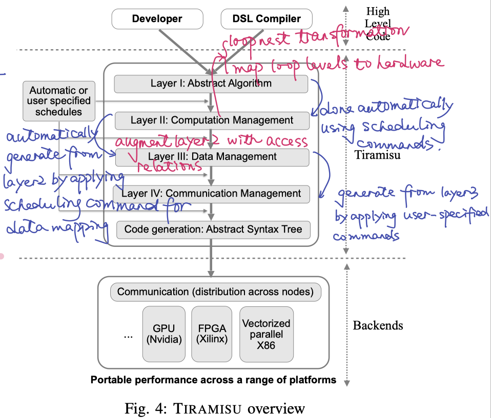

# [Tiramisu: A Polyhedral Compiler for Expressing Fast and Portable Code](https://arxiv.org/abs/1804.10694)

## What is Tiramisu

TIRIMISU is a DSL embedded in C++ with its _**polyhedral compiler**_. It also designs a _**a scheduling language**_ featuring novel commands for _**targeting multiple high performance architectures**_.

- It provides a C++ API that allows users to write a high level architecture-independent algorithm and a set of scheduling commands that guide code generation.

Tiramisu is well-suited for implementing data parallelism.

The process is:

1. takes a high-level representation of the program
    - a pure algorithm and a set of scheduling commands
    - the scheduling commands are designed for enabling:
        1. loop transformations
        2. data layout transformations
        5. mapping buffers to different memory hierarchies
        6. for the distributed system:
            1. _**partitioning computations**_
            1. explicit communication
            1. explicit synchronization
1. applies the necessary code transformations
1. generates highly-optimized code for the target architectures

1. To simplify the implementation of the scheduling language, tiramisu explicitly divides the IR into _**four layers**_.
    - separating the architecture-independent algorithm from code transformations, data layout, and communication.

1. architectures Tiramisu targets:
    1. multicore CPUs
    2. CUDA GPUs
    3. distributed architectures
    4. FPGA

### Tiramisu vs. Halide
- Tiramisu relies on _**polyhedral representation**_ while Halide relies on _**interval-based**_ representation.
- polyhedral representation allows to
    1. _**naturally express non-rectangular iteration spaces**_
    2. support programs with cyclic data-flow graphs
    3. apply any affine transformation (iteration space skewing)
- all of the above are not naturally expressible in Halide.

- Halide cannot naturally represent non-rectangular iteration spaces, as a result:
    1. distributed Halide _**over-approximates the amount of data to communicate**_ (send and receive)
    2. over-approximates non-rectangular iteration spaces
    3. the use of interval prevents Halide from performing many complex affine transformations
        - such as _**space skewing**_
- Halide does not have dependence analysis and thus relies on conservative rules to determine whether a schedule is legal.
- Halide assumes the program has an acyclic dataflow graph, as a result, prevents users from expressing many programs with cyclic dataflow.

## Excerpts from the paper

1. Obtaining the best performance requires:
    1. complex code
    1. data layout transformations
    2. management of complex memory hierarchies
    3. efficient data communication and synchronization.
1. Highly-tuned implementations require:
    1. fusing the multiplication and addition loops
    2. applying _**two-level tiling**_ (_What's two-level tiling?_)
    3. vectorization
    4. loop unrolling
    5. _**array packing**_ (_What's array packing?_)
    6. register blocking
    7. data prefetching
1. tuned implementations separate _**partial tiles**_ from _**full tiles**_ (_What's partial tiles and full tiles?_).
1. High performance GPU implementations require even more optimizations, including:
    1. coalescing memory accesses
    2. managing data movement between global, shared and register memory
    3. inserting synchronization primitives
1. Previous work using the polyhedral models has shown sucess in implementing:
    1. complex _**iteration space**_ transformation;
    2. data locality optimizations
    3. memory management optimizations
1. _**Fully automatic polyhedral compilers**_ do not obtain the desired level of performance since: their search techniques _**only consider only a subset of**_ the necessary optimizations and rely on _**less accurate machine**_ models.

## Tiramisu Embedded DSL

### Specifying the algorithm

1. the algorithm is pure function that has inputs, outputs, and is composed of a sequence of computations.
1. flow-control is restricted to _for_ loops and conditionals.
    - _While_ loops, early exits, and _GOTOs_ cannot be expressed.
2. the user provides both the iteration domain of the computation and the expression to compute.

### Scheduling commands

Novel commands introduced by Tiramisu:
1. array allocation
1. copying data between hierarchies
1. sending and receiving data between **nodes** (what are nodes in Tiramisu)
1. synchronization
1. return an operation that can be scheduled like any other computation.

    > The use of `allocate_at()`, `copy_at()`, and `barrier_at()` allows TIRAMISU to automatically compute iteration domain for the data copy, allocation, and synchronization operations. This is important because it relieves the user from guessing or computing the iteration domain manually, especially when exploring different possible schedules.

### Rationale for a multi-layer IR

1. using memory to communicate between program statements creates memory-based dependencies in the program, and forces compilers to choose data layout before deciding on optimizations and mapping to hardware. Thus, any data layout specified before scheduling must be undone to allow more freedom for scheduling.
    > Optimizing a program for different hardware architectures usually requires modifying the data layout and eliminating memory-based dependencies since they restrict optimizations.
1. buffer mapping to memory hierarchies, communication management, and synchronization should not occur before scheduling.

Four-layer IR:

1. the first layer: describe the pure algorithm using producer-consumer relationships without memory locations.
    - specify the algorithm without specifying when and where computations occur, how data should be stored in memory, or communication
        - values are communicated via explicit producer-consumer relationship.
        - specify iteration domain
2. the second layer: specifies the order of computation, along with which processor computates each value;
    - speficy the order of executions and the processor on which they execute.
    - computations in this layer are ordered and assigned to a particular processor. The order is dictated by _**time dimensions**_ and _**space dimensions**_.
        - this layer is suitable for performing a vast number of optimizations without dealing with concrete memory layouts.
        - this layer does not specify how intermedia values are stored in memory.
3. the third layer speficifies where to store intermediate data before they are consumed.
    - speficify memory locations for storing computed values
        - make the data layout concrete by specifying where intermediate values are stored.
        - this layer is automatically generated from layer 2 by applying the scheduling commands for data mapping.
        - data mapping in TIRAMISU is an affine relation that maps each computation to a buffer element.
4. the forth layer adds all the necessary communication and synchronization operations.
    - add synchronization and communication operations to the representation, mapping them to the time-space domain, and concretizes when statements for buffer allocation/deallocation occur.

    

    
    

    Tiramisu uses integer sets to represent each of the four IR layers and uses maps to represent transformations on the iteration domain and data layout.

# Reference

1. Kazushige Goto and Robert A. van de Geijn. [Anatomy of high- performance matrix multiplication](http://www.cs.utexas.edu/~flame/pubs/GotoTOMS_revision.pdf). ACM Trans. Math. Softw., 34(3):12:1– 12:25, May 2008.
1. Quilleré F, Rajopadhye S. [Optimizing memory usage in the polyhedral model]()[J]. ACM Transactions on Programming Languages and Systems (TOPLAS), 2000, 22(5): 773-815.
1. Chafi H, Sujeeth A K, Brown K J, et al. [A domain-specific approach to heterogeneous parallelism](http://citeseerx.ist.psu.edu/viewdoc/download?doi=10.1.1.644.4729&rep=rep1&type=pdf)[J]. ACM SIGPLAN Notices, 2011, 46(8): 35-46.
1. Collins A, Grewe D, Grover V, et al. [NOVA: A functional language for data parallelism](http://citeseerx.ist.psu.edu/viewdoc/download?doi=10.1.1.666.8678&rep=rep1&type=pdf)[C]//Proceedings of ACM SIGPLAN International Workshop on Libraries, Languages, and Compilers for Array Programming. ACM, 2014: 8.
1. Steuwer M, Remmelg T, Dubach C. [Lift: a functional data-parallel IR for high-performance GPU code generation](http://eprints.gla.ac.uk/146596/1/146596.pdf)[C]//2017 IEEE/ACM International Symposium on Code Generation and Optimization (CGO). IEEE, 2017: 74-85.
