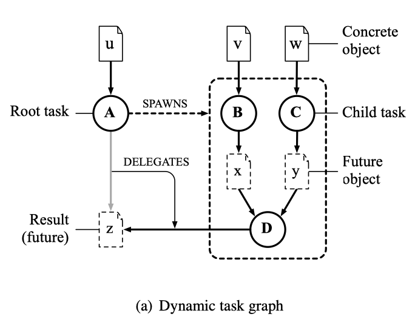
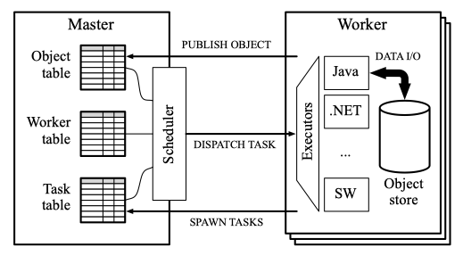

<!-- vscode-markdown-toc -->

- [Ciel: a universal execution engine for distributed data-flow computing](#ciel-a-universal-execution-engine-for-distributed-data-flow-computing)
  - [Motivations](#motivations)
  - [More details](#more-details)
    - [CIEL primitives:](#ciel-primitives)
    - [Dynamic task graph](#dynamic-task-graph)
    - [Architecture of a CIEL cluster](#architecture-of-a-ciel-cluster)
    - [The Skywriting script language](#the-skywriting-script-language)
    - [Map skywriting to CIEL primitives](#map-skywriting-to-ciel-primitives)
      - [creating tasks](#creating-tasks)
      - [data-dependent control flow](#data-dependent-control-flow)
  - [Takeaways](#takeaways)

<!-- vscode-markdown-toc-config
    numbering=true
    autoSave=true
    /vscode-markdown-toc-config -->
<!-- /vscode-markdown-toc -->

# Ciel: a universal execution engine for distributed data-flow computing

- CIEL is a universal data-centric execution engine for the distributed data-flow program.
- CIEL is designed for coarse-grained parallelism across large data sets.
- A Ciel job can make _data-dependent control-flow decisions_ (dynamic control-flow), enabling it able to compute iterative and recursive algorithms.
    - Skywriting, a turning complete scripting language is developed which is run on CIEL.

##  Motivations

MapReduce and Dryad programming models were originally developed for **batched-oriented jobs** (_parallel iterative computations_).
- maximize throughput rather than minimize individual job latency.
- a data-parallel kernel inside a while-not-converged loop

The computational power of a distributed execution engine is determined by the data flow that it can express.
- MapReduce: the data flow is limited to a bipartite graph parameterized by the number of map and reduce tasks
- Dryad: a more general DAG, but must be fully specified.

_data-dependent control flow_

the ability to create more work dynamically, based on the results of previous computations.

##  More details

###  CIEL primitives:

**objects**: unstructred, finite-length sequence of bytes

**references**: a name and a set of locations (is designed to describe an object without processing its full contents.)

- if the location is empty, the reference is a _future reference_ refers to an object that has not yet been produced.

**tasks**: non-blocking atomic computation that executes completely on a single machine. A task has one more dependency which is represented by _references_

A task has two externally-observable behaviors:
1. **publish** one or more objects, by creating a concrete reference for those objects.
2. **spawn** is to support data-dependent control flow. spawn a new task that performs additional computation.

The **dynamic task graph**:

### Dynamic task graph

The dynamic task graph stores the relation between tasks and objects.

- an edge **from** object **to** task: the tasks depends on that object
- an edge **from** a task **to** an object: the task is expected to output the object

"dynamic":

- as a job runs, new tasks are added to the dynamic task graph
- the edges are rewritten when a newly-spawned task is expected to produce an object

**The dynamic task graph provides low-level data-dependent control flow that resembles tail recursion:** a task either produces its output or spawns a new task to produce that output.

### Architecture of a CIEL cluster

- a single **master**
    - master _scheduler_: is responsible for making progress in a CIEL computation
- several **workers**: all bulk data is stored on the workers themselves
    - executor is invoked when a task is dispathed to a worker
- **client** is minimal  

 
Fig. Architecture of a CIEL cluster.

### The Skywriting script language

a script to express task-level parallelism.
- Turing-complete
- can express arbitary data-dependent control flow using _while loops_ and _recursive functons_

Key features:

1. ref
1. spawn
1. exec
1. spawn_exec
1. dereference

### Map skywriting to CIEL primitives

#### creating tasks

#### data-dependent control flow

## Takeaways

The task dependency forms DAG, but the computational process does have cyclic data dependence.

- DAG of tensor operations is essentially a task-dependency graph. The task-dependency graph should not have a cycle to prevent deadlock, but the computational process does have cyclic data dependence --> all RNNs.
