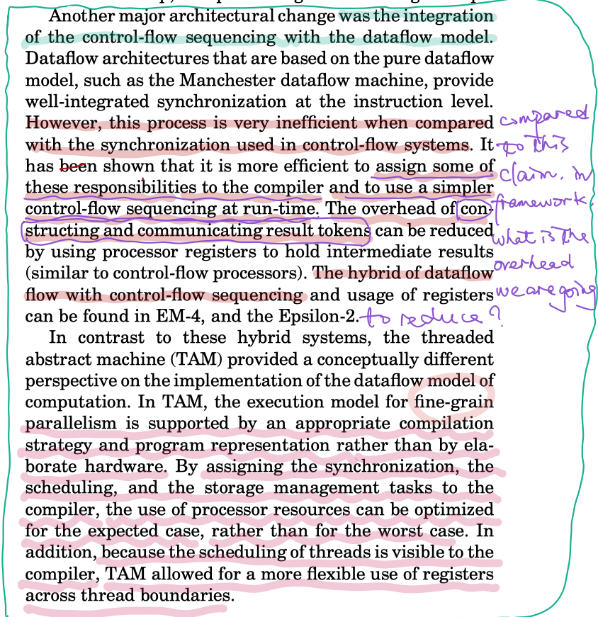
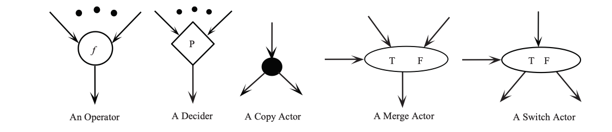
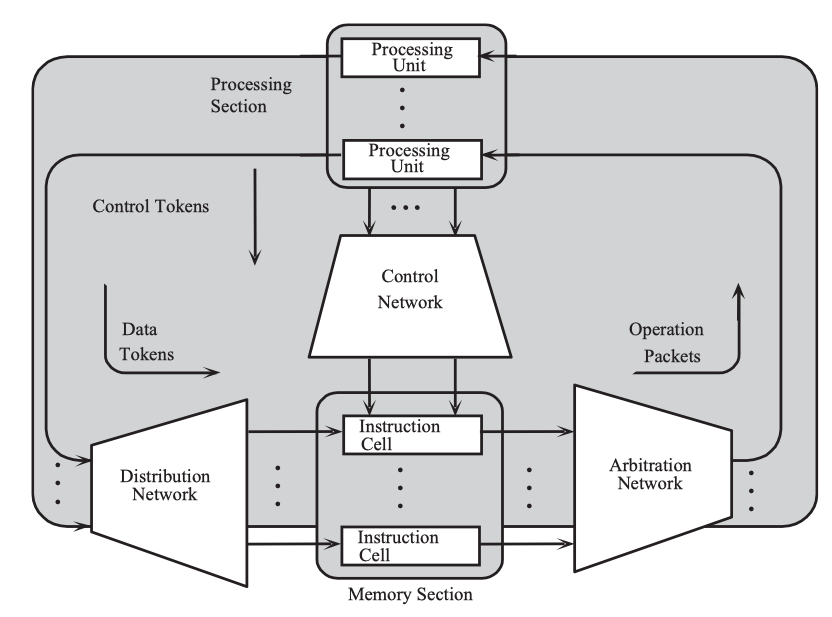
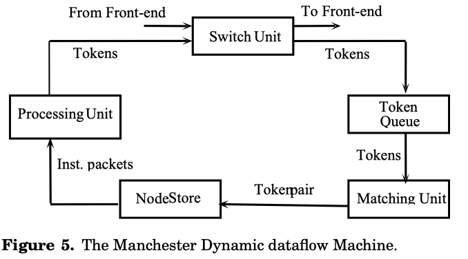

# [Dataflow computers: their history and future](https://csrl.cse.unt.edu/kavi/Research/encyclopedia-dataflow.pdf)

## Terminology

1. _**actor**_: a dataflow graph is a directed graph, $G(N, A)$, where nodes (also called _**actors**_) in $N$ represent instructions and arcs in $A$ represent data dependencies among the nodes.
1. _**tokens**_: the operands are conveyed from one node to another in **data packets** called tokens.
    - How to understand _data packets_ here?
1. _**tag**_: in dynamic dataflow architecture, to _**distinguish between different instances of a node**_, and _**routing data**_ for different instantiations of the node, _**a tag**_ is associated with each token that identifies the context in which a particular token was generated.

## My Takeaways

1. Below sentence is quoted from the paper:
    >Concurrency in conventional systems is based on instruction-level parallelism (ILP), data-level parallelism (DLP), and/or thread-level parallelism (TLP). These parallelisms are achieved using techniques such as _**deep pipelining**_, _**out-of-order execution**_, _**speculative execution**_, and _**multithreaded execution**_ of instructions with considerable hardware and software resources.

    From the description, _**deep pipelining**_, _**out-of-order execution**_, _**speculative execution**_, and _**multithreaded execution**_ are techniques to achieve efficiency through more parallelism and concurrency. I am not familiar with these techniques, but they are worth further reading.
1. because recurrent NN is customized computations performed on list-like structures. `stream` is exactly a list-like data structure, and it gives me a feeling that SISAL has many designs to optimize `stream` computation. So, whether it is possible to steal some design idea from SISAL?
1. Does this indicate that _**pure functional semantics**_ benefit inducing the full parallelism and concurrency, so is there a minimal set for these semantics that also benefits data processing system design?
1. Maybe, we can steal knowledge or learn knowledge from _**dyanmic**_ dataflow architecture research which _**views arc as buffers! and route data**_
1. Though TensorFlow's design has its root in dataflow architecture research, as my understanding, it is more like a static dataflow architecture, not a dynamic dataflow architecture.
1. The computation process should be split into several functional unit so that they can be piplined.
1. Below passage is quoted from the paper. It sounds fascinating for me, but to be honest, due to lacking enough knowledge, I cannot understand it. I think it worth further studying.

    

     Fig. cited from the paper.
    

1. Quoted some sentences from the paper that make me to think:
    1. the amount of _**parallelism lost because of the sequential execution**_ of instructions within a thread is minimal.
    1. _**thread level speculation**_ to _**improve**_ performance of _**imperative programs**_ is simplified in scheduled dataflow system.

## Overview

Quoted from the paper:

>As we approach the technological limitations, concurrency will become the major path to increase the computational speed of computers.

## Dataflow Principles

||Dataflow|Controlflow
|--|--|--|
|execution mechanism|all the required operands are available| executed sequentially under the control of a program counter|

- In the dataflow program, any two enabled instructions do not interfere with each other, thus can be executed in any order, or concurrently.
- In a dataflow environment
    1. conventional concepts such as "variables" and "memory updating" are nonexistent;
    1. instead, objects are consumed by an actor that yields a result object that is passed to the next actors;

## Dataflow Graph

What is a dataflow graph?

- Dataflow graphs can be viewed as the machine language for dataflow computers.
- It is a directed graph.
- In a dataflow graph:
    1. nodes (or actors) are instructions
    1. arcs are data dependencies among nodes

Below figure depicts the basic primitives of the dataflow graph.

 
Fig. Basic primitives of the dataflow graph.

|No.|Primitive|Functionality|
|--|--|--|
|1.|operator|produces a data value that is the result of some operation $f$|
|2.|decider|generates control value which is `true` or `false`|
|3.|merge actor|directs data values.  Direct an input data token to one of its outputs depending on the control input.|
|4.|switch actor|directs data values.  Passes one of its input tokens to the output based on the value of the control token.|
|5.|copy|identity operators that duplicate input tokens.|

## Dataflow Language

### VAL

1. relies on _**pure functional language semantics**_ to exploit implicit concurrency.
    - dataflow language use single assignment semantics, the implementation and the use of arrays present unique challenges.

1. quoted from the paper:

    > if one applies _**imperative semantics**_, both examples proceed sequentially.

    - _What are the differences between "imperative semantics" and "functional semantics"?_

### Id

- block-structured
- expression-oriented
- single assignment

ld programs consist of side-effect-free expressions and expressions can be executed in any order or concurrently based on the availability of input data.

### SISAL: _**Streams**_ and _**Iterations**_ in a Single Assignment Language

Quoted from the paper:

> Sisal 2.0 provided multitasking(or multithreading) to support dataflow parallelism on _**[conventional shared memory multiprocessor](https://link.springer.com/referenceworkentry/10.1007%2F978-0-387-09766-4_142)**_.

- A stream is _**a sequence of values**_ produced _**in order**_ by one expression; thus it consists of homogeneous typed values, and is consumed in _**the same order**_ by one ore more other expressions.
- Sisal can perform reduction operations _**concurrently using binary tree evaluations**_.

## Dataflow Architecture

### static dataflow architecture vs. dynamic dataflow architecture

||STATIC dataflow architecture|DYNAMIC dataflow architecture|
|:--|:--|:--|
||permits at most _**one instance**_ of a node to be enabled for firing|permits simultaneous activation of several instances of a node during the run-time by _**viewing arcs as buffers that contains multiple data items**_.|
|_**PROS**_|has a simplified inherent mechanism to detect enabled nodes|allows greater exploitation of parallelism|
|_**CONS**_|limits performance|greater parallelism comes at the expense of the overhead in terms of the:  1. generation of tags 2. larger data tokens 3. _**complexity of the matching tokens**_|

### pure dataflow architectures

In pure dataflow model, _**no concept of a variable exists**_ and data is exchanged _**in the form of tokens**_ flowing between instructions.

1. The _Static Dataflow Architecture_

    

    
     Fig. The basic organization of the static dataflow model.
    

    It contains five functional units

    1. the memory section
    1. the processing section
    1. the distribution network
    1. the control network

1. _Manchester Dyanmic Model_

    

     Fig. The Manchester Dynamic dataflow Machine.
    

    The manchester dynamic model is composed of five units organized as a pipeline ring:
    1. _**switch unit**_
    1. _**token queue**_
        - a first-in-first-out buffer that stores temporarily tokens traversing on the data-flow graph arcs.
    1. _**matching unit**_
    1. _**node store**_
    1. _**processing unit**_
        - a micro-programmed, 2-stage pipeline unit

1. Performance of the dynamic dataflow architecture significantly affacted by two factors:
    1. the rate at which the matching unit operates.
        - _solution_: ETS (explicit token store) and associative mathing

    1. _**the duration of the instruction cycle relative to its control-flow conunterpart**_.
        - I DO NOT UNDERSTAND THIS.

### macro dataflow architectures??

### hybrid dataflow architecture??

# Reference

1. [Tensorflow Conditionals and While Loops](http://mlexplore.org/2018/03/27/tensorflow-conditionals-and-while-loops/)
1. [dataflow architecture](https://en.wikipedia.org/wiki/Dataflow_architecture)
1. [ILP: instruction level parallel](https://en.wikipedia.org/wiki/Instruction-level_parallelism)
