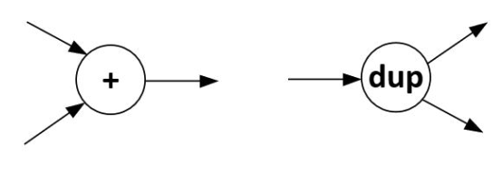
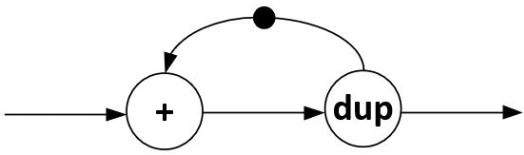
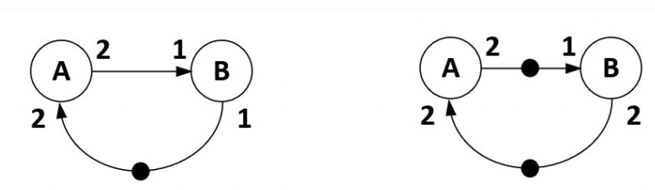
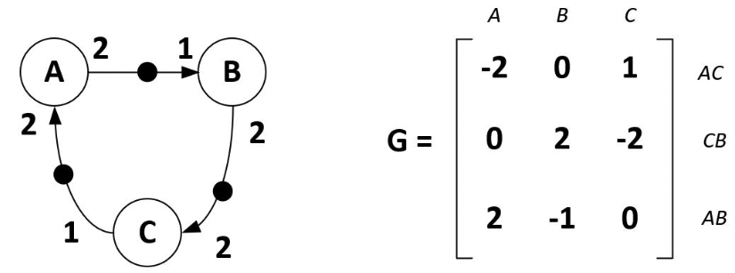
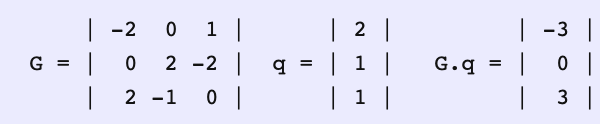
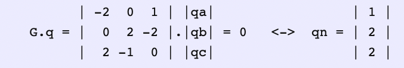

<!-- vscode-markdown-toc -->

- [Synchronous Dataflow](#synchronous-dataflow)
  - [Terminology](#terminology)
  - [Multi-input Multi-output Actors](#multi-input-multi-output-actors)
  - [Multi-rate Actors and Multi-rate Dataflow](#multi-rate-actors-and-multi-rate-dataflow)
  - [Ill-formed multi-rate dataflow](#ill-formed-multi-rate-dataflow)
  - [The existence of a periodic schedule](#the-existence-of-a-periodic-schedule)
    - [Step 1: the topology matrix $G$](#step-1-the-topology-matrix-g)
    - [Step 2: Firing vector $q$ and token vector $G.q$](#step-2-firing-vector-q-and-token-vector-gq)
    - [Goals](#goals)
  - [Limitations](#limitations)

<!-- vscode-markdown-toc-config
	numbering=true
	autoSave=true
	/vscode-markdown-toc-config -->
<!-- /vscode-markdown-toc -->

# [Synchronous Dataflow](https://schaumont.dyn.wpi.edu/ece4530f19/lectures/lecture15-notes.html)

## Terminology

- `actors`: nodes are called actors
- `queues`: edges are called queues
- `tokens`: data items flowing through a queue are called tokens
- `firing rule`: the execution of an actor is driven by the availability of data on the input queue. A `firing rule` is associated with every actor that is a condition exprssing when the actor should run or fire.
- `dataflow schedule`: a dataflow schedule is a sequence of actor firings.
    - a schedule in which only one actor fires at t time is called a ***sequential*** schedule.

## Multi-input Multi-output Actors

Two input add actor add:
1. each of the inputs must hold at least one token.
1. fire the actor when a token is present on each input of the actor.

Two output actor **duplicate**:
1. creates two copies of every input token, one on each of its output queues.

 
Figure: Two-input add actor and two-output duplicate actor

 
Figure: Dataflow accumulator.

1. a dataflow system with a feedback loop will be **deadlocked** unless there is at least one token in a queue that defines the loop.
1. if there is only one token in the loop, then only one actor (within that loop) will be able to fire at a time. Hence, the two-actor system shown here will only allow sequential schedules.
1. the token in the feedback loop serves as the ‘storage’ in this system.

   - **Neither the add actor nor the duplicate actor contain state**; all system state is contained within tokens. You can look at this system with hardware eyes, and imagine a token to be mapped to a register and and the actors to be mapped to combinational logic.

>**A synchronous dataflow system has a one-to-one correspondence to a synchronous hardware circuit**.
> While the notation is very similar, keep in mind that the semantics of these two models are quite different.
> - The connections in hardware are wires, and they have no storage capability; 
>
> - The connections in synchronous dataflow are queues, and they have infinite storage capability.
> 
> - The nodes in the hardware netlist are blocks of combinational logic.
> - The nodes in the synchronous dataflow graph are actors that use a firing rule.

## Multi-rate Actors and Multi-rate Dataflow

In multirate dataflow:

- the number of tokens consumed per actor firing is called the consumption rate.
- the number of tokens produced per actor firing is called the production rate.

All production and consumption rates are integer numbers high than or equal to 1.

## Ill-formed multi-rate dataflow

 
Figure: ill-formed multi-rate dataflow.

A system that is **dead-locked** (the graph on the left).
1. Actor B cannot fire because it misses an input token.
2. Actor A cannot fire because it does not see sufficient input tokens.

A system that requires **unbounded token storage** (the graph on the right).
1. Each time A runs, there is an additional token added to the system.
1. While the actors keep on firing, you’d need in finite amount of storage to hold the value of all tokens produced.

We want a **deadlock-free** design, and we want **bounded token storage**. Furthermore, we want to get a **schedule that is periodic**, and that can repeat forever.

## The existence of a periodic schedule

>transforming the dataflow graph into a system of equations that reflect the number of tokens on each queue, and then show that these equations can be solved by a period schedule.

 
Figure: Topology matrix.

### Step 1: the topology matrix $G$

1. one row per queue and one column per actor.
1. the production and consumption rate are marked as the entries in this matrix
    - production rates are positive
    - consumption rates are negative

### Step 2: Firing vector $q$ and token vector $G.q$

define the **firing vector** $q$ which reflects firings of the three actors. These firing are hypothetical that ignore if the firing rule of `A`, `B` and `C` allows this, saying 'suppose that we run the actors as follows':

- For example: $q = [2, 1, 1]^T$ let A fire two, B fire once and C fire once.

Given the topology matric, we can compute the number of tokens added to the system as a result of the firing vector = $G.q$.

 
a periodic admissible schedule exists.

>A periodic admissible schedule is one that allows unbounded execution and that does not result in deadlock, nor requires infinite queue storage.

### Goals

1. Looks for a firing vector that will keep the amount of tokens in the system stable.

    In other words, we are looking for a firing vector $qn$ for which the following holds: $G.qn = 0$.
1. $G.qn = n$ has an infinite number of solutions for $qn$.
   
   This condition is defined by checking the rank of $G$: `rank(G) = (number of actors) -1`.

1. Find a solution of $G.q = 0$.

    

     
    The periodic admissible schedule is: fire `A` twice, fire `B` and `C` once.
    

1. derive an actual schedule: simply try to fire actors iteratively until each actor has reached the bound indicated in $qn$.

## Limitations

1. The weak point of dataflow modeling is that it is unable to express conditional execution. Tokens are produced or consumed, unconditionally. There are many problems that are not easy to capture in dataflow when you are not able to express conditions.

    In dataflow, there is no if statement!