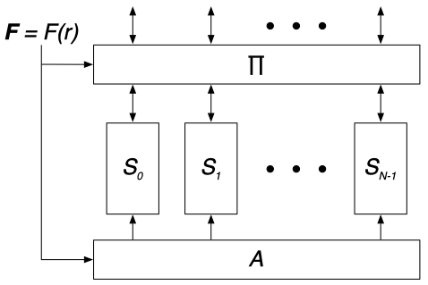

- [Exposure of Patterns in Parallel Memory Access](#exposure-of-patterns-in-parallel-memory-access)
  - [The general PMA model](#the-general-pma-model)
  - [MaP, MaE, and MaCT](#map-mae-and-mact)
  - [MaP Categories](#map-categories)
- [References](#references)

# Exposure of Patterns in Parallel Memory Access
## The general PMA model

 
Fig. The general PMA model

## MaP, MaE, and MaCT

## MaP Categories

# References

1. Crago, N. C., Stephenson, M., & Keckler, S. W. (2018). [Exposing memory access patterns to improve instruction and memory efficiency in GPUs](https://dl.acm.org/doi/pdf/10.1145/3280851). ACM Transactions on Architecture and Code Optimization (TACO), 15(4), 1-23.
1. Jang, B., Schaa, D., Mistry, P., & Kaeli, D. (2010). [Exploiting memory access patterns to improve memory performance in data-parallel architectures](https://www.researchgate.net/profile/David-Kaeli/publication/224141979_Exploiting_Memory_Access_Patterns_to_Improve_Memory_Performance_in_Data-Parallel_Architectures/links/0deec5226219d43067000000/Exploiting-Memory-Access-Patterns-to-Improve-Memory-Performance-in-Data-Parallel-Architectures.pdf). IEEE Transactions on Parallel and Distributed Systems, 22(1), 105-118.
1. Lundgren, B., & Ödlund, A. (2007). [Exposure of Patterns in Parallel Memory Access](https://www.diva-portal.org/smash/get/diva2:24165/FULLTEXT01.pdf).
1. Rubin, Eri, et al. "[Maps: Optimizing massively parallel applications using device-level memory abstraction](https://dl.acm.org/doi/pdf/10.1145/2680544)." ACM Transactions on Architecture and Code Optimization (TACO) 11.4 (2014): 1-22.
   - [Memory Access Patterns in MAPS Framework](https://www.cs.huji.ac.il/project/maps/about.html)