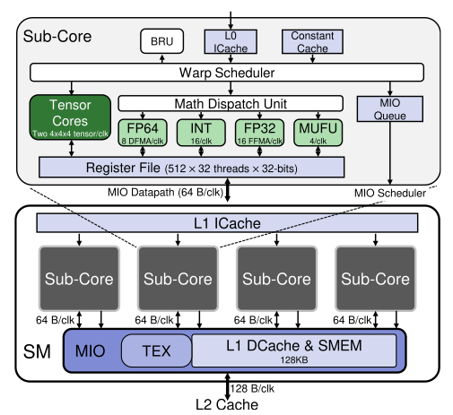

# 背景

## NV GPU Architecture

NV GPU 由许多streaming multiprocess（SM）构成，下图是volta架构的SM和sub-core示意图。

SM通过on-chip interconnection network与shared L2 cache和global memory（DRAM）相连。

Volta架构下每个SM包含：
1. L1 instruction cache（ICache）
1. shared memory I/O（MIO），MIO进一步包含：
    - texture memory
    - L1 data cache (DCache)
    - shared memory（SMEM）
    **从volta之后的GPU开始，L1 data cache和shared memory合并，以更高效的利用代码和sram。**
1. 四个sub-core。sub-core内部由memory sub-system和算术单元构成。
    - memory sub-system 包含：
      - L0 ICache
      - constant cache
      - register file
    - 算术单元包括：
      - CUDA cores
      - multi-function unite（MUFU）
      - 两个tensor core

GPU将并发线程进一步组织成线程层级：blocks，thread block（TB），wrap（32线程），threads。

TB会作为一个基本调度单位整体被调度到一个SM执行，一个TB内部的warp被warp scheduler以interleaved方式调度，可以并发执行。Volta架构下每个SM含4个sub-cores，因此可以并发执行4个warp。只要shared memory和RF容量足够，TB scheduler可以将多个TB调度到一个SM同时执行。SM执行完一个TB，以round-robin方式allocate下一个TB的执行。

## Persistent Kernel

A persistent kernel has a governing loop in it that only ends when signaled, otherwise it runs indenfinitely。A persistent kernel是一种kernel设计策略，我们可以把一个persistent kernel类比为一个生产者-消费者模式，something（host code）生产数据，persistent kernel消费数据生产结果。这个生产者-消费者模型can run indefinitely直到没有数据需要消费。consumer simply waits in a loop。

# Reference

1. Related stack overflow answers:
   - [What's the differences between the kernel fusion and persistent thread?](https://stackoverflow.com/questions/58402802/whats-the-differences-between-the-kernel-fusion-and-persistent-thread)
   - [CUDA How Does Kernel Fusion Improve Performance on Memory Bound Applications on the GPU?](https://stackoverflow.com/questions/53305830/cuda-how-does-kernel-fusion-improve-performance-on-memory-bound-applications-on/53311373#53311373)
   - [Doubling buffering in CUDA so the CPU can operate on data produced by a persistent kernel](https://stackoverflow.com/questions/33150040/doubling-buffering-in-cuda-so-the-cpu-can-operate-on-data-produced-by-a-persiste/33158954#33158954)
1. [NVIDIA A100 Tensor Core GPU Architecture](https://images.nvidia.com/aem-dam/en-zz/Solutions/data-center/nvidia-ampere-architecture-whitepaper.pdf)

1. [Unified virtual addressing in CUDA](https://docs.nvidia.com/cuda/cuda-c-best-practices-guide/#unified-virtual-addressing)