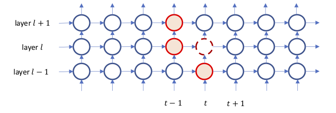
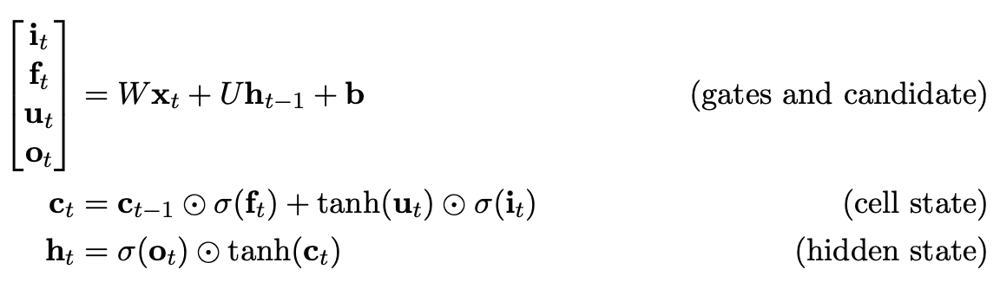
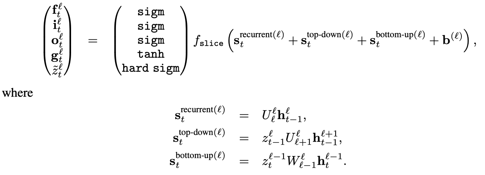

# Hierarchical Multiscale Recurrent Neural Networks

## Problem proposed in this paper

Learn the hierarchical multiscale structure from temporal data ***without explicit boundary information***.

## Key ideas

1. Introduce ***a parametrized binary boundary detector*** at each layer.
    - turned on only at the time steps where a segment of the corresponding abstraction level is completely processed.
    - **avoids “soft” gating which leads to “curse of updating every timestep”.**
1. select one of the three operations below according to boundary state $z_t^{l-1}$ and $z_{t-1}^l$ depicted in the below picture.

    

    
    

    - **UPDATE**: similar to update rule of the LSTM.
    - **COPY**: ***simply copies*** cell and hidden states of the previous time step which is unlike the ***leaky integration*** in LSTM/GRU.
    - **FLUSH**: executed when a boundary is detected, where it first ejects the summarized representation of the current segment to the upper layer and then reinitializes the states to start processing the next segment.

    | $z_{t-1}^l$  left| $z_{t}^{l-1}$ buttom | The Selected Operation ||
    |:-----------:|:-------------:|:----------------------:|:-:|
    |      0      |       0       |        **COPY**        |buttom and left states both do not reach to a boundary.|
    |      0      |       1       |       **UPDATE**       |left state does not reaches to a boundary but buttom does. **UPDATE** is executed sparsely|
    |      1      |       0       |       **FLUSH**        |left state reaches to a boundary.|
    |      1      |       1       |       **FLUSH**        |left state reaches to a boundary.|

1. boundary state is a discrete variable.***straight-through estimator*** is used to calculate its gradient.
    - the straight-through estimator is a very easy-to-implement solution to incorporate _**a binary stochastic variable**_ into the neural network. It seems that some research work generalizes this method into a binary vector to quantize NN.

## HM-LSTM: computation details

### 0. Recap LSTM's equation first:

HM-RNN is based on LSTM cell.

### 1. compute pre-activation

### 2. cell update

$$
\begin{equation}
\mathbf{c}_t^l = \left\{\begin{array}
\mathbf{f}_t^l \odot\mathbf{c}_{t-1}^l + \mathbf{i}_t^{l} \odot \mathbf{g}_t^{l}, & \text{if UPDATE}\\
\mathbf{c_{t-1}^{l}}, & \text{if COPY}\\
\mathbf{i}_t^{i}\odot\mathbf{g}_t^l,& \text{if FLUSH}
\end{array}
\right.
\end{equation}
$$

### 3. hidden update

$$
\begin{equation}
\mathbf{h}_t^l = \left\{\begin{array}
\mathbf{h}_{t-1}^{l}, &\text{if COPY}\\
\mathbf{o}_{t}^l \odot \text{tanh}(\mathbf{c}_t^l), &\text{otherwise}
\end{array}
\right.
\end{equation}
$$

- $\mathbf{g}$ is a cell proposal vector.
- $\mathbf{i}$, $\mathbf{f}$, $\mathbf{o}$ are the input/forget/output gate.

## Calculate the gradient for boundary detector

1. Straight-through estimator
    - forward pass uses the step function to activate $z_t^l$
    - backward pass uses [hardsigmoid](https://stackoverflow.com/questions/35411194/how-is-hard-sigmoid-defined) function as the biased estimator of the outgoing gradient.
    $$\sigma(x) = \text{max}(0, \text{min}(1, (\alpha x + 1)/2))$$

1. Slope annealing
    - start from slope $\alpha = 1$.
    - slowly increase the slope until it reaches a threshold. In the paper, the annealing function task-specific.

## Some claims made (and learned) from this paper

1.  However, because ***non-stationarity is prevalent in temporal data***, and that many entities of abstraction such as words and sentences are in variable length, we claim that ***it is important for an RNN to dynamically adapt its timescales*** to the particulars of the input entities of various length.
2.  It has been a challenge for an RNN to discover the latent hierarchical structure in temporal data without explicit boundary information.
3.  Although the LSTM has a ***self-loop for the gradients that helps to capture the long-term dependencies*** by mitigating the vanishing gradient problem, in practice, it is still limited to a few hundred-time steps due to the leaky integration by which the contents to memorize for a long-term is gradually diluted at every time step.

# References

1. [Hierarchical Multiscale Recurrent Neural Networks](https://arxiv.org/pdf/1609.01704.pdf)
    - [its slides](https://duvenaud.github.io/learn-discrete/slides/hierarchical-rnns.pdf)
1. [Revisiting the Hierarchical Multiscale LSTM](https://www.aclweb.org/anthology/C18-1272)
1.  This paper uses the [***straight-through estimator***] to train neural networks with discrete variables. This paper points to two references using this methods:
    -   [Binarized neural networks: Training deep neural networks with weights and activations constrained to+ 1 or-1](https://arxiv.org/abs/1602.02830)
    -   [Strategic attentive writer for learning macro-actions](https://pdfs.semanticscholar.org/c3dd/2bf141c1371398e29ad37ced18bee34e1766.pdf)
    - [Estimating or Propagating Gradients Through Stochastic Neurons for Conditional Computation](https://arxiv.org/pdf/1308.3432.pdf)
1. [Notes on Hierarchical Multiscale Recurrent Neural Networks](https://medium.com/jim-fleming/notes-on-hierarchical-multiscale-recurrent-neural-networks-7362532f3b64)
