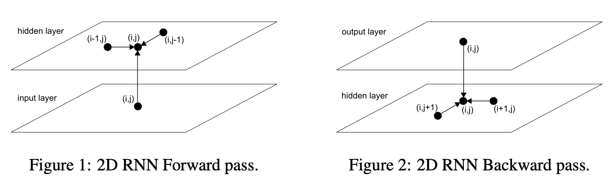
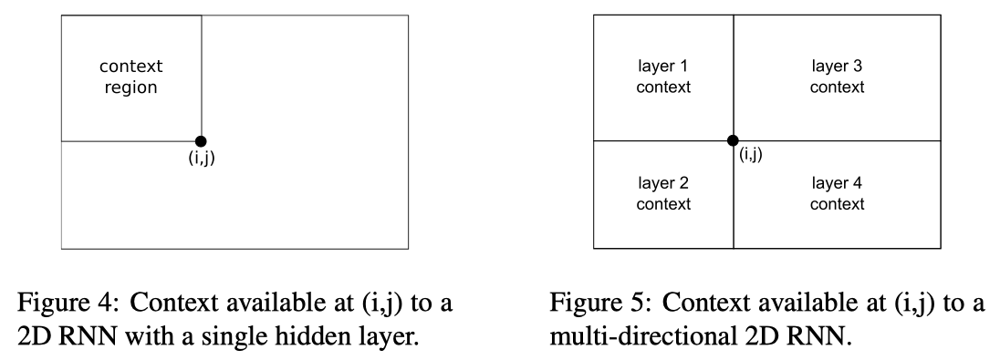

# [MD-LSTM](https://arxiv.org/abs/0705.2011)

## Goal

Applied RNN to multi-dimensional data rather than sequence.

## Approach

---

Recap standard LSTM first

$$\mathbf{f}_t = \sigma (W_f\mathbf{x}_t + U_f\mathbf{h}_{t-1} + \mathbf{b}_f) \tag{1}$$
$$\mathbf{i}_t = \sigma (W_i\mathbf{x}_t + U_i\mathbf{h}_{t-1} + \mathbf{b}_i) \tag{2}$$
$$\mathbf{o}_t = \sigma (W_o\mathbf{x}_t + U_o\mathbf{h}_{t-1} + \mathbf{b}_o) \tag{3}$$
$$\mathbf{\hat{c}}_t = \text{tanh}(W_c\mathbf{x}_t + U_c\mathbf{h}_{t-1} + \mathbf{b}_c) \tag{4}$$
$$\mathbf{c}_t = \mathbf{f}_t \circ \mathbf{c}_{t-1} + \mathbf{i}_t \circ \mathbf{\hat{c}}_t \tag{5}$$
$$\mathbf{h}_t = \mathbf{o}_t \circ \text{tanh}(\mathbf{c}_t) \tag{6}$$

---

1. Replace the single recurrent connection found in standard RNNs with _**as many recurrent connections**_ as there are dimensions in the data.
1. During the forward pass, at each point in the data sequence, the hidden layer of the network receives both an external input and its activations from one step back along all dimensions.

    

     
    Fig1. Figure 1 and 2 from the paper.
    

    Quoted from the paper:

    >_the data must be processed in such a way that when the network reaches a point in an $n$-dimensional **sequence**, it has already passed through all the points from which it will receive its **previous** activations._

1. Incorporate directional information (See Fig2.).
    - Bi-direction contains two separate hidden layers that process the input sequence in the forward and reverse directions. - The two hidden layers are connected to a single output layer to provide the network both past and future context.

    

     
    Fig2. Figure 4 and 5 from the paper.
    

_**Inputs**_

1. $N$: the dimension number
1. Input $\mathbf{x}$ that is arranged in an $N$-dimensional grid
     - such as 2-D grid of pixels in an image.
1. $N$ hidden vectors $\mathbf{h}_1, ..., \mathbf{h}_N$
1. $N$ memory vectors $\mathbf{c}_1,...,\mathbf{c}_N$

$$\mathbf{c}_t = \sum_{i}^{N}\mathbf{f}_t^i \circ \mathbf{c}^i_t + \mathbf{i}_t \circ \mathbf{\hat{c}}_t$$

Quoted from the paper:

>The standard formulation of LSTM is explicitly one-dimensional, since the cell contains a single self connection, whose activation is controlled by a single forget gate. However we can easily extend this to $n$ dimensions by using instead $n$ self connections (one for each of the cell’s previous states along every dimension) with $n$ forget gates.

My Note:

1. Each direction calculates its own forget gate. For example, the input data is arranged as a $N$ dimensional grid, then, $N$ forget gate is calculated.
1. All inputs in the $t$-th iteration calculate a single input, output gate, and a single cell candidate.

# References

1. [Multi-Dimensional Recurrent Neural Networks](https://arxiv.org/abs/0705.2011)
1. [A TensorFlow implemented Multi Dimensional Recurrent Networks on github](https://github.com/philipperemy/tensorflow-multi-dimensional-lstm#multi-dimensional-recurrent-networks)
1. [A stackoverflow question on MD-LSTM in TF](https://stackoverflow.com/questions/42071074/multidimensional-lstm-tensorflow)
