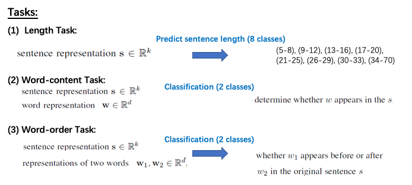

# BERT

## 1. Motivations / Problems

1. A more powerful way to model bidirectional information.
1. Many important downstream tasks such as Question Answering (QA) and Natural Language Inference (NLI) are based on understanding the relationship between two text sentences, which is not directly captured by language modeling.

## 2. Contributions

1. prove again that pre-trained representatioins eliminate the needs of many heavily-engineered task-specific architectures for  sentence-level **and** token-level tasks.
1. advances the state-of-the-art for 11 **NLU tasks**.

## 3.Approaches

### 3.1 Model Topology and Capacity

1. $\text{BERT}_{base}$

    - $L=12$, 12-layer transformer **encoder** (with masked self-attention) = $\text{BERT}_{base}$
    - hidden size $H = 768$, heads $A = 12$
    - FF/filter size = $4H = 3072$

1. $\text{BERT}_{large}$
    - $L=24$, 24-layer transformer **encoder** (with masked self-attention) = $\text{BERT}_{base}$
    - hidden size $H = 768$, heads $A = 12$
    - FF/filter size = $4H = 3072$

### 3.2 Input Representation

1. BERT's input representation is able to _**unambiguously**_ represent both a single text sentence or a pair of text sentences **in one token sequence**.

    

    <image src="images/input-of-bert.png" width=65%>
    

    

    <image src="images/highlight-bert-input.png" width=65%>
    

### 3.3 Pre-training tasks

#### 3.3.1 Masked LM

1. mask some percentage of the input tokens at random.
1. feed final hidden vectors corresponding to the mask tokens into an output softmax over the vocabulary as in a standard LM to predict **only**  those masked tokens.
    - In contrast to denosing auto-encoders, masked LM only predicts the masked words rather than reconstructing the entire input.

    

    <image src="images/highlight-bert-LM1.png" width=55%>
    

    

    <image src="images/highlight-bert-LM2.png" width=55%>
    

    

    <image src="images/highlight-bert-LM3.png" width=55%>
    

#### 3.3.2 Next Sentence Prediction (the auxiliary prediction task)

#### 3.3.3 Pre-training Procedure

- largely follows the existing literature on language model pre-training

- batch size of 256 sequences (256 sequences * 512 tokens = 128,000 tokens/batch)
- 1,000,000 steps.
    - approximately 40 epochs over the 3.3 billion word corpus.

#### 3.3.4 Fine-tuning

BERT's fine-tuning is straight-forward.

1. for sentence-level task, obtain a fixed-dimensional pooled representation of the input sequence,
    - the final hidden state for the first token in the input.
    - by construction this corresponds to the the special `[CLS]` word embedding.
1. The only new parameters added during fine-tuning are for a classification layer $W$.

# Reference

1. [Demystifying BERT: A Comprehensive Guide to the Groundbreaking NLP Framework](https://www.analyticsvidhya.com/blog/2019/09/demystifying-bert-groundbreaking-nlp-framework/)
