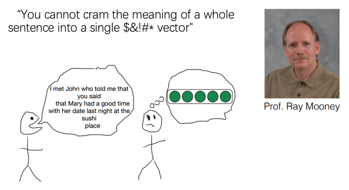
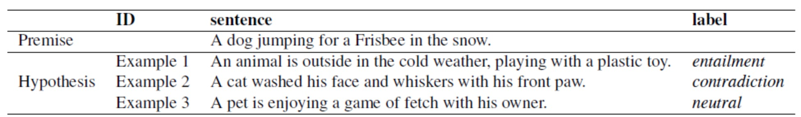

<!-- $theme: gaia -->
<!-- *template: invert -->

## ==What you can cram into vectors?==
###### NLP’s quest for learning language representations

Cao Ying

---

<!-- page_number: true -->

## Take-aways

1. Small breakthroughs gradually made towards BERT.
1. What are fundamental contributions between each milestone model?
    - _Fundamental learnings towards NLU which is the ultimate goal of NLP research from these works_
1. Future work after BERT's pre-training breakthroughs for NLU.

---

# References

1.  _**ULM-FiT (fast.ai 2018): [Universal Language Model Fine-tuning for Text Classification](https://arxiv.org/pdf/1801.06146.pdf)**_
1.  _**ELMo (AllenNLP, 2018, NAACL 2018 the best paper award): [Deep contextualized word representations](https://arxiv.org/abs/1802.05365)**_
    - [Official blog](https://allennlp.org/elmo)
1.  _**GPT (OpenAI, 2018): [Improving Language Understanding by Generative Pre Training](https://s3-us-west-2.amazonaws.com/openai-assets/research-covers/language-unsupervised/language_understanding_paper.pdf)**_
    - Official blogL [Improving Language Understanding with Unsupervised Learning](https://openai.com/blog/language-unsupervised/)
1. GPT-2 (OpenAI, ): [Language Models are Unsupervised Multitask Learners](https://d4mucfpksywv.cloudfront.net/better-language-models/language_models_are_unsupervised_multitask_learners.pdf)
    - Official blog: [Better Language Models and Their Implications](https://openai.com/blog/better-language-models/)
    - [github](https://github.com/openai/gpt-2)
1.  _**BERT (Google AI Language, 2018) [BERT: Pre-training of Deep Bidirectional Transformers for Language Understanding](https://arxiv.org/abs/1810.04805)**_
1. TransformerXL (Google Brain, 2019): [Transformer-XL: Attentive Language Models Beyond a Fixed-Length Context](https://arxiv.org/pdf/1901.02860.pdf)
1. [XLNet: Generalized Autoregressive Pretraining for Language Understanding](https://arxiv.org/pdf/1906.08237.pdf?)
1. MASS (MSRA 2019) [MASS: Masked Sequence to Sequence Pre-training
Unified Language Model Pre-training for Natural Language Understanding and Generation](https://arxiv.org/pdf/1905.02450.pdf)
1. [RoBERTa: A Robustly Optimized BERT Pretraining Approach](https://arxiv.org/abs/1907.11692)
1. Megatron-LM (Nvidia, 2019): [Megatron-LM: Training Multi-Billion Parameter Language Models Using Model Parallelism](https://arxiv.org/abs/1909.08053)
1. (Google, ==ICLR 2019 **under double-blind review**==) [ALBERT: A Lite BERT for Self-supervised Learning of Language Representations](https://arxiv.org/abs/1909.11942)
    - PR: [Meet ALBERT: a new ‘Lite BERT’ from Google & Toyota with State of the Art NLP performance and 18x fewer parameters](https://medium.com/@lessw/meet-albert-a-new-lite-bert-from-google-toyota-with-state-of-the-art-nlp-performance-and-18x-df8f7b58fa28)

---

## ==Backgroud (I)==

##### ==Transductive==(semi-supervised), ==Inductive== and ==Active== transfer learning

Imagine you have a training data, but only a subset of it has labels.

For example, you are trying to classify whether an image has a flower in it or not:

- You have 100,000 images,
- 1,000 images that you know definitively contain a flower;
- and another 1,000 that you know don't contain a flower;
- The other 98,000 you have no idea about: maybe they have flowers, maybe they don't.

---

## ==Backgroud (II)==

1. _**Transductive Transfer Learning**_ (转导推理，aks. semi-supervised learning)
    - the other 98,000 images don't have labels, but they tell me something about the problem space.
    - still use the unlabeled data in training to help improve accuracy.
1. _**Inductive Transfer Learning**_ （归纳推理）
    - only looks at the 2,000 labeled examples, builds a classifier on this.
1. _**Active Learning**_ (主动学习)
    - when looking through the 98,000 examples, select a subset and request labels from an oracle.
    - the algorithm might say "of those 98,000, can you label this set of 50 images for me? That will help me build a better classifier".

---

## ==Warmup==

### The most general inductive transfer setting for NLP

Given a ==static **source task**== $\mathcal{T}_S$, and ==any **target task**== $\mathcal{T}_T$ with $\mathcal{T}_S \ne \mathcal{T}_T$, the inductive transfer learning would like to improve the performance on $\mathcal{T}_T$.

---

<!-- *template: invert -->

## Side Note: ==Why LM a perfect source task for NLP==

1. It captures many facets of language relevant for downstream tasks, such as _**long-term dependencies**_, _**hierarchical relations**_, and _**sentiment**_.
1. It provides data in _**near-unlimited quantities**_ for most domains and languages.
1. A pretrained LM can be easily adapted to the idiosyncrasies of a target.
1. Language modeling already is _**a key component of many existing tasks**_ such as MT and dialogue modeling.

---

<!-- *template: invert -->

# ==ULM-FiT==
#### ==U==niversal ==L==anguage ==M==odel ==Fi==ne-tuning

---

## Breakthroughs

1. First prove a ==**universal**== language model with fine-tuning works for ==any== NLP task.
1. Summarize of a bunch of practically effective fine-tuning tricks.

---

### Goal

A Universal Language Model Fine-tuning enables robust inductive transfer learning for any NLP task.

### Challenges

The idea of LM fine-tuning is not widely adopted in the NLP field.

1. LMs overfit to small datasets.
1. LMs suffer catastrophic forgetting when fine-tuned with a classifier.
1. compared to CV, _**NLP models are typically more shallow**_ and thus require different fine-tuning methods.

---

## Approach: the three-stage workflow of ULM-FiT

### ==**Stage 1**==: General-domain LM pre-training

==**Capture general features of the language in different layers.**==

-  three stacked  AWD-LSTM: [Regularizing and Optimizing LSTM Language Models](https://arxiv.org/pdf/1708.02182.pdf)

- trained on a  _**general-domain corpus**_.
    - Wikitext-103: 28,595 preprocessed Wikipedia articles and 103 million words.

---

### ==**Stage 2**==: Target task LM fine-tuning

==**Learn task-specific features.**==

- discriminative fine-tuning (Discr)

    

    - Tune each layer with different learning rates:
        $$\theta_t^l = \theta_{t-1}^l - \eta^l \cdot \nabla_{\theta^l}J(\theta)$$
    - The paper empirically found it to work well:
        - First only fine-tue the last layer: choose the learning rate $\eta^L$
        - Tune lower layers gradually using $\eta^{l-1} = \eta^{l /2.6}$ as the learning rate.
    

- slanted triangular learning rates(STLR)

    

    
    

---

### ==**Stage 3**==: Target task classifier fine-tuning

==**Preserve low-level representations and adapt high-level ones.**==

1. Fine-tuing model: ==two additional linear blocks==
    
    1. the first linear layer takes as the input the pooled last hidden layer states.
        - concatenate sequence last, max pooling, and mean pooling.
    1. each block uses batch normalization, and dropout.
    1. with ReLU activations for the intermediate layer.
    1. a softmax activation at the last layer.
    

1. Fine-tuning method
    1. _**gradual unfreezing**_
    1. _**Discr**_
    1. _**STLR**_.

---

### Please check more details of the Ablation Analysis section of this paper if interested.

---

<!-- *template: invert -->

# ==ELMo==

#### ==E==mbedding from ==L==anguage ==Mo==deL
#### ==_**Deep contextualized**_== word representations

---

## Breakthroughs

This work demonstrates that exposing the deep internals of the pre-trained network is crucial.

---

## Goal

An ideal representation should model: syntax, semantics, and polysemy.

- An example of polysemy

    >I ==read== the book yesterday.
    >Can you ==read== the letter now?

---

## Approach: The overall ELMo architecture

---

## Detail (I): biLM

LM used by ELMo is proposed from the paper: [Exploring the Limits of Language Modeling](https://arxiv.org/abs/1602.02410?context=cs), but

1. extends to bi-directional LSTM
1. some weights are shared between forward and backward directions.

---

## Detail (I): biLM

==Key learnings== from the above paper used by ELMo, I think are twofold:

1. use big LSTM
1. CNN + LSTM

Quoted from [Exploring the Limits of Language Modeling](https://arxiv.org/abs/1602.02410?context=cs):

>most recent work on large scale LM has shown that ==_**RNNs are great in combination with N-grams**_==, as they may have different strengths that complement N-gram models, but ==_**worse when considered in isolation**_==.

---

## Detail (II):  ELMo vectors

---

## Detail (III): ELMo for downstream tasks

1. first freeze the weights of the biLM;
1. concatenate the ELMo vector $\text{ELMo}_k^{task}$ with $\mathbf{x}_k$: $[\mathbf{x}_k;\text{ELMo}_k^{task}]$;
1. further improvements are observed when including ELMo at the output layer of the target task;

---

## Model Capacity of ELMo

### three layers exposed in ELMo:

1. input tokens flow into 2048 character-level convolution filters, followed by 2 highway layers.
1. a linear projection project CNN's output down to 512 dimensions.
1. $L = 2$, stacked 2 biLSTM layers.
    - 4096 hidden units, input/output dimension 512
    - with a residual connection between layers.

    

    <image src="images/highway2.png" width=50%>
    

---

<!-- *template: invert -->

# ==GPT==
#### ==G==enerative ==P==re-==T==raining

---

## Breakthroughs

1. Use transformer decoder instead of LSTM to achieve better capture long-term linguistic structure.
1. Re-highlights the effectiveness of auxilliary tranining objectives.
1. Domonstrate that unsupervised pre-training (_generative pre-training_) + supervised fine-tuning framework works.

---

## Approach (I)

### ==Stage 1==: Unsupervised pre-training

1. standard language modeling objective (MLE), denoted as $L_1$.
1. transformer decoder as the LM.

<image src="images/transformer-block.png">

---

## Approach (II)

### ==Stage 2==: Supervised fine-tuning

1. an extra linear output layer is added after the final transformer block's activation.
    - the learnable parameter for this layer and embeddings for ==**delimiter token**== are the only extra parameters in fine-tuning.
1. loss function of the supervised task:
    $$L_2(\mathcal{C}) = \sum_{(x, y)} \text{log} P(y|x^1,...,x^m)$$
1. add an auxiliary training objective with weight $\lambda$.

    $$L_3(\mathcal{C}) = L_2(\mathcal{C}) + \lambda * L_1(\mathcal{C})$$

---

## Approach (III)

### task-specific input transformations

---

## Model Capacity

1. $L=12$, 12-layer transformer decoder (with masked self-attention) = $\text{BERT}_{base}$
    - hidden size $H = 768$, heads $A = 12$
    - FF/filter size = $4H = 3072$
1. train for 100 epoches on minibatches of 64 randomly sampled, contiguous sequences of 512 tokens.

---

<!-- *template: invert -->

# ==BERT==
#### ==B==idirectional ==E==ncoder ==R==epresentations from ==T==ransformers

---

# How BERT is designed?

<image src="images/how-bert-comes-out.png">

<small>[Reddit: BERT: Pre-training of Deep Bidirectional Transformers for Language Understanding](https://www.reddit.com/r/MachineLearning/comments/9nfqxz/r_bert_pretraining_of_deep_bidirectional)<small>

>But for us the really ==amazing and unexpected== result is that when we ==go **from a big model**== (12 Transformer blocks, 768-hidden, 110M parameters) to ==a **really big model**== (24 Transformer blocks, 1024-hidden, 340M parameters), we get huge improvements even on very small datasets (small == less than 5,000 labeled examples).

---

## Motivations / Problems

1. A more powerful way to model bidirectional information.
1. Many important downstream tasks such as Question Answering (QA) and Natural Language Inference (NLI) are based on understanding the relationship between two text sentences, which is not directly captured by language modeling.

 
Fig. NLI (蕴含/冲突/中立)

---

## Breakthroughs

1. prove again that pre-trained representatioins eliminate the needs of many heavily-engineered task-specific architectures for  sentence-level **and** token-level tasks.
1. advances the state-of-the-art for 11 **NLU tasks**.

---

## Approach: Model Topology and Capacity

1. $\text{BERT}_{base}$

    - $L=12$, 12-layer transformer **encoder** (with masked self-attention) = $\text{BERT}_{base}$
    - hidden size $H = 768$, heads $A = 12$
    - FF/filter size = $4H = 3072$

1. $\text{BERT}_{large}$
    - $L=24$, 24-layer transformer **encoder** (with masked self-attention) = $\text{BERT}_{base}$
    - hidden size $H = 768$, heads $A = 12$
    - FF/filter size = $4H = 3072$

---

## Approach I: Input Representation

BERT's input representation is able to _**unambiguously**_ represent both a single text sentence or a pair of text sentences **in one token sequence**.

<image src="images/input-of-bert.png" width=65%>

<image src="images/highlight-bert-input.png" width=65%>

---

## Approach II: Pre-training tasks

#### 3.3.1 Masked LM

1. mask some percentage of the input tokens at random.
1. feed final hidden vectors corresponding to the mask tokens into an output softmax over the vocabulary as in a standard LM to predict **only**  those masked tokens.
    - In contrast to denosing auto-encoders, masked LM only predicts the masked words rather than reconstructing the entire input.

---

## Highlight some caveats from BERT's design choices

<image src="images/highlight-bert-LM1.png" width=45%>

<image src="images/highlight-bert-LM2.png" width=45%>

<image src="images/highlight-bert-LM3.png" width=45%>

---

## Approach II: Pre-training tasks

#### 3.3.2 Next Sentence Prediction (the auxiliary prediction task)

Some examples of popular auxiliary prediction tasks to achieve/validate NLU

---

## Approach III: Pre-training Procedure

- largely follows the existing literature on language model pre-training

- batch size of 256 sequences (256 sequences * 512 tokens = 128,000 tokens/batch)
- 1,000,000 steps.
    - approximately 40 epochs over the 3.3 billion word corpus.

---

## Approach IV: Fine-tuning

BERT's fine-tuning is straight-forward.

1. for sentence-level task, obtain a fixed-dimensional pooled representation of the input sequence,
    - the final hidden state for the first token in the input.
    - by construction this corresponds to the the special `[CLS]` word embedding.
1. The only new parameters added during fine-tuning are for a classification layer $W$.

---

# Some future work after BERT

1. Light weighted pre-training models.
1. Light weighted pre-training models for inference.
1. Pre-training dose not work well for NLG.
    
    - MASS (MSRA 2019) [MASS: Masked Sequence to Sequence Pre-training
Unified Language Model Pre-training for Natural Language Understanding and Generation](https://arxiv.org/pdf/1905.02450.pdf)
    

