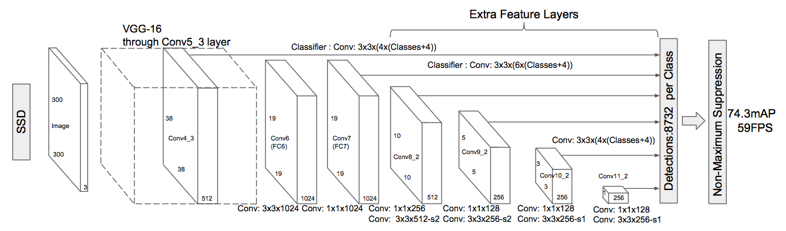
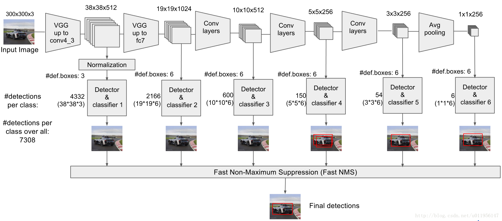

## Motivations

## Model

1. SSD is based on:
    * A _**feed-forward convolutional network**_ that produces a _**fixed-size**_ collection of bounding boxes and scores for the presence of object class instances in those boxes.
    * Followed by a _**non-maximum suppression**_ step to produce the final detections.
    * Uses VGG16 as the base network.
1. Auxiliary structures:
    * **Multi-scale feature maps for detection.**
      * Convolution layers at the end of the base network, sizes of which decrease progressively.
    * **Convolutional predictors for detection**
      * Each added feature layer can produce a fixed set of detection predictions using a set of convolutional filters.
    * **Default boxes and aspect ratios**
      * Associates a set of default bounding boxes with each feature map cell for multiple feature maps.
      * The default boxes tile the feature map in a convolutional manner. The position of each box relative to the default box shapes in the corresponding cell is fixed.
      * At each feature map cell, predicts:
          1. the offsets relative to the default box shapes in the cell.
          1. the per-class scores.
      * Particularly, for each box out-of $k$ at a given location calculates $c$ class scores and 4 offsets, yeilding $k(c+4)mn$ outputs for a $m\times n$ feature map.
    * _**SSD efficiently discretizes the space of possible output box shapes by using different default box shapes in several feature maps**_.

## Chose scales and aspect ratios for default boxes

* default boxes are like anchors in Fast-RCNN.

## Details

* Default anchor boxes
  * An anchor box can have an arbitrary shape, sample a set of anchor boxes as the candidate.
  * In particular, for each pixel, sample multiple boxes centered at this pixel but have various sizes and ratios.
    * Assume the input size is $w \times h$
    * for size $s \in (0,1]$, the generated box shape will be $ws \times hs$
    * for ratio $r > 0$, the generated box shape will be $w\sqrt{r} \times \frac{h}{\sqrt{r}}$

## Training

* Ground truth information needs to be assigned to specific outputs in the fixed set of detector outputs.
* Choose:
    1. the set of default boxes and scales for detection.
    1. the hard negative mining.
    1. data augmentation strategies.
