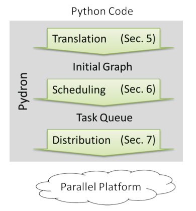
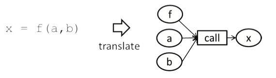
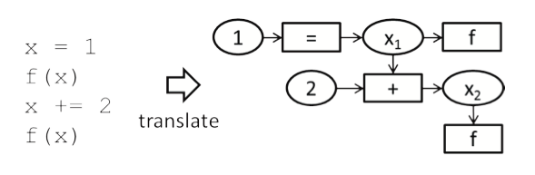

# 1. [Pydron: Semi-Automatic Parallelization for Multi-Core and the Cloud](http://citeseerx.ist.psu.edu/viewdoc/download?doi=10.1.1.1018.8549&rep=rep1&type=pdf)

## 1.1. My Takeaways and Some Thoughts

1. Work in this paper mainly target parallelize imperative Python's codes. To fulfill this goal, this paper defines its own IR which is a kind of control-flow graph.
1. The data flow graph is the basis for automatic parallelism.
1. "Parallelism" is also a kind of infrastructure: we have a parallel framework (Spark, Hadoop, etc.), hardware.

Some segments in my mind:
1. mutable/immutable data/variables should be distinguished in DL/ML programming.
1. do not ignore PL's scopes constraints when considering the problem.

## 1.2. Compare this paper's work in Python to Julia
|                        | Python                                                            | Julia                                                                                                                                              |
| ---------------------- | ----------------------------------------------------------------- | -------------------------------------------------------------------------------------------------------------------------------------------------- |
| Function Calls         | First-class functions                                             | First-class functions. [_Need to give details_] More consistent behavior/design of functions.       |
| SSA Form               | Needs to implement the translation of Python codes into SSA form. | Already has an SSA form language IR.                                                                                                               |
| In-place modifications | Python objects can change after their creation.                   | [_Need to give details_] Julia objects have more explicit control/notations on mutation/immutation. |

# 2. Overall

## 2.1. Background

- The way to achieve performance today is through large scale parallelism: multi-core, rack-scale, or cloud computing.
- Many of the languages currently in widespread use were not designed with parallelization in mind, which leads to a demand for easy-to-use interfaces between the language and the parallel infrastructure.

### 2.1.1. Related Works

1. _**Science Data Archives**_
    - Raw data are processed into some scientific data form, like _**tabular**_ or _**relational**_.
    - _Science Data Archives_ try to provide a system-wide solution to simplify the analysis of such scientific data. This kind of work is highly application specific and are rarely used in other contexts.
1. _**Delayed Execution**_
    - Introduce a set of _*data types*_ together with operations that can be applied to them, which allows for efficient parallelization and sophisticated data management.

    This is a little like Julia's kernel fusion in the broadcast.
1. _**Source-to-Source Translation**_
    - Translate the source code into another programming language that is more suited for the target infrastructure.
    - The translation and subsequent compilation typically happen just-in-time during execution.
    - Not all data type and operations are available in the target language, thus the translation place constraints.
        - Typically require complete type inference.
1. _**DSL**_
    - Strong constraints.
    - Less practical.

## 2.2. Problem Proposed

Parallelize and execute sequential Python code on a cloud, cluster or multi-core infrastructure.

## 2.3. Goal

1. Simplify development without sacrificing the performance gains of parallelism _**at the machine or cluster level**_.

_**Challenges**_ Dynamic-typing, late-binding, and side-effects make static analysis of Python code hard.

## 2.4. Approach

Semi-automatic parallelization.

1. Translate Python into an intermediate (1) data-flow graph representation.
1. The graph is then evaluated by a (2) _**scheduler sub-system**_ which uses (3) _**distribution sub-system**_ to execute individual tasks to the worker nodes.

 
Fig. Pydron Overview.

Pydorn consists of three components:
1. translator
1. scheduler
1. distribution system

# 3. Detail

## 3.1. Interfaces

1. `@scheduler` makes the functions which should be considered for automatic parallelization.
1. `@functional` informs Pydron the marked function is free of side-effects and may be run on a different machine.
    No automatic checking for whether a function meets the functional criteria in current work.

## 3.2. Language Translation

The intermediate Data-Flow Graph used by Pydron:
- Nodes:
    1. _**value nodes**_: immutable data.
        - variables become value-nodes.
        - intermediate values in expressions also become value-nodes.
    1. _**tasks**_: operations on data.
        - expressions and statements become tasks
- Edges:
    - dependencies between tasks can ONLY result from data dependencies.

Use Python's built-in parser to create an AST which will be traversed twice:
1. identify the scopes.
1. translation.

### 3.2.1. Function Call

_**[Functions are first-calss objects in Python](https://www.geeksforgeeks.org/first-class-functions-python/).**_

>_Functions in Julia are first-class objects: they can be assigned to variables and called using the standard function call syntax from the variable they have been assigned to. They can be used as arguments, and they can be returned as values. They can also be created anonymously, without being given a name._

- a function is represented by a value-node.
- the value-node then become the input of a call-task.

 
Fig. Function call translation.

### 3.2.2. Static Single Assignment Form

My Note:

- This process is to formalize Python codes into SSA format.
- It seems that the SSA algorithm is non-trivial.
- In Python, we have to formalize Python codes into SSA representation ourselves.
- In a language like Julia that already has an SSA format IR, the difficulty then become how to manipulate such a language's IR, and making the manipulated results still a valid IR format.

 
Fig. SSA form translation.

### 3.2.3. In-place modifications

Challenges:

1. Copy-on-write is impractical.
    - Data of the value-node may not have value semantics.
1. _**Not all in-place operations cause problems, but it is impossible to identify them all in general.**_
1. If targeting parallel, the execution order is important, thus requires synchronization.
    - e.g: If the task performs the in-place modification is executed after all other tasks that use that value-node have completed, such a modification will not have an observable effect.
    - Whenever there is a risk of having an in-place modification that may affect other value-nodes, Pydron makes the task into a synchronization.

Solution:

1. the input edge that connects the task with the affected value-node is flagged as _**last-read**_.
1. the _**scheduler**_ is aware of the _last-read_ flag and ensures correct ordering of task-executions.
1. for each affected value-node, special translations 1 ~ 3 has to be applied.
1. A pseudo-variable is introduced to model synchronization.

### 3.2.4. Attribute and Subscript

Attribute and Subscript access are translated into a task.
- support _**all indexing construct**_.

### 3.2.5. `@functional` decorator

>Formal analysis/parallel execution/scheduling favor functional style, but it seems that except some functional programming language, most programming languages do not explicitly model side-effect, so it seems to be impossible to detect/model side-effects in general, but make some assumptions.

This is to annotate user-defined functions which are not changed at all, but just be kept track of.

### 3.2.6. Conditional Statements/Loops

See dynamic [data-flow graph](https://www.cs.tufts.edu/comp/150CMP/papers/dataflow-johnston-acm04.pdf) for reference if interested.

Loops are transformed into a _**tail-recursive pattern**_ to enforce sequential execution.

### 3.2.7. _return, break, and continue_

There three statements interrupt the regular control flow.
Reformulate them with conditional expressions and flag variables.

### 3.2.8. Non-local variables

global variables, closures, and nested functions.

### 3.2.9. Exception

Can still achieve parallelism by speculative execution.

> If we consider reverse-mode AD,

## 3.3. Scheduler

# 4. Reference

1. [First-class citizen](https://en.wikipedia.org/wiki/First-class_citizen)
1. [First-class functioins](https://en.wikipedia.org/wiki/First-class_function)
1. [Tail Call Optimization(TCO)](http://wiki.c2.com/?TailRecursion)
