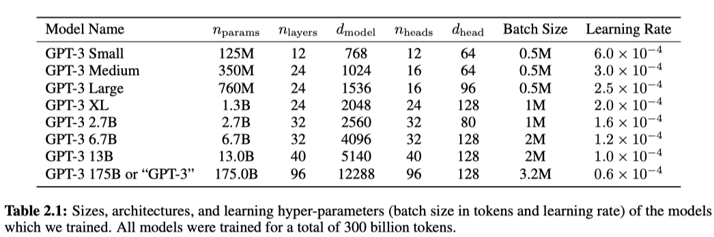

 
Fig. The original GPT model. (from [wiki page](https://en.wikipedia.org/wiki/Generative_pre-trained_transformer))

|Model|Context Window Length|
|:--|:--|
|GPT|512|
|GPT-2|1024|
|GPT-3|2048|
|GPT-4|[8000](https://help.openai.com/en/articles/7127966-what-is-the-difference-between-the-gpt-4-models)|