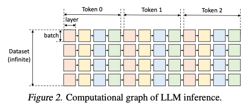

<!-- START doctoc generated TOC please keep comment here to allow auto update -->
<!-- DON'T EDIT THIS SECTION, INSTEAD RE-RUN doctoc TO UPDATE -->
**Table of Contents**  *generated with [DocToc](https://github.com/thlorenz/doctoc)*

- [FlexGen: High-Throughput Generative Inference of Large Language Models with a Single GPU](#flexgen-high-throughput-generative-inference-of-large-language-models-with-a-single-gpu)
  - [Goal](#goal)
  - [Challenges](#challenges)
  - [Some background information](#some-background-information)
  - [Approach](#approach)
    - [Problem formulation](#problem-formulation)
    - [Search space](#search-space)

<!-- END doctoc generated TOC please keep comment here to allow auto update -->

# [FlexGen: High-Throughput Generative Inference of Large Language Models with a Single GPU](https://arxiv.org/pdf/2303.06865.pdf)

[[codes]](https://github.com/FMInference/FlexGen)

FlexGen can be flexibly configured under various hardware resource constraints by aggregating memory and computation from the GPU, CPU, and disk. By
solving a linear programming problem, it searches for efficient patterns to store and access tensors.

GPT-175B requires 325GB of GPU memory to load its model weights. At least 5 A100.

Propose a setting called "***throughput-oriented generative inference***": running LLM inference in batches over a large number of tokens, and are less sensitive to latency,
thus possible to trade-off latency for throughput, producing opportunities to reduce resource requirements.

Lower resource requirements of LLM inference:

|Approach|Limitations|
|:--|:--|
|model compression to decrease total memory footprint|struggle to run 175B-scale model with a single commodity GPU|
|collaborative inference|same as above|
|offloading to utilize memory from CPU and disk|do not achieve acceptable throughput|

## Goal

Achieving high-throughput generative inference with limited GPU memory while we can sacrifice the latency.

## Challenges

<ins>1. **design an efficient offloading strategy**</ins>.

The complexity of data: weights, activations, key-value cache.

1. which tensor to offload (weights, activations, and key-value cache)
1. where to offload
1. when to offload

The complexity of computation forms a complex dependency graph.
1. batch-by-batch
1. token-by-token
1. layer-by-layer

All together form a large design space.

<ins>2. **develop effective compression strategies**.</ins>

When combining compression with offloading for high-throughput inference, the I/O costs and memory reduction of the weights and KV cache become more important,
motivating alternative compression schemes.

## Some background information

Transformer模型推理任务的计算量，memory footprint 由以下几个超参数决定。
以OPT-175B为例

|Parameters|Value|
|:--|:--|
|$h_1$|12288|
|$h_2$|49152|
|$L$|96|
|$s$|512|
|$b$|512|
|$n$|32|

## Approach

1. Define a search space of possible offloading strategies by considering computation schedule, tensor placement, and computation delegation.
1. Compress both weights and KV cache for LLMs (OPT-175B to 4 bits using fine-grained group-wise quantization)
### Problem formulation

图2中的一个彩色方块是对一个transformer layer进行一次batch预测，颜色相同的方块加载的weights相同。图中的模型有4层，每个prompt生成3个token。这篇论文关心throughput-oriented的预测，因此假定上图中dataset维度可以任意长。

将“Generative inference with offloading” formalize成一个图遍历问题，在图上寻找到一个valid path。一个valid path是一条遍历所有方块的路径，编历时需要遵循以下这些依赖条件：
1. 一个块只有当他的左侧块全部计算完毕后才可以进行计算
1. 一个块在device上计算时，它的输入（weights, activations，cache）必须在同一个device上。
1. 一个块计算完输出两个结果：activation和KV cache：
    - activation存储到右兄弟算完毕
    - KV cache存储到同一行最右侧的方块计算完毕
1. 任何时刻device上存储的tensor不能超过memory capacity

算法目标是找到一个valid path，最小化执行时间。最小的实行时间包括计算时间和在device之间移动tensor的I/O cost。

### Search space

search space由三个维度构成：

**Compute**

遍历图有两种顺序：

|遍历方式|优点|缺点|
|:--|:--|:--|
|按行遍历|以lantency优先的方式完成一个batch序列的生成，然后KV cache占的空间也能够被释放|连续的两个小方块weights不共享，需要频繁的加载模型参数，因此I/O复杂度高|
|按列遍历|一列小方块共享weights，在一列小方块计算完之前让weights驻留在GPU上，只load/unload activations和KV cache|activations和KV cache也需要存储，纵向扫描最终也会超过存储的限制|

1. 提出了一种I/O-optimal schedule，但是仅仅实现了更为简单的block schedule。
1. overlap 各种load/unload和computation，这一步向搜索空间引入两个超参数：<ins>GPU batch size</ins>和 <ins>GPU batch</ins>数目

**Tensor Placement**

**Compute Delegation**