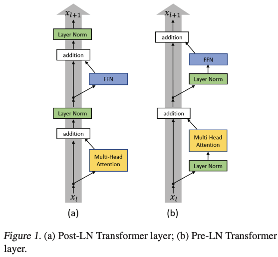

# 一些不错的背景资料

1. [分析transformer模型的参数量、计算量、中间激活、KV cache](https://zhuanlan.zhihu.com/p/624740065)
1. [On Layer Normalization in the Transformer Architecture](http://proceedings.mlr.press/v119/xiong20b/xiong20b.pdf)
   

