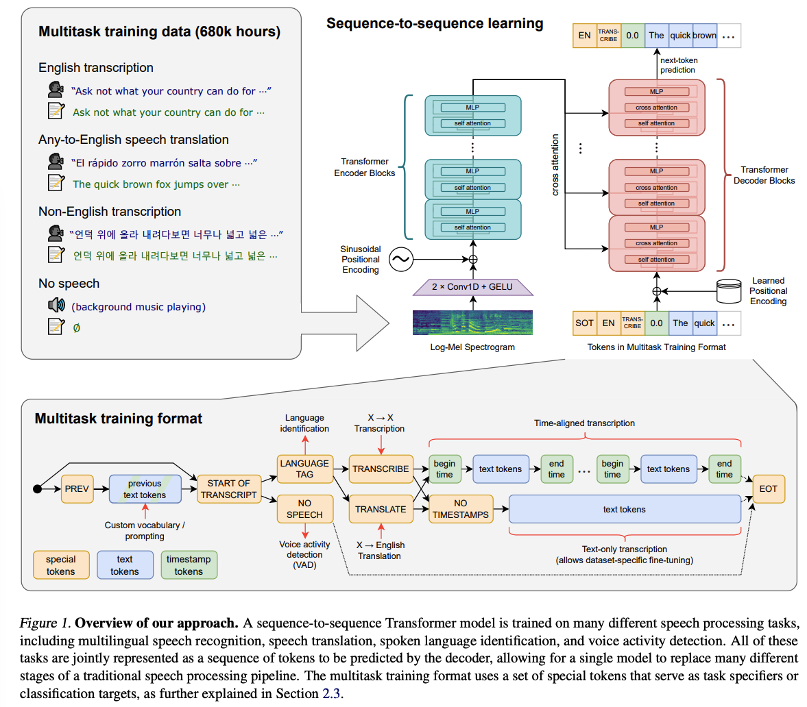
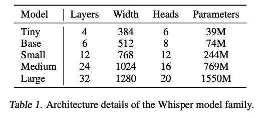

1. 官网：[Introducting whisper](https://openai.com/research/whisper)
1. [Robust Speech Recognition via Large-Scale Weak Supervision](https://cdn.openai.com/papers/whisper.pdf)
1. [Whisper.cpp](https://github.com/ggerganov/whisper.cpp)

# [Robust Speech Recognition via Large-Scale Weak Supervision](https://cdn.openai.com/papers/whisper.pdf)

<ins>**无监督学习训练audio encoder**</ins>

Wav2Vec 2.0 这样的无监督预训练技术能让模型利用起来1,000,000小时的无标签数据训练一个audio encoder，从而加强语音识别任务的性能。学术界的有监督训练语料时常大约在1000小时左右。
这些通过无监督预训练得到的audio encoder学到了高质量的speech representation，但由于缺乏一个性能优异的decoder将学习到的speech representation映射到有用的输出，在使用中需要一个fine-tuning过程才能将speech representation应用到语音识别这样的任务中。
fine tuning有两个局限性：
1. 这个复杂的过程需要有经验的专家；
2. 机器学习方法非常善于寻找held-out数据集上dataset-specific的，人难以察觉的pattern来改善学习性能，但这些pattern并不泛化到更通用的数据集上。

由于缺乏(1)同样高质量的预训练decoder;(2)一个好的dataset specific fine tuning的protocol，尽管无监督学习极大的改善了audio encoders的性能，但有用性和鲁棒性依然有很大的局限性。
语音识别系统追求稳定地在更广泛的环境中部署，而不是要求在不同环境中部署时不断重新进行有监督的fine-tuning。

<ins>**有监督学习训练decoder**</ins>

另一方面现，现有研究表明使用跨越多datasets/domains训练的有监督学习模型对比单一数据源训练的有监督模型，呈现出了更好的鲁棒性和泛化。但这些研究仅使用了中等量级的训练数据（5000+小时）。

<ins>**数据集相关**</ins>
认识到高质量数据的重要性之后，一些工作降低了对人工标注文本的要求，通过一些自动化方法产生weekly supervised语言识别数据，将数据量从10,000提升到了30,000小时。这些数据中含有一定的噪音，但是whisper的作者认为这种降低质量换取提升训练样本数量是正确的方向。

把以上三方面的思考合起来就是whsiper工作的动机。使用680,000小时语音数据（117,000是96种语言的非英语语音）将weekly supervised pre-training从English-only扩展到multilingual和multitask。作者发现<ins>*对一个足够大的大模型（sufficiently large models），使用multilingual和multitask训练没有明显的drawbacks，甚至有一点的好处*。</ins>

作者在论文中说Whisper这个工作主要研究large-scale有监督预训练在语音识别任务上的能力，模型改进不是重点，因此直接沿用了encoder-decoder架构的transformer。

## Multitask Format

尽管语言识别问题的核心是“给定一段音频预测文字”，一个全功能的语言识别系统涉及多个模块，包括语音活动检测，说话人分离和逆文本规范化等。这些模块通常都是独立进行处理，于是围绕着语言识别核心问题会形成一个较为复杂的pipe line。
为了简化这么多个模型，一种很自然的期望是有一个模型能完成语言识别的整个pipe line：给定一段语言，多个不同的任务（例如：transcription，翻译，VAD，对齐，语言识别）可以同时完成。<ins>**为了让一个模型有能力完成这样一个“one-to-many mapping”的任务，某种形式的任务说明是必要的。于是一个很重要的考虑是这样一个模型的接口是怎样的**<ins>。

在whisper这个工作中，作者构造了这样的一个包含四个任务multi-task任务：

1. **任务一：多语言语音识别**。Decoder是一个audio-conditional 语言模型，把transcription的历史也加入context，把历史文本跟在当前audio segment之前，以`<|startoftranscript>`token提示历史文本的开始；
1. **任务二：预测说的是哪一个语言**。用一个特殊的语言id表示（0~99）；
2. **任务三：语音活动检测**。当audio segment中没有speech。让模型预测`<|nospeech>`；
3. **任务四：语音翻译**。预测下面的任务到底是什么`<|transcribe>` 还是 `<|translation>` 

通过特殊token`<nottimestamps>`告诉模型，decoder是否需要预测timestamp。

>**Voice Activity Detection(VAD, 语言活动检测)**: It is a process of detecting whether there is human speech present in an audio signal, and if so, where it occurs in the signal. VAD is commonly used in speech processing applications such as speech recognition, speaker identification, and speech coding.

>**Speaker Diarization (说话人分离)**：It's a process of automatically identifying and segmenting speech signals from multiple speakers in an audio recording, and then assigning each segment to a specific speaker. This can be useful in a variety of applications, such as transcribing meetings or interviews, analyzing call center data, or monitoring broadcast media.)

>**Inverse Text Normalization（逆文本规范化）**：It is a process of converting spoken language into its written form by mapping the spoken words to their corresponding written forms. This is necessary because spoken language often contains variations and irregularities that are not present in written language, such as contractions, slang, and regional dialects. Inverse text normalization is an important step in many speech processing applications, such as speech recognition, where the goal is to transcribe spoken language into written form.

## 模型结构

Encoder-Decoder架构的Transformer模型。

1. 两个卷积+filter+GELU激活处理输入speech representation;
1. sinusoidal positional embedding;
1. transformer block使用pre-activation residual blocks，final encoder output后加layer normalization;
1. decoder使用learned position embeddings和tiled input-output token representations;
1. encoder和decoder层数相同;

