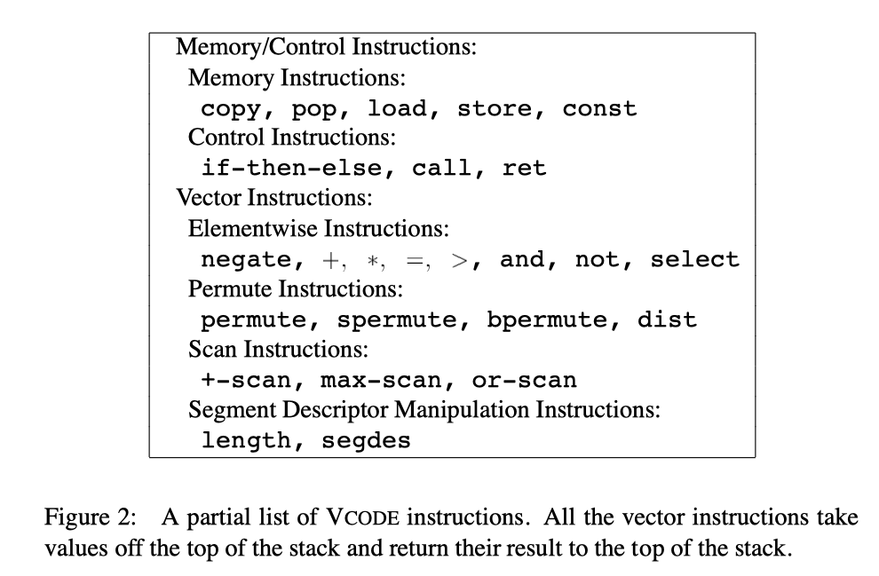

<!-- vscode-markdown-toc -->
- [VCODE](#vcode)
  - [VCODE instructions](#vcode-instructions)
- [Reference](#reference)

<!-- vscode-markdown-toc-config
    numbering=true
    autoSave=true
    /vscode-markdown-toc-config -->
<!-- /vscode-markdown-toc -->

# VCODE

##  VCODE instructions

# Reference

1. Blelloch, Guy E., and Siddhartha Chatterjee. "[VCODE: A data-parallel intermediate language](http://citeseerx.ist.psu.edu/viewdoc/download?doi=10.1.1.47.6593&rep=rep1&type=pdf)." Proceedings Frontiers of Massively Parallel Computation. 1990.
