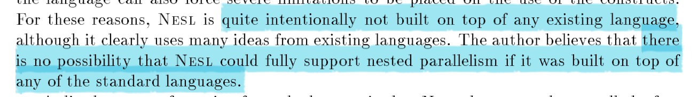

<!-- vscode-markdown-toc -->
- [NESL: a nested data-parallel language](#nesl-a-nested-data-parallel-language)
  - [Goals](#goals)
  - [Why NESL is designed?](#why-nesl-is-designed)
  - [Parallelism](#parallelism)
    - [Parallel operations on vector](#parallel-operations-on-vector)
    - [Nested parallleism](#nested-parallleism)
- [Reference](#reference)

<!-- vscode-markdown-toc-config
    numbering=true
    autoSave=true
    /vscode-markdown-toc-config -->
<!-- /vscode-markdown-toc -->

# NESL: a nested data-parallel language

NESL is intended to be used as a portable interface for programming a variety of parallel and vector supercomputers. Parallelism is supplied through _**a simple set of data-parallel constructs based on vectors, including a mechanism for applying any function over the elements of a vector in parallel**_.

##  Goals

1. Support parallelism using a set of _data-parallel_ constructs based on vectors.
1. **Support complete nested parallelism**.
1. To be **well suited for describing _parallel algorithmes_**, and supply a mechanism to **derive the theoretical running time directly from the code**.
1. To generate _efficient code_ for a variety of architectures, including SIMD and MIMD machines, with both shared and distributed memory.

## Why NESL is designed?

Existing data-parallel languages almost all consist of a set of data-parallel constructs added to a serial language.

**Advantages**:

- allows the creation of a parallel language with only a small effort in language design.

**Disadvantages**:

1. data-parallel constructs often do not fit well with the existing serial languages, causing awkward semantic and compiler problems.
1. the interaction of the parallel constructs with the full features of the language can also force severe limitations to be placed on the use of the constructs.

NESL does not subsume all the features of a full language.

A common complaint about high-level data-parallel languages, and more generally in the class of Collection-Oriented languages, is that **it can be hard or impossible to determine approximate running times for a computation by looking at the codes**.

NESL was designed so that the asymptotic complexity can always be derived from the code as a function of the length of the vectors used in the code.

## Parallelism

### Parallel operations on vector

NESL supports parallelism through operations on vectors. The parallelisms are achieved through two ways:

1. any function whether primitive or user-defined can be applied over the elements of a vector. This is called the **"over form"**.
1. vector function that operate on whole vectors and all have relatively simple parallel implementations, like `reduce`, `permute`.

### Nested parallleism

Nested parallelism is the ability to apply a parallel function multiple times in parallel.

# Reference

1. Blelloch, Guy E. [NESL: a nested data-parallel language](http://www.cs.cmu.edu/~guyb/papers/Nesl2.0.pdf). Carnegie Mellon Univ., 1992.