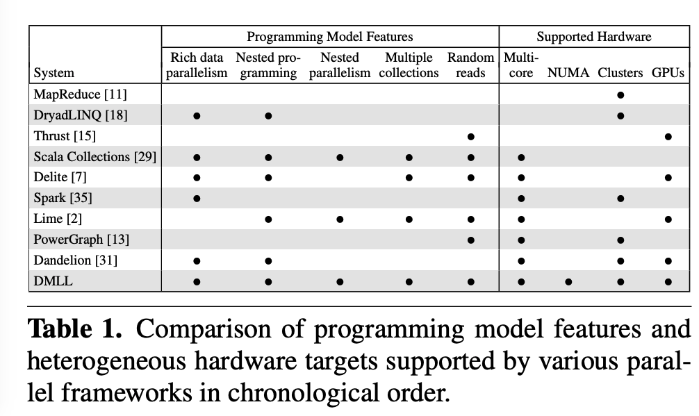

# DMLL

# Reference

1. Brown, Kevin J., et al. "[Have abstraction and eat performance, too: Optimized heterogeneous computing with parallel patterns](https://dawn.cs.stanford.edu/pubs/abstraction-cgo2016.pdf)." 2016 IEEE/ACM International Symposium on Code Generation and Optimization (CGO). IEEE, 2016.
