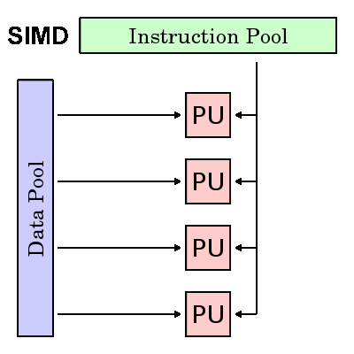

# Parallel computer

|SISD|SIMD|
|--|--|
|**MISD**|**MIMD**|

1. SISD
    - serial computer
1. **SIMD**
    - parallel computer.
        - Most modern computers, particularly those with graphics processor units (GPUs) employ SIMD instructions and execution units.
    - best suited for specialized problems characterized by _**a high degree of regularity**_, such as graphics/image processing

    

    
    

1. MISD
    - Few (if any) actual examples of this class of parallel computer have ever existed.
1. **MIMD**
    -  the most common type of parallel computer
        -  most modern supercomputers fall into this category.
        -  Examples: most current supercomputers, networked parallel computer clusters and "grids", multi-processor SMP computers, multi-core PCs.
        -  many MIMD architectures also include SIMD execution sub-components.

    

    
    

# [Parallel programming model](https://hpc.llnl.gov/training/tutorials/introduction-parallel-computing-tutorial#Models)

Parallel programming models exist as an abstraction above hardware and memory architectures.

# Data Parallel Model

May also be referred to as the **Partitioned Global Address Space (PGAS)** model:

1. Address space is treated globally
2. Most of the parallel work focuses on performing operations on a data set. The data set is typically organized into a common structure, such as an array or cube.
3. A set of tasks work collectively on the same data structure, however, each task works on a different partition of the same data structure.
4. Tasks perform the same operation on their partition of work, for example, "add 4 to every array element".

On **shared memory architectures**, all tasks may have access to the data structure through global memory.

On **distributed memory architectures**, the global data structure can be split up logically and/or physically across tasks.

## Single Program Multiple Data (SPMD)

SPMD is actually a "**high level**" programming model that can be built upon any combination of the previously mentioned parallel programming models.
1. SINGLE PROGRAM: All tasks execute their copy of the same program simultaneously.
    - This program can be threads, message passing, data parallel or hybrid.
2. MULTIPLE DATA: All tasks may use different data **SPMD programs usually have the necessary logic programmed into them to allow different tasks to branch or conditionally execute** only those parts of the program they are designed to execute.
    1. tasks do not necessarily have to execute the entire program - perhaps only a portion of it.
