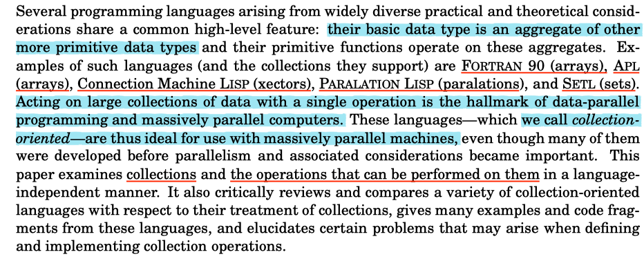

<!-- TOC depthFrom:1 depthTo:6 withLinks:1 updateOnSave:1 orderedList:0 -->

- [Some issues in collection operations](#some-issues-in-collection-operations)
  - [implicit apply-to-each vs. explicit apply-to-each](#implicit-apply-to-each-vs-explicit-apply-to-each)
  - [_element correspondence_](#element-correspondence)
  - [_argument extension_](#argument-extension)
- [The kinds of collections](#the-kinds-of-collections)
- [Operations on collections](#operations-on-collections)
  - [2.1 Aggregate Operations](#21-aggregate-operations)
    - [2.1.1 Information operations](#211-information-operations)
    - [2.1.2 Restricted reduce for unordered collections](#212-restricted-reduce-for-unordered-collections)
    - [2.1.3 Append](#213-append)
    - [2.1.4 Select and Pack](#214-select-and-pack)
    - [2.1.4 Permute](#214-permute)
    - [2.1.5 Reduce and Scan](#215-reduce-and-scan)
  - [2.2 Apply-to-each Operations](#22-apply-to-each-operations)
- [Reference](#reference)

<!-- /TOC -->

collection operations takes two kinds required arguments: collection argument and functional argument.

---

<p align="center">

</p>

---

issues that are not covered in this papers but have to be considered in designing a parallel computing system:

1. parallel implementation of the collection operations
1. representations of collections

---

In this paper, the authors call a programming language <font color=#C71585>_**collection-oriented**_</font> if aggregate data structures and operations for manipulating them "as a whole" are primitives in the language.

- _**common collections**_: set, sequences, arrays, vectors and lists.
- _**common operations**_: summing all the elements of a collection / permuting the order of the elements / applying a function to all elements of the collection.

A collection-oriented language is characterized by two features:

1. the kinds of collections it supports
1. the operations permitted on those collections

# Some issues in collection operations

## implicit apply-to-each vs. explicit apply-to-each

- implicit apply-to-each

    ```python
    Vector a;
    a = negate(a); # this is implicit apply-to-each
    ```

- explicit apply-to-each

    ```python
    Vector a;

    foreach item in a:
        item = negate(item);  # a variable name is bind to a representative element of the collection,
                              # and then apply the `negate`
    ```

Two issues are around implicit _apply-to-each_

1. interacts badly with overloading of functions based on argument type
2. have to make the decision which functions can be used in an apply-to-each?
    - all primitives, user-defined functions, or a fixed set of primitives?
## _element correspondence_

how to lining up multiple collections, and applying the multiple argument functions at each location?

- collections may have different lengths, dimension or nesting level.
##  _argument extension_

how to treate non-collection as collections?

- what it means to "add a scalar to a collection"? mechanism for specifying that the scalar (non-collection as collections) should be treated as a collection, each of whose elements has that particular value.

    |explicit extension|implicit extension|
    |--|--|
    |introduce special syntax to indicate apply-to-each explicitly|non-collection is automatically extended as needed.|

    <font color=#C71585>**implicit extension can lead to ambiguity when the collections to be extended are nested**</font>.
# The kinds of collections

1. **simple collection vs. nested collection**

    |Simple Collection| *Nested Collection|
    |--|--|
    |the elements may not be collections themselves|the elements can be collections themselves|

    _**Nested collections are useful for a great many reasons:**_
    - allow a greater degree of data abstraction.
    - allow an added degree of parallelism to be specified.
    - allow any function to be the argument of an apply-to-each form.

2. **type homogeneity**

    whether and how elements of differing types may be present in the same collection.

    |*homogeneous collection|heterogeneous collection|
    |--|--|
    |all elements have the same type|no constraint on element type|

3. **collection ordering**

    |unordered collection|*sequence-ordered collection|*grid-ordered collection|key-ordered collection|
    |--|--|--|--|
    |sets: allow or do not allow repetitions|linearly-ordered by their position within the collection|arrays of arbitrary dimension|indexed via an arbitrary mapping function|

    ordered collection makes possible an unambiguous correspondence between elements of two different collections.

    If two collections are ordered in the same manner and are of equal sizes, we may <font color=#C71585>_**superimpose**_</font> one collection on top of another by associating elements with the same index or key. Such collections are said to be of the same <font color=#C71585>_shape_</font> or to be <font color=#C71585> _conformable_</font>.

    - an additional kind of collection in functional language: infinite collection in language support lazy evaluation

# Operations on collections

- The collection operations described here should be thought of as **abstract mathematical constructs**.
- The result of performing a collection operation should depend only on the semantics of that operation in the language and not on its implementation.
    - result in the historical difficulty of defining language semantices for parallel machines.


|Aggregate operations|Apply-to-each|
|--|--|
|act on collections in their entirety.|can be factored into the application of a function to the individual elements of a collection.|
## 2.1 Aggregate Operations

### 2.1.1 Information operations

returns basic information about a collection.

- `length` of a collection is independent of the nature of the elements of the collection.
- `length` of a nested collection is the number of "top-level" components.

### 2.1.2 Restricted reduce for unordered collections

reduction operator takes as arguments a collection $C$ and a binary function $f$ that is associative and commutative.

- [associative](https://en.wikipedia.org/wiki/Associative_property): In mathematics, the associative property is a property of some binary operations, which means that rearranging the parentheses in an expression will not change the result.
- [commutative](https://en.wikipedia.org/wiki/Commutative_property): In mathematics, a binary operation is commutative if changing the order of the operands does not change the result.
    - _`floating point add` is commutative but not associative_.
    - _`append` is associative, but not commutative_.

Being associative and commutative guarantees that the result of a restricted reduction be the same regardless of the manner by which it might be evaluated.
### 2.1.3 Append

- `append` is an operation on two collection.
- the actual output is determined by the specific ordering imposed on the collection $C$.
    - `C` is grid-ordered
        - concatenate the collection _**along any of their axes**_ if the dimensions are conformable.
        - there is an argument specifies the dimension whose size will be modified by the operation.
    - `C` is sequence-ordered: _**concatenate**_ one collection to the end of the other.

### 2.1.4 Select and Pack

||select|pack|
|--|--|--|
|**Inputs**|a collection and a predicate|two conformable ordered collection, one containing data and another containing boolean values|
|**Returns**|a new collection containing thoese elements satisfying the predicate|a new collection consisting of thoese elements of the first collection for which corresponding element of the second collection is true|
|**requirement for high-order function**| yes| no|
|**requirement for ordering of the collecition argument**|no|yes|

- **pack** can be used to implement **select** on _**ordered collection**_.
    - apply a predicate to all the elements of the collection to generate the conforming boolean collection
    - use **pack** to extract the elements.
### 2.1.4 Permute

- rearrange the order of the elements in a collection.
    - include: `shift`, `rotate` and `transpose`

Permute takes two conformable ordered collections:
- data collection;
- index collection;

||Index collection|Returns|Notes|
|--|--|--|--|
|**Permute**|no index is repeated and all are present of the first collection; |a new collection in which the index collection specifies where the corresponding element of the data collection goes in the result collection|permuting arrays can be done in element by element manner or by axes (`transpose` in framework).|
|**Inverse Permute**|the index vector specifies where the corresponding result element comes from, instead of where it goes.||`inv-permute` can be generalized to the case where the index collection is not a proper permutation of the indices of the data collection (`gather` in framework).|
|**Key-ordered permute**|the index collection is a collection of elements whose keys are the same as the keys of the data and whose values are all distinct||the combining function must be associative and commutative.|

- `permute` and `inv-permute` _**only**_ applies to sequence-ordered collections.
### 2.1.5 Reduce and Scan

- when operating on a linearly-ordered collection, the combining function _**need not**_ be commutative.
- _**but the associativity is not easy to relax**_.
    - if the collection  argument to a non-associative `reduce` or `scan` is ordered, the result of evaluating the expression will depend on the associativity direction of the combining function.
## 2.2 Apply-to-each Operations

**Apply a function to each element of a collection**.

- apply-to-each operation _**maps perfectly to the massively parallel programming paradigm**_: all processors apply the function to different elements at the same time.

The most important difference between collection-oriented languages is whether there are any limitations on which functions are permitted as the functional argument to an apply-to-each _form_ (in this paper, _form_ is used instead of _function_ to describe `apply-to-each`).

We are interested in the _form_:

- allow any function: primitives or user-defined
- allow nested collections

use explicit functional extension to remove ambiguity occuring with nested collections.
- use binding `apply-to-each` form.

# Reference

1. [A Data-Parallel Language and Its Compilation to a Formally Defined Intermediate Language](https://d1wqtxts1xzle7.cloudfront.net/42210725/A_data-parallel_language_and_its_compila20160206-25249-1tn2588.pdf?1454772513=&response-content-disposition=inline%3B+filename%3DA_Data_Parallel_Language_and_Its_Compila.pdf&Expires=1609898183&Signature=geVW0mlqhU8kERczMk3TVYoTHy7htxusb2SNkq~kbv8S1M2JTswZqzRFRxG7UyRqR~~3IA5tABIlA5bO4irKSmH~1J~w1Y66ZOq0HqR~cJOI6nlTa-EG-UqggK5MBDd~6Fwxg7DkV19iV5LI5-rQ31y5uvKzsZ9YcqpyVWmx3v7rthEnd8nXTlWBqfH-KQY6MuJae4JKebfvhTTAyBC97Gy15STzevSY9WtqUy8igBB6wGpguqNGOafGzytTVeHxMBfHlyar3TXHXK96bDyzIKoLu4zrnP4~~VTtp3-Ch1fXOVxZSEfhZUeFQXrJ2OEFM53xkDOpl6gVUA50jncdWg__&Key-Pair-Id=APKAJLOHF5GGSLRBV4ZA).
