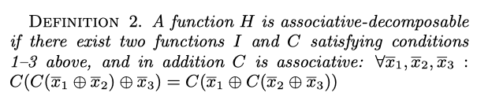

## References

1. Yu, Yuan, Pradeep Kumar Gunda, and Michael Isard. "[Distributed aggregation for data-parallel computing: interfaces and implementations](http://www.michaelisard.com/pubs/sosp-035-yu.pdf)." Proceedings of the ACM SIGOPS 22nd symposium on Operating systems principles. 2009.
1. Liu, Chang, et al. "[Automating distributed partial aggregation](https://www.microsoft.com/en-us/research/wp-content/uploads/2016/02/main-8.pdf)." Proceedings of the ACM Symposium on Cloud Computing. 2014.
## Decomposable functions

 
 
 

1. If an aggregation computation can be represented as a set of ***associative-decomposable*** functions followed by some final processing, then it can be split up in such a way that the query plan in Figure 2 below can be applied.
1. If the computation is instead formed from ***decomposable*** functions followed by final processing then the plan from Figure 2 can be applied, but without any intermediate aggregation stages.
1. If the computation is ***not decomposable*** then the plan from Figure 1 is required.

