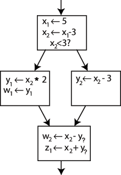

# [SSA](https://en.wikipedia.org/wiki/Static_single_assignment_form#Converting_to_SSA)

1.  each variable is assigned exactly once
1.  every variable is defined before it is used.

***CPS vs. SSA***

-   In functional language compilers [continuation-passing style](https://en.wikipedia.org/wiki/Continuation-passing_style) (CPS) is generally used.

-   SSA is formally equivalent to a well-behaved subset of CPS ***excluding non-local control flow***, which does not occur when CPS is used as intermediate representation.

## Benefit

Compiler optimization algorithms which are either enabled or strongly enhanced by the use of SSA include:

1.  Constant propagation
1.  Value range propagation
1.  Sparse conditional constant propagation
1.  Dead code elimination
1.  Global value numbering
1.  Partial redundancy elimination
1.  Strength reduction
1.  Register allocation

## Converting ordinary code into SSA

The original CFG of a program:

 
 fig.1 CFG of the original program.

1.  Replace the target of each assignment with a new variable.
1.  Replace each use of a variable with the "version" of the variable reaching that point.

 
 fig.2 converting to SSA format (1)

### Why and What is $\phi$ function

- **The problem**
    In fig.2, it is clear which definition each use is referring to except for one case: both uses of $y$ in the bottom block could be referring to either $y_1$ or $y_2$, depending on which path the control flow took.

- **Solution: $\phi$ functioin**
    A special statement is inserted in the last block, called a $\phi$ function.
    - Generate a new definition of $y$ called $y_3$ by "choosing" either $y_1$ or $y_2$, depending on the control flow in the past.
    - the last block can simply use $y_3$, and the correct value will be obtained either way.

    

     
     fig.3 Introduce Phi function into SSA
    

$\phi$ functions are not implemented as machine operations on most machines. A compiler implements the $\phi$ function.

- **Challenges**
    Given an arbitrary CFG, it can be difficult to tell **where to insert $\phi$ functions**, and **for which** variables.
    - dominance frontiers

---

# [Julia SSA](https://docs.julialang.org/en/v1/devdocs/ssair/index.html)

Main SSA data structure:

1. The core of the data structure is **a flat vector of statements**.
1. Each statement is implicitly **assigned an SSA values** based on its position in the vector.
    - The result of the statement at idx 1 can be accessed using SSAValue(1) etc.
1. For each SSA value, additionally maintain its type.
    - Since, SSA values are definitionally assigned only once, this type is also the result type of the expression at the corresponding index.

|Pros|Cons|
|--|--|
|Efficient, because the assignments don't need to be explicitly encoded|1. order is semantically significant, so reorderings and insertions change statement numbers. 2. Julia does not keep use lists, so the LLVM-style RAUW (replace-all-uses-with) operation is unavailable.|

- _**LLVM RAUW**_: implement the replacement of one Value with another by [iterating over its def/use chain](https://llvm.org/docs/ProgrammersManual.html#iterating-over-def-use-use-def-chains) and fixing up all of the pointers to point to the new value.

Instead and additionally:

1. insertion buffer: keep a separate buffer of nodes to insert, including the position to insert them at, the type of the corresponding value and the node itself.
    - i.e. if there is 12 statements in the original statement list, the first new statement will be accessible as SSAValue(13)
1. **RAUW style operations** are performed by setting the corresponding statement index to the replacement value.
1. Statements are erased by setting the corresponding statement to nothing.
