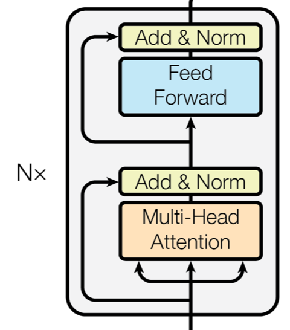
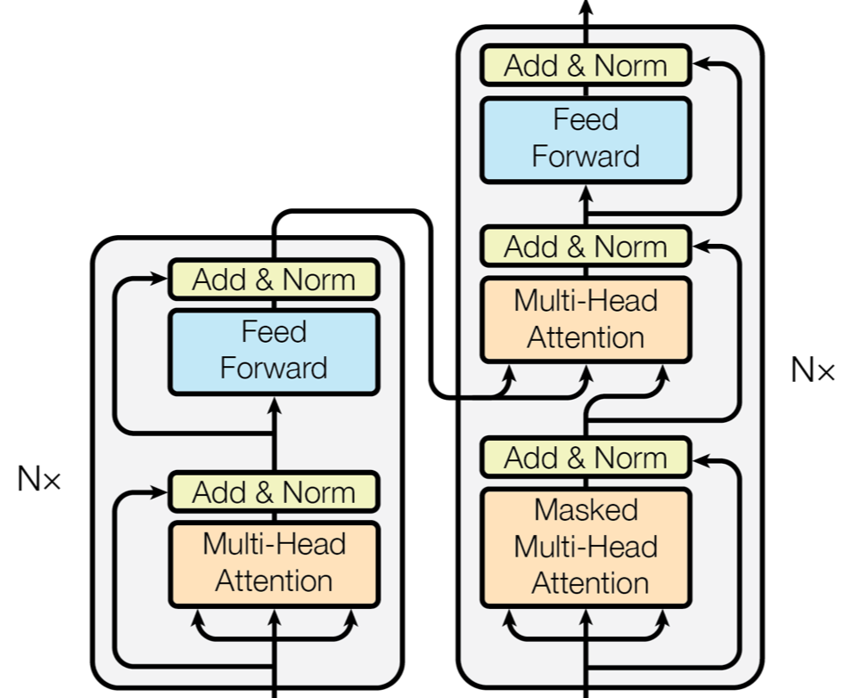

<!-- $theme: default -->
## contributions
- transformer soley on attention, no recurrences and convolutions
- being more parallizable and requiring **significantly** less time to train

---
## Experimental evaluation
- WMT 2014 English-to-German state-of-art, BLEU 28.4
- English-to-French, best single model
    - BLEU 41.0
    - training only for 3.5 days on 8 GPUs
- Generalize well both on large and limited data

---
## important related works (part I)
- reduce sequential computation
    - extended neural GPU: [Can Active Memory Replace Attention?](https://arxiv.org/abs/1610.08613)
    - ByteNet: [Neural Machine Translation in Linear Time](https://arxiv.org/abs/1610.10099)
    - ConvS2S: [Convolutional Sequence to Sequence Learning](https://arxiv.org/abs/1705.03122)
---
## important related works (part II)
- self attention (sometimes called intra-attention)
    - in reading task: [Long Short-Term Memory-Networks for Machine Reading](https://arxiv.org/abs/1601.06733)
    - in text summarization: [A Decomposable Attention Model for Natural Language Inference](https://arxiv.org/abs/1606.01933)
    - in textual entailment: [A Deep Reinforced Model for Abstractive Summarization](https://arxiv.org/abs/1705.04304)
    - in learning sentence representation: [A Structured Self-attentive Sentence Embedding](https://arxiv.org/abs/1703.03130)

---
## Points of the architecture
1. encoder and decoder stacks
2. attention
    - scaled dot-product attention (just as the common way in most papers)
    - multi-headed self-attention
3. introducing positional embedding into the model
4. word embedding and softmax share their weights

---

 model architecture of the Transformer

---

## encoder
- stack $N$ = 6 block (a layer) as shown below
- every layer has two sub-layers
    1. **multi-head** self-attention
    2. simple **position-wise** fully connected feed-forward network
- residual connection around each of the two sub-layers, followed by layer normalization.

- embedding and all sub-layers has a dimension $d_{model}=512$

---

## decoder
- a stack of $N=6$ identical layers
    - besides the two sub-layers as in encoder, a third sub-layer performing multi-head attention over the output of encoder statck is inserted

---
## attention
- attention function is to map a query and a set of key-value paris to an output, where the query, keys, valuts and the outputs are all vectors.
    - query: decoder state at a certain time-step
    - keys:
    - values: encoder vectors
    - outputs: weighted sum of values
---
### Scaled Dot-Product Attention

