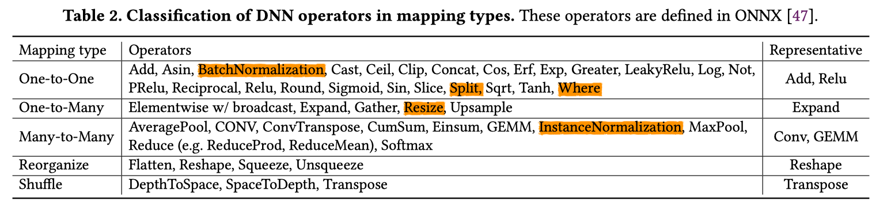

# [DNNFusion: Accelerating Deep Neural Networks Execution with Advanced Operator Fusion](https://arxiv.org/pdf/2108.13342.pdf)

## Approach

It is possible to classify all operators into **five** high-level abstract types based on the relationship between input and output elements.

>***Though in DNNFusion, the author does not give a formal definition of the concept of "mapping type." In my eye, it describes the information that the access function captures in polyhedral compilation..***

Assume each input element can be denoted as $x[d_1, ..., d_n]$:

>1. Tensor a is collection type.
>1. fusion analysis in paper mainly keeps operators black-box. The mapping type is still very vague. It is not carefully distinguish (the analysis is not sensitive to ?) whether $d_{...}$ an integer(one-dimensional addressing) or tuple (high-dimensional addressing)?

1. **One-to-One**: $y[d_1,...,d_n]=F(x[f_1(d_1),...,f_n(d_n)])$

   >***It seems for me that $f_1$...$f_n$ are just a same function, they are not different. One-to-one***
    - shape does not change.

2. **Reorganize**

    > this class for me it to change the intepretation of logical address (modifying meta information).

3. **Shuffle**: $y[e_1,...,e_n]=x[f_1(d_{F(1)}),...,f_n(f_{F(n)})]$

    a set permutation function.

4. **One-to-Many**: $y[e_1,...,e_m]=F(x[f_1(d_1),...,f_n(d_n)])$, $m>n$

5. **Many-to-Many**:  $y[e_1,...,e_m]=F(x^1[f_1^1(d_1), ..., f_n^1(d_n)],...,x^k[f_1^k(d_1), ..., f_k^k(d_n)])$

    This definition DOES not seem correct for me.

 
Highlighted are some operators that the classification does not appropriately capture the key information in optimizing its implementation, in my opinion.

 
