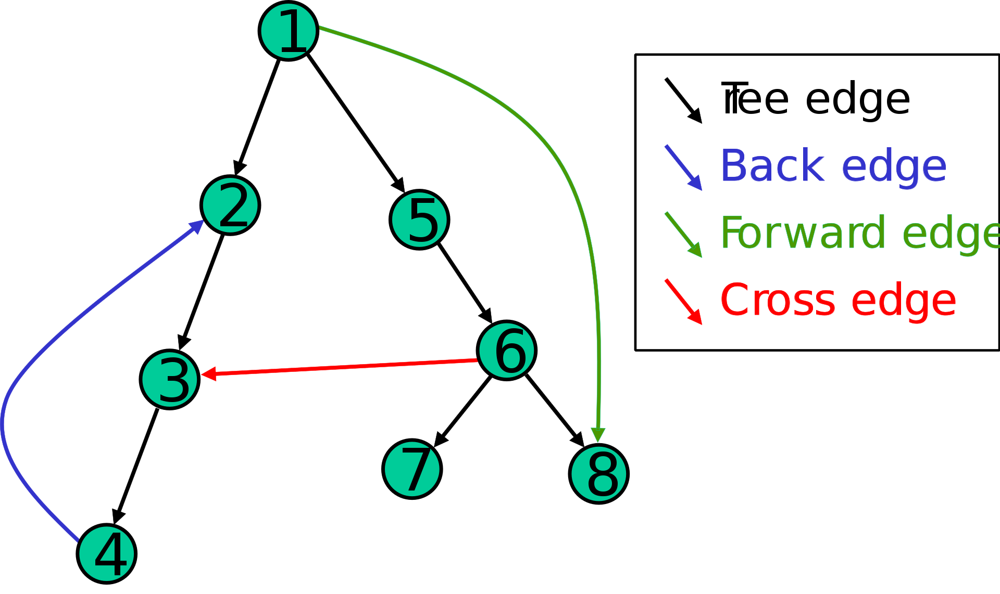

# [Back Edges](https://stackoverflow.com/questions/44494426/back-edges-in-a-graph/44494705)

Given a DFS tree of a graph, a Back Edge is an edge that connects a vertex to a vertex that is discovered before it's parent.

# [Domination Relationship](https://en.wikipedia.org/wiki/Control_flow_graph)

- A block M **dominates** a block N if every path from the entry that reaches block N has to pass through block M.
  - The *entry block* (through which control enters into the flow graph) **dominates** all blocks.
- In the reverse direction, block M **postdominates** block N if every path from N to the exit has to pass through block M.
  - The *exit block* (through which all control flow leaves) **postdominates** all blocks.

# [Use-define chain / Definition-use chain](https://en.wikipedia.org/wiki/Use-define_chain)

* A Use-Definition Chain (UD Chain) is a data structure that consists of a use, U, of a variable, and all the definitions, D, of that variable that can reach that use without any other intervening definitions.

* A counterpart of a UD Chain is a Definition-Use Chain (DU Chain), which consists of a definition, D, of a variable and all the uses, U, reachable from that definition without any other intervening definitions.

Both UD and DU chains are created by using a form of static code analysis known as data flow analysis.

Knowing the use-def and def-use chains for a program or subprogram is a prerequisite for many compiler optimizations, including constant propagation and common subexpression elimination.
