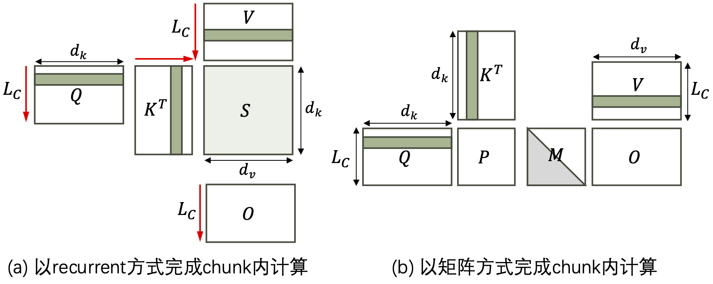
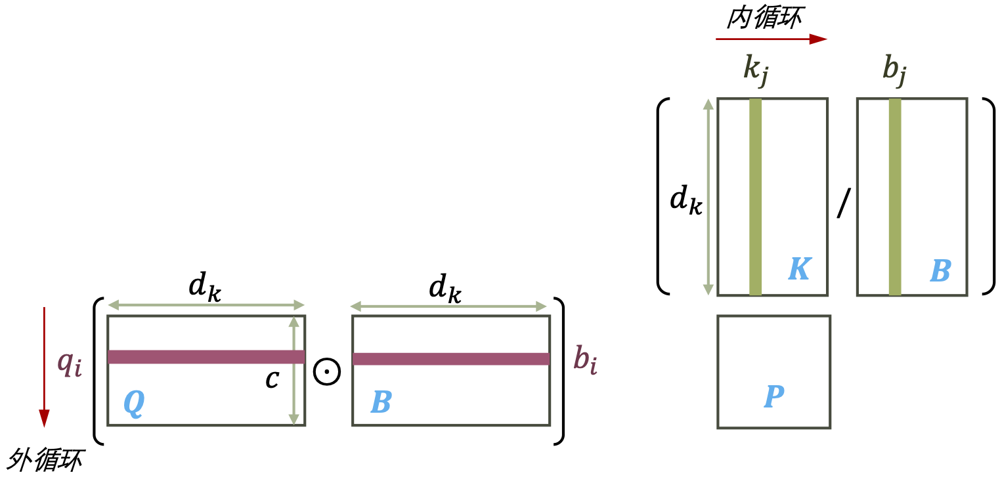

- [Run Test](#run-test)
- [背景](#背景)
  - [Linear Attention](#linear-attention)
  - [Chunkwise Parallelism](#chunkwise-parallelism)
  - [一个例子](#一个例子)
- [Gated Linear Attention Layer](#gated-linear-attention-layer)
  - [GLA在模型设计方面的贡献](#gla在模型设计方面的贡献)
  - [Gated states的全并行形式](#gated-states的全并行形式)
- [Chunked Fuse 的实现](#chunked-fuse-的实现)
  - [fwd\_decay\_cumsum](#fwd_decay_cumsum)
  - [prepare\_qg\_kg](#prepare_qg_kg)
  - [fused\_chunk\_gla\_fwd\_kernel](#fused_chunk_gla_fwd_kernel)
  - [fwd\_inner\_chunk](#fwd_inner_chunk)
  - [combine inner and intra](#combine-inner-and-intra)

# Run Test

```bash
python3 main.py
```

# 背景

## Linear Attention

下面的公式是attention的全并行形式。

$$
\begin{aligned}
Q, K, V &= XW_Q,XW_K,XW_V \\
O &= \text{softmax}(QK^T)V
\end{aligned}
$$

下面的公式是attention的单步计算形式（预测时）：

$$
\begin{aligned}
o_t = \frac{\sum_{i=1}^{t} \exp(q_tk_i^T) v_i}{\sum_{i=1}^{t}\exp(q_t k_i^T)}
\end{aligned}
$$

linear attention的核心是用一个kernel function将query 和key序列中的token映射到正值，然后用内积（内积的数据并行可以用矩阵乘高效实现）作为两者之间的相似性度量，$<\phi(q_i), \phi(k_i)^T>$，用来替代softmax中的$\exp(q_i, k_i^T)$。于是输出$o_t$的计算可以被简化为：

$$
\begin{align}
o_t &= \frac{\sum_{i=1}^{t} \phi(q_t)\phi(k_i)^T v_i}{\sum_{i=1}^{t}\phi(q_t) \phi(k_i)^T} \nonumber \\
&= \frac{\phi(q_t) \sum_{i=1}^{t}\phi(k_i)^T v_i}{\phi(q_t) \sum_{i=1}^{t} \phi(k_i)^T} \nonumber\\
o_t &\triangleq\frac{\phi(q_t) S_t}{\phi(q_t)z_t} \\
S_t &=S_{t-1} + \phi(k_t)^T v_t \\
z_t&= z_{t-1} + \phi(k_t)
\end{align}
$$

将(1)，(2)，(3)进一步简化，令$\phi = I$（indentity function），同时舍弃归一化因子$z_t$于是有：

$$
\begin{align}
o_t &= q_t S_t \\
S_t &=S_{t-1} + k_t^T v_t \\
\end{align}
$$

式（4）和（5）就是linear attention的recurrent形式。从式（4）和（5）我们可以得到一个看待linear attention的新的视角：

1. linear attention是一个hidden state是matrix的RNN；
1. 对状态$S_t$的更新是以”$+$“为二元操作符，不断累加$k_i$和$v_i$的外积；$+$具有结合性，这样的一个累加过程是可并行的，可以利用parallel scan算法在序列长度级别增加并行性；
1. 如果以recurrent方式完成计算，linear attention只在序列长度上循环一次，<font color=red>不论是时间还是空间复杂度都不是序列长度的二次方</font>。过程Fig 1（a）所示。但缺点是如果在一个chunk之内以recurrent方式计算，<font color=red>chunk之内的计算是外积、gemv和加法。他们都无法利用tensor core</font>。

## Chunkwise Parallelism

linear attention和MHA相比优点有两个：

1. 预测时，由于对状态进行了压缩，可以选择用recurrent方式计算，节约k-v cache；
2. 训练时刻，序列长度维度的并行pattern是parallel scan，当序列特别长的时候，在序列长度方向还有并行性可以利用；

linear attention存在以下两种计算模式：

||Recurrent形式|全并行形式|
|:--|:--|:--|
|优点|I/O复杂度低，一次在序列长度上的for循环就可以完成输出的计算|并行性高，可以利用tensor core|
|缺点|无法利用tensor core|时间和空间复杂度都是序列长度的二次方|

可以看到recurrent计算形式和全并行计算形式的优缺点相对。chunkwise parallelism是用来trade-off两者的优点的一种并行方法。

将式（5）展开：

$$
\begin{equation*}
\begin{aligned}
S_1 &= S_0 + k_1^T v_1 \\
S_2 &= S_1 + k_2^T v_2 \\
&= S_0 + k_1^T v_1 + k_2^T v_2 \\
S_3 &= S_2 + k_3^T v_3 \\
&= S_0 + k_1^T v_1 + k_2^T v_2 + k_3^T v_3 \\
S_t &=  S_0 + \textcolor{red}{\sum_{i=1}^{t} k_i^T v_i} \qquad \leftarrow \text{\footnotesize{这里外积之上的连加等价于矩阵乘}}
\end{aligned}
\end{equation*}
$$

最后一行外积之上的连加$\sum_{i=1}^t k_i^Tv_i$就等于矩阵乘；如果我们将$S_t$分为多个chunk，每个chunk含有$C$个token，那么$\mathbf{S}_t$可以写成：$\mathbf{S}_t = \mathbf{K}^T_{[d_k,C]}\mathbf{V}_{[C,d_v]}$，从而利用起来tensor core计算出$S_t = K^TV$，但是要注意因为矩阵乘直接得到的是$0$到$C-1$时刻的累加，不暴露每一步循环的中间结果，$\mathbf{S}_t$如果得到$\mathbf{S}_t$后，通过$q_t \mathbf{S}_t$计算出来$o_t$，这样一个$o_t$始终是每一个chunk最后一个时刻的输出。

<font color=red>如果希望一个chunk内的计算能够利用上tensor core，需要再次切换回：$(QK^T)\odot MV$</font>，这个和经典Transformer相同的，有着$O(C^2d)$复杂度的计算过程，先算$\mathbf{Q}\mathbf{K}$再算$\mathbf{V}$这个视角。

<p align="center">
<br>
Fig 1. chunk-form linear attention.<br>
<br>
Fig 2. attention的chunk内计算<br>
</p>

我们来看一下在块间累积状态：

$$
\begin{aligned}
\mathbf{O}_{i+1} &= \textcolor{red}{Q_{i+1}S_{i}} + \textcolor{blue}{\left( \left(Q_{i+1}K^T_{i+1} \right) \odot M \right)V_{i+1}} \\
\mathbf{S}_{i+1} &= \mathbf{S}_{i} + \mathbf{K}_{i+1}^T\mathbf{V}_{i+1},\quad i = 0,\dots, \frac{L}{C}
\end{aligned}
$$

。因为外积计算先算$\mathbf{K}^T\mathbf{V}$得到状态，只能得到最后一个时间步的输出。一个长度为$C$的块计算输出$\mathbf{O}_{[C \times d_v]}$，需要以二次方复杂度的方式来计算当前块这个局部窗口内$C$个时间步的输出，也就是上面公式的蓝色部分。于是chunkwise 并行算法将整个计算过程分为两部分：

1. 每一个块独立的计算出当然块的输出和<font color=red>每一块最后一个时刻的状态</font>。这一步是块间全并行方式，互相独立地完成，也就是上述公式的蓝色部分。
1. 将每一块最后一个时刻的状态在块间进行传递，也就是上述公式的红色部分。

到这里就会出现两种实现选择：

1. 第一步以更大的并行性将所有的chunk独立进行计算（相当于用kernel并行地计算<font color="blue">上面公式中的蓝色部分，没有数据依赖</font>），每个分块计算出状态$S_i$；这时候状态会占一个较大的空间（$\frac{L}{C} \times d_k \times d_v$，$C$是分块的大小，<font color=blue>但应该比全并行方式存储$\mathbf{P}=\mathbf{K}\mathbf{V}$占据$L \times L$要小才会有明显的受益？</font>），存储回DRAM；第二步再用另外一个kernel，以parallel scan 方式利用序列级别的并行性，对状态进行累加，计算出最终的$O$ （相当于用parallel scan kernel计算上面公式的红色部分），或者串行累加解决空间；
2. 为了避免将状态$S$存回DRAM，kernel内部在序列长度方向循环，在SRAM上计算出状态，对状态进行累加，这时候不会产生DRAM和SRAM之间的I/O，但是并行性会较小一些；

我们继续用一个hello world的例子来理解一下上面第一个公式红色和蓝色的部分所做的事情。

## 一个例子

假设我们以分段的方式计算0~11之上的前缀和：

|Input|0|1|2|3|4|5|6|7|8|9|10|11|
|:--|:--|:--|:--|:--|:--|:--|:--|:--|:--|:--|:--|:--|
|prefix-sum|0|1|3|6|10|15|21|28|36|45|55|66|

1. **将整个序列分成三段，每段首先相互独立的计算前缀和**

    第一个chunk

    |Input|0|1|2|3|
    |:--|:--|:--|:--|:--|
    |prefix-sum|0|1|3|<font color=red>6</font>|

    第二个chunk

    |Input|4|5|6|7|
    |:--|:--|:--|:--|:--|
    |prefix-sum|4|9|15|<font color=red>22</font>|

    第三个chunk

    |Input|8|9|10|11|
    |:--|:--|:--|:--|:--|
    |prefix-sum|8|17|27|<font color=red>38</font>|

2. **传播块间的状态，对每个chunk进行调整**

   这时chunk 2和chunk 3由于是独立计算的，需要为每一项累加之前chunk的累积状态，chunk 2的每一项都应该加上chunk 1的最后一项，chunk 3的每一项都应该加上chunk 1和chunk 2最后一项之和。

    第二个chunk

    |Input|4|5|6|7|
    |:--|:--|:--|:--|:--|
    |调整|4+6|9+6|15+6|22+6|
    ||10|15|21|28|

    第三个chunk

    |Input|8|9|10|11|
    |:--|:--|:--|:--|:--|
    |调整|8+28|17+28|27+28|38+28|
    ||36|45|55|66|

第一步就是红色的公式，第二步就是蓝色公式的部分。

<!-- chunkwise parallelism是一种兼具两者优点的并行方法。将$\mathbf{Q}$，$\mathbf{K}$和$\mathbf{V}$分成多个chunk，每个chunk含有$C$个token。 -->

<!-- Fig 1是这个计算过程的示意图，

<p align="center">
<br>
Fig 1. 以先算KV视角理解linear attention的含义
</p> -->

<!-- Fig.2和Fig.3 chunk form linear attention的示意图，$Q$，$K$，$V$是含有12个token的序列，每一个长方形都是一个维度为$d$的词向量，$Q$，$K$，$V$被分为了3个chunks，每个chunk含有4个token。Fig 4中部的scores矩阵是单个query token和key token的相似度分析矩阵，每一个小方块是一个scalar。 -->

chunk之间沿着序列长度方向对状态$S_t$进行累积，在序列长度方向的parallel scan（下面公式的红色部分），chunk之内以全并行或者recurrent 方式进行计算。

# Gated Linear Attention Layer

Gated Linear Attention在linear attention的基础上加上input-dependent的门控，对状态进行衰减，也就是引入了下图红色的$G$矩阵。$\textcolor{red}{G_t}$是一个$d_k\times d_v$大小的矩阵，并且依赖于输入。

$$
\begin{aligned}
o_t &= q_t S_t & [1,d_v]&=[1, d_k]\otimes[d_k, d_v]\\
S_t &= \textcolor{red}{G_t} \odot S_{t-1} + k_t^T v_t & [d_k, d_v] &=\textcolor{red}{[d_k, d_v]}\odot[d_k,d_v]+[d_k,1]\otimes[1,d_v]\\
\end{aligned}
$$

我们把GLA看做是一个RNN layer（causal形式，不attend到未来时刻，$i$时刻只去attend $i$时刻之前）由以下计算得到：

$$
\begin{aligned}
&\text{for} \ \ t \in \left[0, L - 1 \right) \\
&\qquad s_t = s_{t - 1} * g_{t} + k_t \otimes v_t &&\qquad \text{\footnotesize{// 对状态进行衰减，与当前时刻状态相加}} \\
&\qquad o_t = \gamma * q_t * s_t &&\qquad \text{\footnotesize{// gemv操作}} \\
\end{aligned}
$$

<!-- 和MHA相比，linear attention独特之处在于如果以recurrent模型进行计算，一个for循环就可以算出来最终的输出，这个是算法层面地对计算量和存储需求的巨大改善。缺点是串行计算时无法利用tensor core。 -->

## GLA在模型设计方面的贡献

如果通过full rank的方法得到$G_t$，那么需要$d_k \times d_k \times d_v$大小的映射矩阵，需要学习的参数会非常多；GLA通过以下2个技巧解决parameter-efficiency问题：

1. 第一，通过一个低秩方法得到整个序列长度级别的gating factors矩阵：$$G=\text{sigmoid}\left( (x_{[1,d_k]}\textcolor{blue}{W}^1_{[d_k,d_1]}) \textcolor{blue}{W}^2_{[d_1, d_k]} \right)$$

    也就是将输入$\mathbf{X}$先映射到一个***维度非常小的向量空间，再映射到最终的向量空间***。上面公式中两个蓝色的$W$矩阵是门控部分的可学习参数。

1. 第二，每个时间步的$G_t$矩阵通过对$G$的列进行扩展得到：$\textcolor{red}{G_t} = \left(\alpha^T_t \mathbf{1} \right)$；

通过以上两步，GLA只增加了：$d_k \times d_1 + d_1 \times d_k = 2d_1 \times d_k$ 个可学习参数得到了gating factor，其中$d_1 \lll d$，比full rank 需要的$d_k \times d_k \times d_v$方式要高效许多。

下面四行公式是gated linear attention layer在算法设计上得到的最终模型，公式（8）和（9）是linear attention部分，(10）和（11）是normalization和类似于输出门。

<p align="center">
<br>
Fig 3. GLA layer以recurrent模式单步计算的线性代数公式<br>
</p>

下图是GLA layer作者的实现转换为tensor operator之间的数据流依赖，对应了Fig 3。**图中GLA圈出来的部分实现了论文中的公式（8）和（9），但在实现中分成了多个kernel**。

<p align="center">
<br>
Fig 3. GLA layer的数据流依赖
</p>

**<font color="red"> 从DNN模型设计的角度看GLA的数据流动，上图中蓝色虚线这一枝信息的流动起到了和传统RNN中input gate类似的功能，也是GLA这个模型中"gated"所指的部分。绿色虚线这一枝信息的流动起到了和传统RNN中output gate类似的功能。</font>**

一些注释：

1. $\text{LogSigmoid}(x) = \log \frac{1}{1+\exp (-x)}$。将sigmoid函数的输出映射到log空间，将连乘转换为对数空间的连加。

    > PyTorch里LogSigmoid计算是以2位为底的对数，作者在代码实现中通过换底公式，将LogSigmoid激活的输出乘以 $\frac{1}{\ln 2}$（$\log_2\left(x\right) = \frac{\ln x}{\ln 2}$ ），转换为以 $e$ 为底的对数。然后后续会通过$2^{x}$还原回sigmoid的输出，也就是gating的输出（gate是[0, 1)之间的一个浮点数）。

2. $\text{silu}(x) = x * \text{sigmoid}(x)$

## Gated states的全并行形式

当引入$\textcolor{red}{G_t}$对状态$S_{t}$进行衰减之后，我们很容易发现上面的chunk-wise并行方式需要重新进行推导。为了得到全并行方式（或者判断一个递推式是否存在某种等价的高效全并行实现形式），我们将递推公式：$S_t = G_t \odot S_{t-1} + k_t^Tv_t$进行unroll展开，于是会得到：

$$
\begin{aligned}
S_1 &= G_1 \odot S_0 + k_1^Tv_1 \\
S_2 &= G_2 \odot S_1 + k_2^T v_2 \\
&= G_2 \odot \left( G_1 \odot S_0 + k_1^Tv_1 \right) + k_2^Tv_2 \\
&= G_2 \odot G_1\odot S_0 + G_2 \odot k_1^Tv_1 + k_2^Tv_2 \\
S_3 &= G_3 \odot S_2 + k_3^Tv_3 \\
&= G_3 \odot \left( G_2 \odot G_1 \odot S_0 + G_2 \odot k_1^Tv_1 + k_2^Tv_2\right) + k_3^Tv_3\\
&= \textcolor{red}{G_3 \odot G_2 \odot G_1} \odot S_0 + \textcolor{red}{G_3 \odot G_2} \odot k_1^Tv_1 + \textcolor{red}{G_3} \odot k_2^Tv_2 + k_3^Tv_3
\end{aligned}
$$

注意观察上面的公式，假设当前时刻为$t$，从$1$到$t$时刻的gating factor全部都会作用于$S_0$，对$S_0$进行衰减，也就是说<font color=red>距离当前时刻越远的状态对$t$时刻的影响越小</font>。假设在计算每个时间步的输出$o_t$时，总是从0时刻开始运算，于是我们会得到以下展开的$S_t$计算公式。同时，上文提到在GLA这个模型中，处于效率方面的考虑$G_t$这个衰减矩阵来自于对向量$\alpha_t$（大小$1\times d_k$）的扩展运算，即：$G_t = \left(\alpha^T_t \mathbf{1}\right)$（这里$\mathbf{1}$的大小为$1 \times d_v$），将$G_t$的这个具体形式一并带入unrolled 的$S_t$计算公式，于是有：

$$
\begin{aligned}
S_t &=\sum_{i=1}^{t} \left( \left(\prod_{j=i+1}^t G_j\right) \odot \left(k_i^T v_i \right)\right) \\
&=\sum_{i=1}^{t} \left( \left(\prod_{j=i+1}^t \alpha_j^T \mathbf{1}\right) \odot \left(k_i^T v_i \right)\right)
\end{aligned}
$$

令$b_t \triangleq \prod_{j=1}^t \alpha_j$（<font color="blue">这是一个沿着序列长度维度的parallel scan运算</font>），于是$S_t$可以写成：

$$
\begin{aligned}
S_t &= \sum_{i=1}^{t} \left( \left( \frac{b_t}{b_i} \right)^T\mathbf{1} \right) \odot k_i^Tv_i \\
&=\sum_{i=1}^{t} \left(\left( \frac{b_t}{b_i}\right)k_i \right)^Tv_i
\end{aligned}
$$

一旦采用了外积视角通过矩阵乘先计算了$\mathbf{K}^T \mathbf{V}$，得到的是到当前时刻的累加状态，而不能得到所有时刻的输出。<font color=red>公式$\mathbf{S}_t$得到了是chunk-wise算法中到$t$时刻为止的状态，这与上文讨论的非gating的chunk-wise并行计算方式是一致的，我们还需要一个能够的得到每个时间步输出的块内全并行计算</font>。

$o_t = q_tS_t$，于是有：

$$
\begin{aligned}
o_t &= q_t\sum_{i=1}^{t} \left( \left( \frac{b_t}{b_i} \right)^T\mathbf{1} \right) \odot k_i^Tv_i \\
&=\sum_{i=1}^{t} \left(q_t \odot b_t \right) \left( \frac{k_i}{b_i}\right)^Tv_i \\
&=\left(q_t \odot b_t \right) \sum_{i=1}^{t} \textcolor{blue}{\left( \frac{k_i}{b_i} \right)^Tv_i}
\end{aligned}
$$

gating factor同时作用于$q_t$和$k_i$。将$b_i^T$（$i=0,\dots ,L$）进行stack，记作$\mathbf{B}\in (0,1)^{L \times d}$。将上面的公式写成矩阵化的形式：

$$
\begin{aligned}
\mathbf{O} &= \left( \left(\mathbf{Q} \odot \mathbf{B}\right) \left( \frac{\mathbf{K}}{\mathbf{B}} \right)^T \odot \mathbf{M} \right) \mathbf{V}
\end{aligned}
$$

公式中每一个操作数的形状为：$[C, d_v]=[C, d_k]\odot [C, d_k] \left( \frac{[C, d_k]}{[C, d_k]}\right)^T[C, d_v]$，上式就是GLA的全并行公式。如果能够提前对$\mathbf{Q}$和$\mathbf{K}$进行衰减得到$\widetilde{\mathbf{Q}}=\mathbf{Q}\odot \mathbf{B}$及$\widetilde{\mathbf{K}}=\frac{\mathbf{K}}{\mathbf{B}}$，那么$\widetilde{\mathbf{Q}}\tilde{\mathbf{K}}^T$依然可以利用矩阵乘完成。

但是$\mathbf{B}$是一个对$(0,1)$之间浮点数沿着序列长度方向上的连乘，随着序列长度增加数值会无限趋近于0，<font color=red>导致计算$\frac{\mathbf{K}}{\mathbf{B}}$是数值不稳定的</font>。为了让数值计算稳定，$\mathbf{P} \triangleq \left( \mathbf{Q} \odot \mathbf{B}\right) \left(\frac{\mathbf{K}}{\mathbf{B}}\right)^T \odot \mathbf{M}$，将计算转换到对数空间，将得到$\mathbf{B}$的连乘变成对数空间的连加，然后再通过$\exp$操作转换回来原空间，于是有：

$$\mathbf{P}_{ij}=\sum_{k=1}^{d_k} \mathbf{Q}_{i,k} \mathbf{K}_{j,k} \exp\left( \log \left(\mathbf{B}_{i,k}\right) - \log \left(\mathbf{B}_{j,k} \right)\right),\qquad i \ge j$$

这个公式的计算pattern和矩阵乘一样，如下图所示。上式中的连加符号就是在矩阵乘的$K$维度进行reduce，但是可以注意由于$A$，$B$操作数（沿用矩阵乘的namning convention）需要首先和gating factor进行element-wise运算（<font color=red>为了使用tensor core，实现的时候会对$Q$和$K$预先完成与gating</font>）。

<p align="center">
<br>
Fig. 
</p>

这里我们总结一下，也就是说GLA要解决的一个问题是：<font color="red">引入data-dependent的门控机制对状态进行衰减，对学习效果的改善有很大帮助，但是随着序列长度的增加会引起数值不稳定问题。在对数空间的计算稳定更高，但是会无法利用起tensor core</font>。

# Chunked Fuse 的实现

分成了5步，前4步是4个triton kernel，最后一步是一个简单的相加，用了PyTorch的operator。下面的符号都尽量沿用了代码中对应的变量名，以便和代码对应。

|Notation|Explanation|取值量级||
|:--:|:--|:--|:--|
|$B$|batch size|32|
|$L$|sequence length|2048|
|$H$|head number|4|
|$D_{qk}$|query和key的hidden dimension|1024或者2048这样的量级|
|$D_{v}$|value的hidden dimension|1024或者2048这样的量级|
|$BT$|序列长度维度上的分块大小|*固定取16*|<font color=red>太小了</font>|
|$BK$|$D_{qk}$维度上的分块大小|$D_{qk}$和64中的较小值|
|$NK$|$NK=\frac{D_{qk}}{BK}$|$D_{qk}$维度上的分块数目|
|$BV$|$D_{v}$维度上的分块大小|$D_v$和64中的较小值|
|$NV$|$NV = \frac{D_v}{BV}$|$D_v$维度上的分块数目|

|输入tensor|形状|
|:--:|:--|
|$Q$|$[B, H, L, D_{qk}]$|
|$K$|$[B, H, L, D_{qk}]$|
|$V$|$[B, H, L, D_{v}]$|
|$gK$|$[B, H, L, D_{qk}]$|

下面表格第3列的”数据划分“，就对应了CUDA device kernel launch config中blocks的三个维度，也就是并发blocks数目。

|Kernel|数据划分|theads per CTA|
|:--|:--|:--|
|$g_o=\text{fwd\_decay\_cumsum}(g)$|$NK,\frac{L}{BT}, B*H$|32|
|$\textcolor{red}{q_g}, \textcolor{red}{k_g}=\text{prepare\_qg\_kg}(q,k,g_o)$|$NK,\frac{L}{BT}, B*H$|32|
|$o = \text{fused\_chunk\_gla\_fwd\_kernel}(\textcolor{red}{q_g},\textcolor{red}{k_g},v,g_o,o)$|$NK, NV, B * H$|64|
|$o_2 = \text{fwd\_inner\_chunk}(\textcolor{blue}{q},\textcolor{blue}{k},g_o)$|$NK,\frac{L}{BT}, B * H$|128|
|combine inner and intra chunks|/|由PyTorch operator完成，见后面的说明|

## fwd_decay_cumsum

>这个kernel是为了计算论文中的$\mathbf{B}$矩阵，在序列长度维度上进行分块，实现的时候分块大小固定为16。但是由于这个kernel在序列长度上并行分布blocks，因此gating factor的累乘只在长度为16的窗口内进行。

第1个kernel是一个很小的element-wise kernel，用来计算沿着序列长度$L$维度的gated factor的累乘。输入的是通过低秩方法得到的gating factor $GK_{[B,H,L,D_{qk}]}$。由于多样本和多head之间完全独立，我们总是可以忽略$B$，$H$这两个全并行维度，他们最终会映射到CUDA的blocks之上并发进行处理。于是我们始终只关注如何处理一个序列。

Fig 4是fwd_decay_cumsum这个kernel处理数据的示意图，这个kernel在$G$的hidden维度和序列长度维度并行。

1. 每一个CTA相互独立地处理$D_{qk} \times BT$大小的数据。
2. 这个kernel的pattern是一个2D kernel，在序列长度维度上进行scan，在$G$的hidden dimension上没有数据依赖，可以全并发处理。

<p align="center">
<br>
Fig 5. fwd_decay_cumsum的并行方式
</p>

这个kernel内部带有一个pattern为scan的for循环 ：$Y=\text{scan}\left((\vec{s}, \vec{x})\rightarrow f, I=\vec{1}, \text{rows}(X)\right)$，$f(\vec{s},\vec{x})$是scan携带的二元算符，公式如下：

$$f(\vec{s},\vec{x}) = \vec{s} + \vec{x} / \ln 2 $$

这个kernel**可能是为了提高并行性**，在蓝色小块内部进行了累积和运算，但是小块之间是独立的，也就是说这个kernel计算完毕后，**gating factor在每一个长度为16的local窗口内进行了累积，但是并没有在全序列长度范围内进行累积**。

## prepare_qg_kg

以$Q$，$K$，$V$和$G$为输入，以和$Q$，$K$等大的$Q_g$和$K_g$为输出，给$Q$和$K$都乘以gating factor $G$，进行衰减。这个kernel完成的数学计算如下（实现中需要先对$g$计算2的幂运算，将映射到对数空间的gating factor进行还原得到sigmoid的输出，下面的公式省略了这个2的幂运算)：

$\qquad q_i = q_i * g_i * \gamma$
$\qquad k_i = k_i * (\text{last\_decay} - g_i)$

```python
load(last_decay)

for i in range(BT):
  load(_q)  # [BK]
  load(_k)  # [BK]
  load(_g)  # [BK]

  _q *= _g * scale
  _k *= (last_decay - _g)

  store(_k)
  store(_g)
```

这个kernel和`fwd_decay_cumsum`的分数据方式，kernel内部循环方式完全一样，也就是每个kernel依然独立地去处理Fig 4中蓝色部分的数据块。当前kernel需要读取gating factor矩阵$G$中$D_{qk}$行，$BT$列大小的一块数据（Fig 4蓝色方块大小）的一块数据，来看`last_decay`的指针偏移计算，`last_decay`取到这块数据的最后一列。

```python
last_decay = tl.load(g + i_bh * s_qk_h + (i_c * BT + BT - 1) * DK + i_k * BK
           + tl.arange(0, BK))
```

取到的数据如下图所示：

<p align="center">

</p>

## fused_chunk_gla_fwd_kernel

这个kernel完成了在整个序列长度上累积状态，本质上是一个parallel scan过程。这个kernel的分数据方案如下，<font color="red">这个公式的内部以recurrent模式计算linear attention，每个块是相互独立的，只有这个kernel里面的运算使用到了tensor core</font>。

<p align="center">
<br>
Fig 6. fused_chunk_gla_fwd_kernel的并行方式
</p>

这个kernel内部的for循环在整个序列长度方向上进行循环，每个循环步处理一个分块。$h_0$大小为$[d_k, d_v]$初始化为全0。

$$
\begin{aligned}
o_t &= q_t \otimes h_{t-1}\\
h_t &= h_{t-1} * g_{db} + k_t @ v_t \qquad \leftarrow 这里的k_t已经被\text{gating factor}调整过
\end{aligned}
$$

第2个公式中的$g_{db}$对应了代码中的`d_b`。`d_b`取到了一个序列第一个分块（跨16列）的最后一列。随着kernel内的循环在序列长度分块上移动，$g_{db}$总是指向当前分块的最后一列，类似于`prepare_qg_kg`中`last_deacy`的作用。

```cpp
d_b = g + i_bh * s_qk_h + (BT - 1) * s_qk_t + i_k * BK + tl.arange(0, BK)
load(d_b)
```

<font color=red>第二个公式中外积转换为矩阵乘，</font>等价于在多次外积之上的累加和。

```python
b_h = zeros(BK, BV)  # hidden初始化为0
for i in range(L / BT):
    load(b_k)  # b_k 形状：[BK, BT]
    load(b_v)  # b_v 形状：[BT, BV]
    load(b_q)  # b_q 形状：[BT, BK]
    load(d_b)  # d_b 形状：[BK]

    b_o = zeros(BT, BV, dtype=float32)

    b_o = b_q @ b_h  # [BT, BV] = [BT, BK] @ [BK, BV]
    b_h = b_h * d_b + b_k @ b_v  # [BK, BV] = [BK, BV] * [BK, 1] + [BK, BT] @ [BT, BV]

    store(b_o)
```

## fwd_inner_chunk

这个kernel分数据的方式和kernel 1，2 完全相同。每个小分块之间完全的独立。以$Q$，$K$和$G$为输入，输出tensor的大小$[NK,B,H,\frac{L}{BT},BT,BT]$。

<p align="center">
<br>
Fig 7. fwd_inner_chunk的并行方式
</p>

kernel内部的for循环在序列长度方向循环。Fig 6的右半部分是`fwd_inner_chunk` kernel内部access数据的示意图，下面的代码是这个kernel完成的计算（下面的变量名和上图以及作者代码中的实现完全相同，方便对应回作者的代码）：

```python
for i in range(BT):
  s = (_q * b_k) * (gq - b_g)  # [BT, BK]，注意这里的形状，第一个“*”和最后一个“-”是broadcast
  score = sum(s, axis=1)  # [BT, 1]，这里是在算一个q和K-chunk的内积。
  score = tl.where(o_i <= i, score, 0)  # [BT, BT]， o_i = range(0, BT)，causal mask
```

## combine inner and intra

这一步是用PyTorch的tensor operator完成的。

```python
# A has a shape of [NK, B, H, L/BT, BT, BT]
v2 = rearrange(v, 'b h (n c) d -> b h n c d', n=num_chunk)
A = A.sum(0)  # A是`fwd_inner_chunk的输出`，[B, H, L/BT, BT, BT]
o2 = A @ v2  # [B, H, L/BT, BT, Dv]
o2 = rearrange(o2, 'b h n c d -> b h (n c) d')  # [B, H, L, Dv]
# fwd_inner_chunk结合到这一行为止，联合起来用传统Transforer平方复杂的方式计算出了每个块之内的输出

o.add_(o2)
```